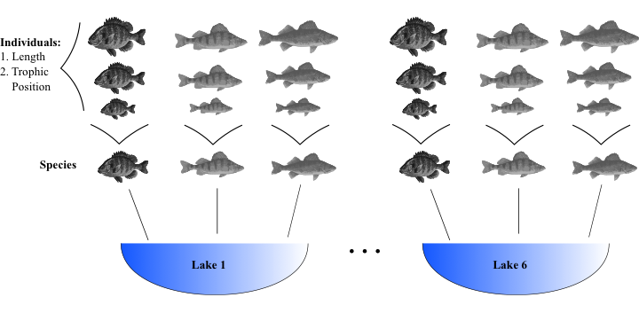

# (PART\*) Linear mixed models (LMMs) {-}

# Overview  
Biological and ecological data are often messy. Usually, there is an
inherent structure to data (i.e. single observations are not always
independent), relationships between variables of interest might differ
depending on grouping factors like species, and more often than not
sample sizes are low making it difficult to fit models that require many
parameters to be estimated. Linear mixed effects models (LMM) were
developed to deal with these issues. They can be applied to a great
number of ecological questions and take many different forms. In this
workshop we will use a simple question-based approach to learn the
basics of how LMM operate and how to fit them. We will then conclude
with a thought experiment of applying LMM to a more diverse set of
questions. 

# What is a LMM and why should I care?

LMM's allow you to use all the data you have instead of using means of
non-independent samples, they account for structure in your data (for
example, quadrates nested in sites nested in forests), they allow
relationships to vary by different grouping factors (sometimes referred
to as random effects), and they require less parameter estimates than
classical regression which saves you degrees of freedom. But how do they
do all of this? These questions will hopefully become clear during this
section. First, Let's start by getting to know the dataset.

# Introduction to the dataset

```{r, echo = TRUE, eval = FALSE}
# Remove prior commands in R
rm(list=ls()) 

# Place all workshop material in one folder on your computer
# Run the following line of code and use the browsing window to choose the QCBS_W6_Data.csv 
# file in the folder that contains the workshop material
file.choose()

# Set the working directory to the folder which contains the lab material by copy and pasting
# all but the R file name from the output of the file.choose() command into the set working 
# directory command. 

# For example paste "/Users/ziegljac/Documents/QCBS_R/" -> include the quotations
# NOT "/Users/ziegljac/Documents/QCBS_R/Get_Data_Func.R" -> include the quotations
setwd()

# Load useful libraries and data
# If you have never loaded these libraries before you will have to use 
# The install.packages() function before the library() function
library(ggplot2)
library(lme4)
library(arm)
library(AICcmodavg)

data <- read.csv('QCBS_W6_Data.csv')
```

The dataset we will be using deals with fish trophic positions.
Individuals were sampled over a range of body lengths that come from
three different fish species caught in six different lakes. Here is a
visual representation to help wrap your head around all of this! Note:
only three sizes of fish are shown within each species but in reality
there are 10 individuals per species.

{width="800"}

A simple question you might answer with this dataset is **does fish
trophic position increase with fish size for all three fish species**?
This will be our motivating question for this workshop.

------------------------------------------------------------------------

**CHALLENGE 1**

For your fist challenge, reproduce the plots 1-3 from the
*QCBS\_W5\_LMM.R* code. Observe the plots and try to get a sense of what
is occurring. Two key questions to ask yourself are:

    -Do I expect all species to increase in trophic position with length? In the exact same way?
    -Do I expect these relationships to be the same across lakes? What might differ?

++++ Challenge 1 Answer \|

```{r, echo = TRUE, eval = FALSE}
# Used to strip down figures to make them simpler
fig <- theme_bw() + theme(panel.grid.minor=element_blank(), panel.grid.major=element_blank(), panel.background=element_blank()) + 
  theme(strip.background=element_blank(), strip.text.y = element_text()) + theme(legend.background=element_blank()) + 
  theme(legend.key=element_blank()) + theme(panel.border = element_rect(colour="black", fill=NA))

# Make the followoing three plots to explore the data
plot <- ggplot(aes(Fish_Length,Trophic_Pos),data=data)

# Plot 1 - All Data
plot + geom_point() + xlab("Length (mm)") + ylab("Trophic Position") + labs(title="All Data") + fig

# Plot 2 - By Speceis
plot + geom_point() + facet_wrap(~ Fish_Species) + xlab("Length (mm)") + ylab("Trophic Position") + labs(title="By Species") + fig

# Plot 3 - By Lake 
plot + geom_point() + facet_wrap(~ Lake) + xlab("Length (mm)") + ylab("Trophic Position") + labs(title="By Lake") + fig
```

**OUTPUT**\
**Plot 1** {width="300"} **Plot 2**
{width="300"}

**Plot 3** {width="300"}

Do I expect all species to increase in trophic position with length? In
the exact same way? All species seem to increase in trophic position
with length, but the slope might be different across species

Do I expect these relationships to be the same across lakes? What might
differ? Some parameters specific to one particular lake might change the
relationship, such as the primary productivity of the system

++++