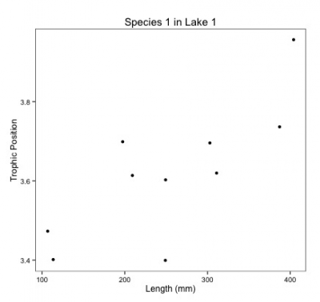

# Why choose mixed models? 

Biological and ecological data are often messy. Most of the time there is an inherent structure to data (i.e. single observations are not always independent), relationships between variables of interest might differ
depending on grouping factors like species, and more often than not sample sizes are low, making it difficult to fit models that require many parameters to be estimated. 

Linear mixed effects models (LMM) were developed to deal with these issues. They can be applied to a great
number of ecological questions and take many different forms. In this workshop we will use a simple question-based approach to learn the basics of how LMM operate and how to fit them. 

# Starting with a question

Before we dive in, let's start by considering an example dataset and proposing a research question.

The [dataset](http://qcbs.ca/wiki/_media/qcbs_w7_data.csv) we will be using looks at fish trophic positions. In this dataset, data was collected for **3** different fish species (S1-3) with 10 individuals sampled per species across 6 different lakes (L1-6). Individuals from each species were measured and exhibit variation in their body length and trophic position. 

Here is a visual representation to help wrap your head around all of this! 

*Note: Only three sizes of fish are shown within each species but in reality
there are 10 individuals per species.*


A simple question you could answer with this dataset is **does fish trophic position increase with fish size?**
This will be our motivating question for this workshop.

## Challenge 1 

For our first challenge, we are going to start looking deeper at our dataset. 
Reproduce plots 1-3 using the script below and the [fish dataset](http://qcbs.ca/wiki/_media/qcbs_w7_data.csv). 
Observe each plot and try to get a sense of what is occurring. A few key questions to ask yourself are:

- **1.** Do we expect an increase in trophic position with length in the exact same way for *all species*?
- **2.** Do we expect an increase in trophic position with length in the exact same way for *all lakes*?
- **3.** How might these relationships differ?

```{r, echo = TRUE, eval = TRUE}
library(ggplot2)

#Load dataset into R 
fish.data <- read.csv('data/qcbs_w7_data.csv', stringsAsFactors = TRUE)

# simple theme
fig <- theme_bw() + theme(panel.grid.minor = element_blank(), 
                          panel.grid.major = element_blank(), 
                          panel.background = element_blank()) +
                    theme(strip.background = element_blank(), 
                          strip.text.y = element_text()) + 
                    theme(legend.background = element_blank()) +
                    theme(legend.key = element_blank()) + 
                    theme(panel.border = element_rect(colour = "black", fill = NA))

plot <- ggplot(aes(Fish_Length, Trophic_Pos), data = fish.data)

# Plot 1 - All data
plot + geom_point() + xlab("Length (mm)") + ylab("Trophic Position") + labs(title = "All Data") + fig

# Plot 2 - By species
plot + geom_point() + facet_wrap(~ Fish_Species) + xlab("Length (mm)") + ylab("Trophic Position") +
   labs(title="By Species") + fig

# Plot 3 – By lake
plot + geom_point() + facet_wrap(~ Lake) + xlab("Length (mm)") + ylab("Trophic Position") +
   labs(title="By Lake") + fig
```

---

#### **Challenge 1 Solution:** {-}

Based on these plots we can draw two initial observations:

- **1.** All species appear to increase in trophic position with length, but the slope might be different across species.
- **2** Some parameters specific to each particular lake (ex. the primary productivity of the system) may change the observed relationship.


# Analyzing the data

We know that ecological and biological data are often complex. Many datasets will include:

- Hierarchical structure in the data
- Many covariates and grouping factors
- Unbalanced study/experimental design

So how can we analyze our data?

- **Option 1:** Separate - Run separate analyses for each species in each lake
- **Option 2:** Lump - Run one analysis ignoring lake and species
- **Option 3:** ?

Let's look a little closer at these options using our fish dataset!

## Separate 

One way to analyze this data is to fit linear regressions for each species in each lake.

What would it look like it we ran separate analyses for each species?



Notice you would have to estimate a slope and intercept parameter for each regression (2 parameters x 3 species X 6 lakes = 36 parameter estimates) and the sample size for each analysis would be 10. 

There is a decreased chance of finding an effect due to low sample size and increased familywise error rate due to multiple comparisons.

## Lump 

Another way to analyze this data is to fit a single linear regression ignoring species and lake.

What would it look like it we put all of our data together for all lakes?


Notice you now have a huge sample size and far fewer parameters to estimate! 

But what about pseudoreplication? Fish within a lake and within a species might be correlated. 

Also, look at all that noise in the data, some of it might be due to **differences** among **species** and **lakes**


## Is there a third option? 

For our question, we only want to know if there is a **general effect of body length on the trophic position**.

However, this relationship might differ slightly among **species** due to unmeasured biological processes (e.g. growth rate) or among **lakes** due to unmeasured environmental variables. But we are not interested in this variation, so we need to find a way to **control** for these potential effects while still maximizing the use of our data. This is why both separating and lumping alone are unsatisfactory options.

This brings us to mixed models! Linear mixed models enable us to lump **and** separate the analysis. 

Linear mixed models:

- Estimate slope and intercept parameters for each species and lake (**separating**) but estimate fewer parameters than classical regression.
- Use all the data available (**lumping**) while accounting for pseudoreplication by controlling for differences among lakes and species.

In doing so, they: 

- allow you to use all the data you have instead of using means of non-independent sample;
- account for structure in your data (for example, quadrates nested in sites nested in forests);
- allow relationships to vary by different grouping factors (also known as random effects);
- they require less parameter estimates than classical regression which saves you degrees of freedom. 

But how do they do all of this? Let's get into it! 

