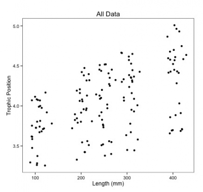
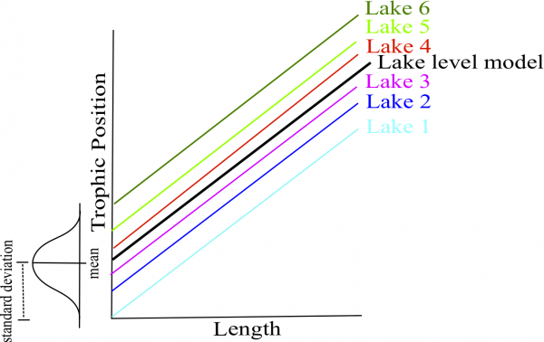

# How do I analyze this dataset?

## Run many separate analyses

One way to analyze this data is to fit linear regressions for each
species in each lake. Here is a plot of species 1 in lake 1:

{width="400"}

Notice you would have to estimate a slope and intercept parameter for
each regression (2 parameters x 3 species X 6 lakes = 36 parameter
estimates) and the sample size for each analysis would be 10. There is a
decreased chance of finding an effect due to low sample size and
increased familywise error rate due to multiple comparisons.

## Run one lumped analysis

Another way to analyze this data is to fit a single linear regression
ignoring species and lake. Again here is the plot of all the data:

{width="400"}

Notice you now have a huge sample size and far fewer parameters to
estimate. But what about pseudoreplication? Things within the same lake
and species will likely be correlated. Also, look at all that noise in
the data, surely some of it is due to differences in lakes and species.

In this case we simply want to know if trophic position increases with
length and we don't really care that this relationship might differ
slightly among species due to biological processes that we didn't
measure or among lakes due to unmeasured environmental variables. This
is variation we simply want to control for (sometimes referred to as
random factors).

## Fit a LMM

LMM's are a balance between separating and lumping. They:

    -Provide slope and intercept parameters for each species and lake (separating) but estimate fewer parameters than classical regression.
    -Use all the data available (lumping) while accounting for pseudoreplication and controlling for differences among lakes and species.

# Fixed and Random Effects

There is a debate in the litterature about the definition of fixed and
random effects. There are many possible definitions, and we chose to
present those we think are easier to apply when doing your analyses.

## Fixed effect

When a variable has a fixed effect, data is usually gathered from all
it's possible levels. The person doing the analyses is also interested
in making conclusions about the levels for which the data was gathered.

Example of a fixed effect: comparing mercury concentration in fish from
three different habitats. Habitat has a fixed effect as we sampled in
each 3 habitats and we are interested in making conclusions about these
specific habitats.

## Random effect

Variables with a random effect are also called random factors, as they
are only categorical variables (not continuous variables). A random
effect is observed when the data only includes a random sample of the
factor's many possible levels, which are all of interest. They usually
are grouping factors for which you want to control the effect in your
model, but are not interested in their specific effect on the response
variable.

Example of a random effect: studying mercury contamination in fish in
Ugandan crater lakes. For logistical reasons, you can't sample all the
crater lakes, so you sample only 8 of them. However, fish from a given
lake might have some sort of correlation between themselves
(auto-correlation) since they experience the same environmental
conditions. Even though you're not interested in the effect of each
lake specifically, you should account for this potential correlation
with a random factor (crater lake) in order to make conclusions about
crater lakes in general.

# How do LMM's work?

## Intercepts and/or slopes are allowed to vary by lake and species

In LMM's allowing intercepts and/or slopes to vary by certain factors
(random effects) simply means you assume they come from a normal
distribution. A mean and standard deviation of that distribution are
estimated based on your data. The most likely intercepts and slopes from
that distribution are then fit by optimization (ex. maximum likelihood
or restricted maximum likelihood).

**Intercepts**

In the case of species only a mean and standard deviation are estimated
for the distribution of species intercepts instead of three separate
species intercepts. The mean of this distribution is the 'species level
model'. In this example, we only have three species. In general, the
more levels you have for a given factor, the more accurately the
parameters of the distribution can be estimated (three may be a little
low for estimating a mean and standard deviation but it makes simpler
graphs!). When you will implement LMM's in R, note that the intercept
in the summary is the species level intercept (i.e. the mean of all
random intercepts).

{width="600"}

Likewise for lake only mean and standard deviation of lake intercepts
are estimated saving you the need to estimate 6 different lake intercept
parameters. This saves degrees of freedom as less parameter estimates
are needed given the amount of data.

{width="600"}

**Slopes**

The same concept is used for allowing slopes to vary by a given factor
(random effect). This is a little harder to visualize than the
intercepts. In the case of species only a mean and standard deviation of
slope parameters are estimated instead of three separate slopes. Again,
when you will implement LMM's in R, the slope in the summary is the
species level slope.

{width="600"}

## Intercepts, slopes, and associated confidence intervals are adjusted to account for the structure of data

If a certain species or lake is data poor like in the example below (we
have a balanced design so not the case in our scenario) it will rely
more heavily on the group level model for the intercept and slope in
that species or lake.

{width="600"}

Confidence intervals of intercepts and slopes are adjusted to account
for pseudoreplication based on the **intraclass correlation coefficient
(ICC)** - How much variation is there among groups versus within groups?
This determines your **effective sample size** - An adjusted sample
sized based on how correlated the data within groups are.

**High ICC**

{width="400"}

In this scenario the LMM will treat points within lake more like an
overall mean because they are highly correlated. Therefore, the
effective sample size will be smaller leading to larger confidence
intervals around your slope and intercept parameters.

**Low ICC**

{width="400"}

In this scenario the LMM will treat points within lake more
independently because things are less correlated within groups compared
to among groups. Therefore the effective sample size will be larger
leading to smaller confidence intervals around your slope and intercept
parameters.

------------------------------------------------------------------------

**CHALLENGE 2**

For your second challenge answer these two questions with your
neighbours. How will the ICC and confidence intervals be affected in
these two scenarios:

    -Fish trophic positions are not variable among lakes?
    -Fish trophic positions are similar within lakes but variable among lakes?

++++ Challenge 2 Answer \|

    -Low ICC smaller confidence intervals
    -High ICC larger confidence intervals

++++

