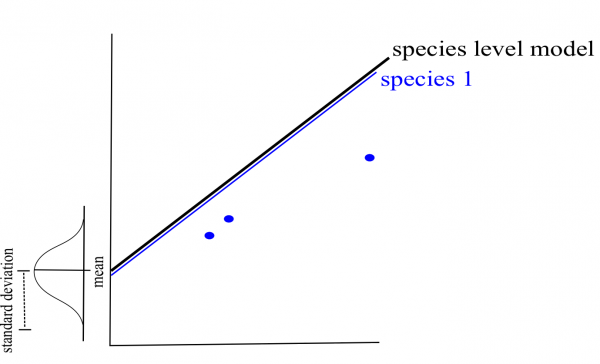

# Fixed vs. random effects 

We frequently encounter the terms 'fixed' and 'random' effects in the LMM literature.

There are also many possible definitions, and we chose to present those we think are easier to apply when doing your analyses.

## Fixed effects: deterministic processes 

Data comes from: 

- all possible levels of a factor (**qualitative variable**)
- a predictor (**quantitative variable**)

We wish to make conclusions about the levels of the factor or about the relationship between the response variable and the predictor.

**Example:** If you are comparing mercury concentration in fish from three different habitats. Habitat has a fixed effect as we sampled in each 3 habitats and we are interested in making conclusions about these specific habitats.

## Random effects: stochastic processes 

Variables with a random effect are also called random factors, as they are only **qualitative variables** (categorical, not continuous). 

A random effect is observed when the data only includes a random sample of the factor's many possible levels, which are all of interest. 

They usually are grouping factors for which you want to control the effect in your model, but are not interested in their specific effect on the response variable. Therefore they enable us to structure the error process.

**Example:** If you are studying mercury contamination in fish in Ugandan crater lakes. For logistical reasons, you can't sample all the crater lakes, so you sample only 8 of them. However, fish from a given lake might have some sort of correlation between themselves (auto-correlation) since they experience the same environmental conditions. Even though you're not interested in the effect of each lake specifically, you should account for this potential correlation with a random factor (crater lake) in order to make conclusions about crater lakes in general.

# How do LMMs work?

## Parameters are varied

In linear mixed models, intercepts and/or slopes are allowed to vary according to a given factor (random effect; e.g. by lake and/or species).

Allowing intercepts and/or slopes to vary by random effects means that you assume they come from a normal distribution. A mean and standard deviation of that distribution are estimated based on your data. The most likely intercepts and slopes from that distribution are then fit by optimization (ex. maximum likelihood or restricted maximum likelihood).

### Intercepts: {-}

If we consider species as a random effect first, we can estimate a mean and standard deviation for the combined distribution of species intercepts rather than separate intercepts for each species. The mean of this distribution is the 'species level model'. 

In this example, we only have three species. In general, the more levels you have for a given factor, the more accurately the parameters of the distribution can be estimated (three may be a little low for estimating a mean and standard deviation but it makes simpler graphs!). *Note that when you implement LMM's in `R`, the intercept in the summary is the species level intercept (i.e. the mean of all random intercepts).*

Likewise, if we consider lake as a random effect then only mean and standard deviation of the combined lake intercept are estimated. This saves you the need to estimate 6 different lake intercept parameters, ultimately saving degrees of freedom as less parameter estimates are needed given the amount of data.

### Slopes: {-}

The same concept is used for allowing slope to vary by a given factor (random effect). This is a little harder to visualize than the intercepts. 

In the case of species, the mean and standard deviation of slope parameters are estimated instead of three separate slopes. *Note that when you implement LMM's in `R`, the slope in the summary is the species level slope.*

## Data structure is taken into account

In linear mixed models, intercepts, slopes and their confidence intervals are adjusted to take the data structure into account.

**What happens if the sample size for a specific factor level is small?** (e.g. low $n$ for a specific species)

If a certain species or lake is poorly represented in the data, the model will give more weight to the pooled model to estimate the intercept and/or slope of that species or lake (i.e. shrinkage).

**Ideally, you should have a minimum of $n$ = 3 for any specific factor level.**

**How do we assess the impact of a random effect on the model?**

The confidence intervals for the **general** intercepts and slopes are adjusted to account for pseudoreplication based on the **intraclass correlation coefficient (ICC)**

The ICC is calculated as the **ratio** of variance between the random effect and the total variance. Thus, the ICC describes the proportion of variance in the response variable that is attributed to a specific random effect:

$$ICC = \frac{\sigma_{\alpha}^2}{\sigma_{\alpha}^2 + \sigma_{\varepsilon}^2}$$
*Note: The specific mathematical notation may vary according to the article/book and according to how the model equation was written.*

In our fish example, the ICC informs us of the **extent** to which the average trophic position (i.e. intercepts) **varies** among species or lakes.

<ins> High ICC </ins>

The % of variance (ICC) is high because **species differ strongly** in their average trophic position.

The confidence intervals for the general intercept and slope are high.

<ins> Low ICC </ins>

The % of variance (ICC) is low because **species differ poorly** in their average trophic position.

The confidence intervals for the general intercept and slope are small.

## Challenge 2

For your second challenge, think about these two questions. How will the ICC and confidence intervals be affected in these two scenarios:

- **1.** Fish trophic positions are not variable among lakes?
- **2.** Fish trophic positions are similar within lakes but variable among lakes?

---

#### **Challenge 2 Solution:** {-}

- **1.** Low ICC, smaller confidence intervals
- **2.** High ICC, larger confidence intervals
