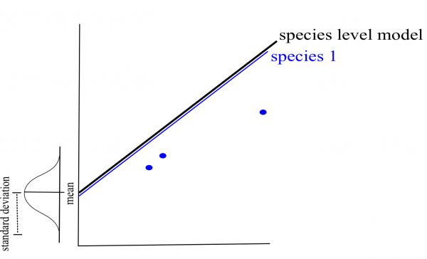
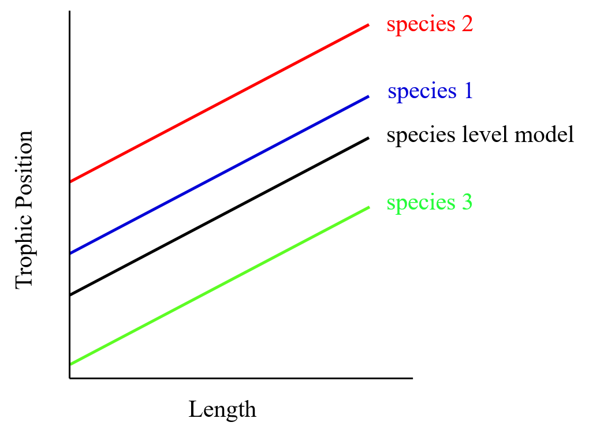

# Effets fixes vs effets aléatoires

Il y a un débat dans la littérature sur la définition des effets fixes et aléatoires. Il existe plusieurs définitions possibles des effets fixes et aléatoires et nous vous présenterons ici celles que nous trouvons plus faciles à appliquer.

## Effet fixe: processus déterministes 

Quand une variable a un effet fixe, les données proviennent: 

- de tous les niveaux possibles d'un facteur (**variable qualitative**) 
- d'un prédicteur (**variable quantitative**)

On souhaite émettre des conclusions à propos des niveaux du facteur ou de la relation entre le prédicteur et la variable réponse.

**Exemple d'un effet fixe:** comparer la concentration de mercure dans les poissons de trois habitats différents. L'habitat est un effet fixe (les trois ont été échantillonnés) et nous sommes intéressés à tirer des conclusions sur les effets de ces trois habitats spécifiques.

## Effet aléatoire: processus stochastiques

Les variables avec un effet aléatoire sont également appelées facteurs aléatoires, car il s'agit uniquement de **variables qualitatives** (catégoriques, non continues). 

Un effet aléatoire est observé lorsque les données ne comprennent qu'un échantillon aléatoire des nombreux niveaux possibles du facteur, qui présentent tous un intérêt. 

Il s'agit généralement de facteurs de regroupement dont vous souhaitez contrôler l'effet dans votre modèle, mais dont l'effet spécifique sur la variable de réponse ne vous intéresse pas. Ils nous permettent donc de structurer le processus d'erreur.

**Exemple d'un effet aléatoire:** une étude de la contamination du mercure dans les poissons de lacs de cratères ougandais. Pour des raisons logistiques, vous ne pouvez pas échantillonner tous les lacs de cratères, donc vous échantillonnez seulement huit d'entre eux. Cependant, les poissons d'un lac donné pourrait avoir une sorte de corrélation entre eux (pseudo-corrélation), car ils sont soumis aux mêmes conditions environnementales. Même si vous n'êtes pas intéressé par l'effet de chaque lac spécifiquement, vous devez tenir compte de cette corrélation potentielle avec un facteur aléatoire (lac de cratère) afin de tirer des conclusions sur les lacs de cratères en général.

# Comment fonctionnent les MLMs?

## Les paramètres peuvent varier

Dans les modèles linéaires mixtes, les ordonnées à l'origine et/ou les pentes peuvent varier en fonction d'un facteur donné (effet aléatoire ; par exemple, par lac et/ou par espèce).

Permettre aux ordonnées à l'origine et/ou pentes de varier selon certains facteurs (effets aléatoires) signifie simplement que vous supposez qu'ils proviennent d'une distribution normale. La moyenne et l'écart-type de cette distribution sont évalués en fonction de vos données. Les ordonnées à l'origine et pentes les plus probables de cette distribution sont ensuite ajustées par optimisation (ex. maximum de vraisemblance ou maximum de vraisemblance restreint).

### Ordonnée à l'origine: {-}

Si nous considérons d'abord l'espèce comme un effet aléatoire, nous pouvons estimer une moyenne et un écart-type pour la distribution combinée des ordonnées à l'origine des espèces plutôt que des ordonnées à l'origine séparées pour chaque espèce. La moyenne de cette distribution est le "modèle au niveau de l'espèce". 

Dans cet exemple, nous n'avons que trois espèces. En général, plus vous avez de niveaux pour un facteur donné, plus les paramètres de la distribution peuvent être estimés avec précision (trois peut être un peu faible pour l'estimation d'une moyenne et d'un écart type, mais cela permet d'obtenir des graphiques plus simples !) *Notez que lorsque vous implémentez des LMM dans `R`, l'intercept dans le résumé est l'intercept du niveau de l'espèce (c'est-à-dire la moyenne de tous les ordonnées à l'origine aléatoires).*

De même, si nous considérons le lac comme un effet aléatoire, seules la moyenne et la déviation standard de l'ordonnée à l'origine combinée du lac sont estimées. Cela vous évite d'avoir à estimer 6 paramètres différents de l'ordonnée à l'origine du lac, ce qui vous permet de gagner des degrés de liberté puisque moins d'estimations de paramètres sont nécessaires compte tenu de la quantité de données.

### Pentes {-}

Le même concept est utilisé pour faire varier la pente d'un facteur donné (effet aléatoire). Ceci est un peu plus difficile à visualiser que les ordonnées à l'origine. 

Comme dans le cas des espèces, la moyenne et l'écart type des paramètres de pente sont estimés au lieu de trois pentes distinctes. *Notez que lorsque vous implémentez les LMM dans `R`, la pente dans le résumé est la pente au niveau de l'espèce.*

## Tenir compte de la structure des données

Dans les modèles mixtes linéaires, les ordonnées à l'origine, pentes, et intervalles de confiance associés sont ajustés pour tenir compte de la structure des données.

**Qu'arrive-t-il si j'ai peu d'échantillons (faible $n$) pour un niveau des facteurs?** (Par exemple, si on a un faible $n$ pour une espèce...)

Si une espèce ou un lac est peu représenté dans les données, le modèle va accorder plus d'importance au modèle groupé pour estimer l'ordonnée à l'origine et la pente de cette espèce ou de ce lac (Processus de « shrinkage »). Nous avons un design équilibré ici, donc ce n'est pas le cas dans notre exemple.

**Idéalement, on devrait toujours avoir un minimum de $n$ = 3 par niveau d'un facteur.**

**Comment évaluer l'impact d'un effet aléatoire sur le modèle?**

Les intervalles de confiance des ordonnées à l'origine et des pentes **générales** sont ajustés pour tenir compte de la pseudo-replication basée sur le **coefficient de corrélation intra-classe (CIC)**.

Le CIC correspond au **ratio** entre la variance d'un effet aléatoire (e.g. ordonnées à l'origine des espèces) et la variance totale. Ainsi, l'ICC décrit la proportion de la variance de la variable de réponse qui est attribuée à un effet aléatoire spécifique:

$$ICC = \frac{\sigma_{\alpha}^2}{\sigma_{\alpha}^2 + \sigma_{\varepsilon}^2}$$
*Notez: La notation mathématique spécifique peut varier selon l'article/livre et selon la façon dont l'équation du modèle a été écrite.*

Dans notre exemple, le CIC nous informe donc **à quel point** la position trophique moyenne entre chaque espèce ou chaque lac (c'est-à-dire les ordonnées à l'origine) **varie**.

<ins> CIC élevé </ins>

Le ratio de variance (CIC) est élevé puisque **les espèces diffèrent grandement** dans leur position trophique moyenne.

Les intervalles de confiance pour la pente et l'ordonnée à l'origine générale sont donc grandes.

<ins> CIC faible </ins>

Le ratio de variance (CIC) est faible car **les espèces diffèrent faiblement** dans leur position trophique moyenne.

Les intervalles de confiance pour la pente et l'ordonnée à l'origine générale sont donc petits.

## Défi 2

Pour votre deuxième défi, réfléchissez à ces deux questions. Comment le CIC et les intervalles de confiance seront-ils affectés dans ces deux scénarios:

**1.** Si les positions trophiques des poissons ne varient pas entre les lacs?

**2.** Si les positions trophiques des poissons sont similaires dans chaque lac, mais différentes entre les lacs?

---

#### **Défi 2 Solution:** {-}

- **1.** CIC serait faible et les intervalles de confiance seraient plus petits
- **2.** CIC serait élevé et les intervalles de confiance seraient plus larges
