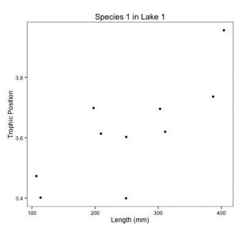

# Comment pourrions-nous analyser ces données?

## Nombreuses analyses séparées

Une façon d'analyser ces données est de faire une analyse séparée pour
chaque espèce et chaque lac. Voici le graphique de la position trophique
en fonction de la taille pour l'espèces 1 dans le lac 1 :

{width="400"}

Remarquez que vous devez estimer une ordonnée à l'origine et une pente
pour chaque régression (2 paramètres x 3 espèces X 6 lacs = 36
paramètres estimés) et la taille d'échantillon pour chaque analyse est
de 10. Il y a peu de chances de détecter un effet à cause de la faible
taille d'échantillon et un taux d'erreur augmenté en raison de
comparaisons multiples.

## Une analyse groupée

Une autre façon d'analyser ces données est de faire une seule analyse
en ignorant les variables espèce et lac. Encore une fois, voici le
graphique de toutes les données :

{width="400"}

Notez que vous avez maintenant une énorme taille d'échantillon et
beaucoup moins de paramètres à estimer. Mais qu'en est-il de la
pseudoréplication? Les poissons d'un même lac et d'une même espèce
sont plus similaires entre-eux que les poissons de lacs et d'espèces
différentes. De plus, regardez tout ce bruit dans les données ! Une
partie doit être due aux effets de l'espèce et du lac.

Pour notre question, on veut seulement savoir s'il y a un effet général
de la longueur corporelle sur la position trophique. On ne cherche pas
directement à savoir si cet effet pourrait varier faiblement par espèce
en raison de processus biologiques que nous n'avons pas mesurés ou parmi
les lacs en raison de variables environnementales non mesurées. Nous
voulons simplement prendre en compte cette variation dans le modèle
(parfois désignée effets aléatoires).

## Construire un MLM

Les MLMs sont un compromis entre séparer et regrouper. Ils:

    - Estiment une pente et une ordonnée à l'origine pour chaque espèce et chaque lac (séparer), mais en calculant moins de paramètres
    qu'une régression classique.  
    - Utilisent toutes les données disponibles (regrouper) tout en contrôlant les différences entre les lacs et les espèces (pseudo-réplication).

# Effets fixes et aléatoires

Il y a un débat dans la littérature sur la définition des effets fixes
et aléatoires. Il existe plusieurs définitions possibles des effets
fixes et aléatoires et nous vous présenterons aujourd'hui celles que
nous trouvons plus faciles à appliquer.

## Effet fixe

Quand une variable a un effet fixe, les données proviennent de tous les
niveaux possibles d'un facteur (variable qualitative). On souhaite
émettre des conclusions à propos des niveaux du facteur d'où les
données proviennent.

Exemple d'un effet fixe : comparer la concentration de mercure dans les
poissons de trois habitats différents. L'habitat est un effet fixe (les
trois ont été échantillonnés) et nous sommes intéressés à tirer des
conclusions sur les effets de ces trois habitats spécifiques.

## Effet aléatoire

Les variables avec un effet aléatoire sont également appelées facteurs
aléatoires, car elles sont seulement qualitatives (pas de variable
continue). Un effet aléatoire est observé lorsque les données incluent
seulement un échantillon aléatoire de tous les niveaux possibles du
facteur, qui sont tous d'intérêt. Ils correspondent souvent à des
facteurs de regroupement pour lesquels vous souhaitez contrôler l'effet
dans votre modèle; vous ne vous intéressez pas à leur effet spécifique
sur la variable de réponse.

Exemple d'un effet aléatoire: une étude de la contamination du mercure
dans les poissons de lacs de cratères ougandais. Pour des raisons
logistiques, vous ne pouvez pas échantillonner tous les lacs de
cratères, donc vous échantillonnez seulement huit d'entre eux.
Cependant, les poissons d'un lac donné pourrait avoir une sorte de
corrélation entre eux (pseudo-corrélation), car ils sont soumis aux
mêmes conditions environnementales. Même si vous n'êtes pas intéressé
par l'effet de chaque lac spécifiquement, vous devez tenir compte de
cette corrélation potentielle avec un facteur aléatoire (lac de cratère)
afin de tirer des conclusions sur les lacs de cratères en général.

# Comment fonctionnent les MLMs?

## Permettre aux intercepts et/ou pentes de varier selon le lac et l'espèce

Permettre aux intercepts et/ou pentes de varier selon certains facteurs
(effets aléatoires) signifie simplement que vous supposez qu'ils
proviennent d'une distribution normale. La moyenne et l'écart-type de
cette distribution sont évalués en fonction de vos données. Les
intercepts et pentes les plus probables de cette distribution sont
ensuite ajustées par optimisation (ex. maximum de vraisemblance ou
maximum de vraisemblance restreint).

**Intercepts**

Dans le cas d'espèces, seulement la moyenne et l'écart-type de la
distribution d'intercepts sont estimés au lieu de trois intercepts pour
chaque espèce. La moyenne de cette distribution est le «modèle au niveau
de l'espèce». Dans cet exemple, nous n'avons que trois espèces. En
général, plus votre facteur comporte de niveaux, plus la moyenne et
l'écart-type de la distribution normale seront estimés précisément.
Trois niveaux c'est un peu faible, mais plus facile à visualiser!
Lorsque vous implémenterez un MLM dans R, notez que l'intercept dans le
résumé est l'intercept au niveau des espèces (c.-à-d. la moyenne de
tous les intercepts aléatoires).

{width="600"}

C'est la même chose pour les lacs : seuls la moyenne et l'écart-type
des intercepts des lacs sont estimés au lieu de six intercepts pour
chaque lac. Cela économise des degrés de liberté (moins d'estimation de
paramètres sont nécessaires).

{width="600"}

**Pentes**

Le même concept s'applique aux pentes qui varient par un facteur donné
(effet aléatoire). C'est juste plus difficile à visualiser. Comme dans
le cas des espèces, seuls la moyenne et l'écart-type des pentes sont
estimés au lieu de trois pentes distinctes. Encore une fois, quand vous
implémenterez votre MLM dans R, la pente dans le résumé sera la pente au
niveau des espèces.

{width="600"}

## Les intercepts, pentes, et intervalles de confiance associés sont ajustés pour tenir compte de la structure des données

Si une certaine espèce ou un lac est peu représenté (faible échantillon)
dans les données (nous avons un design équilibré ici, donc ce n'est pas
le cas dans notre exemple), le modèle va accorder plus d'importance au
modèle groupé pour estimer l'ordonnée à l'origine et la pente de cette
espèce ou de ce lac.

{width="600"}

Les intervalles de confiance des intercepts et pentes sont ajustés pour
tenir compte de la pseudo-réplication basée sur \*\* le coefficient de
corrélation intra-classe (CIC) \*\* - Combien de variation y a-t-il dans
chaque groupe versus entre les groupes ? Ceci détermine votre \*\*
taille effective de l'échantillon\*\* - Une taille d'échantillon
ajustée en fonction de la façon dont les données sont corrélées à
l'intérieur des groupes.

**CIC élevé**

{width="400"}

Dans ce scénario, le MLM traitera les points provenant du même lac plus
comme une moyenne globale, car ils sont fortement corrélés. Par
conséquent, la taille effective de l'échantillon sera plus petite, ce
qui entraînera des intervalles de confiance plus grands pour la pente et
l'intercept.

**CIC faible**

{width="400"}

Dans ce scénario, le MLM traitera les points parvenant du même lac plus
indépendamment parce qu'ils sont moins corrélés au sein du groupe que
parmi les groupes. Par conséquent, la taille de l'échantillon sera plus
grande, ce qui entraînera des intervalles de confiance plus petits pour
la pente et l'intercept.

------------------------------------------------------------------------

**DÉFI 2**

Pour votre deuxième défi, répondez aux deux questions suivantes avec vos
voisins. Comment le CIC et son intervalle de confiance seront affectés
dans ces deux scénarios?

    -Les positions trophiques des poissons ne varient pas entre les lacs?
    -Les positions trophiques des poissons sont similaires dans les lacs mais différentes entre les lacs?

++++ Réponse défi 2 \|

    -CIC faible - intervalles de confiance plus petits
    -CIC élevé - intervalles de confiance plus larges

++++
