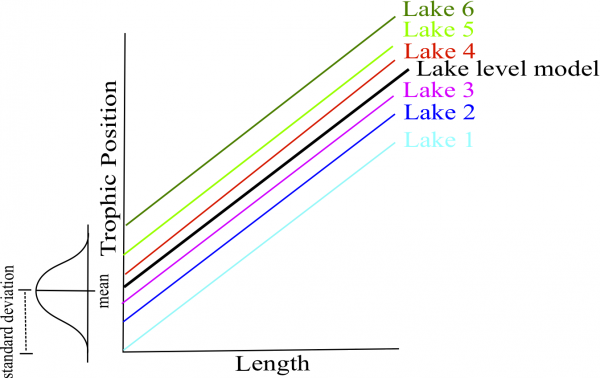
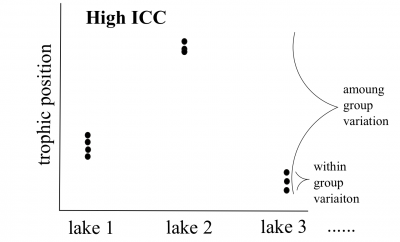
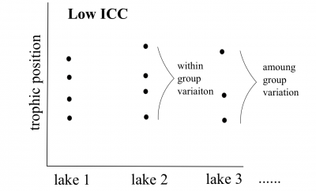
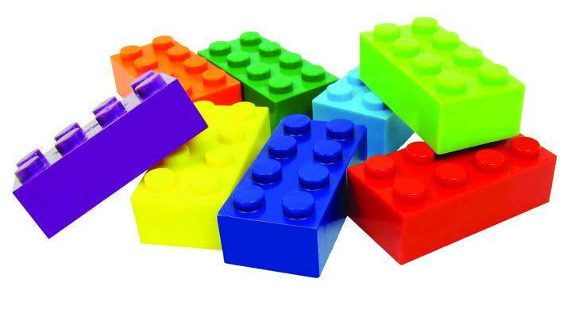
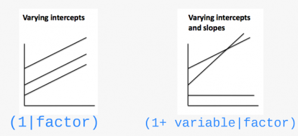
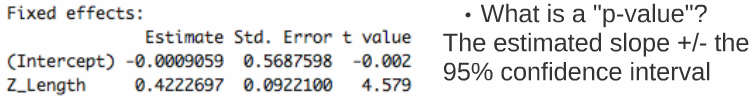

```{r setup, echo = FALSE}
knitr::opts_chunk$set(
  comment = "#",
  collapse = TRUE,
  warning = FALSE,
  message = FALSE,
  cache = TRUE,
  fig.width = 6, fig.height = 6,
  fig.retina = 3,
  fig.align = 'center'
)

options(repos = structure(c(CRAN="http://cran.r-project.org")))

mypar = list(mar = c(3,3,1,0.5), mgp = c(1.6, 0.3, 0), tck = -.02)
```

class: inverse, center, middle

```{r install_pkgs, message=FALSE, warning=FALSE, include=FALSE, results=0}
# Standard procedure to check and install packages and their dependencies, if needed.

list.of.packages <- c("ggplot2", 
                      "lme4", 
                      "MuMIn", 
                      "MASS", 
                      "vcdExtra", 
                      "bbmle", 
                      "DescTools")

new.packages <- list.of.packages[!(list.of.packages %in% installed.packages()[,"Package"])]

if(length(new.packages) > 0) {
  install.packages(new.packages, dependencies = TRUE) 
  print(paste0("The following package was installed:", new.packages)) 
} else if(length(new.packages) == 0) {
    print("All packages were already installed previously")
  }

# Load all required libraries at once
lapply(list.of.packages, require, character.only = TRUE, quietly = TRUE)
```

# About this workshop

[](https://github.com/QCBSRworkshops/workshop07)
[](https://wiki.qcbs.ca/r_workshop7)
[](https://qcbsrworkshops.github.io/workshop07/workshop07-en/workshop07-en.html)
[](https://qcbsrworkshops.github.io/workshop07/workshop07-en/workshop07-en.pdf)
[](https://qcbsrworkshops.github.io/workshop07/workshop07-en/workshop07-en.R)

---

# Required packages

* [ggplot2](https://cran.r-project.org/package=ggplot2)
* [lme4](https://cran.r-project.org/package=lme4)
* [MuMIn](https://cran.r-project.org/package=MuMIn)
* [MASS](https://cran.r-project.org/package=MASS)
* [vcdExtra](https://cran.r-project.org/package=vcdExtra)
* [bbmle](https://cran.r-project.org/package=bbmle)
* [DescTools](https://cran.r-project.org/package=DescTools)

<br>
To install them from CRAN, do:

```{r eval = FALSE}
install.packages(c("ggplot2", 
                   "lme4", 
                   "MuMIn", 
                   'MASS', 
                   'vcdExtra', 
                   'bbmle', 
                   'DescTools'))
```

---

# Learning objectives

1. Describe what are mixed effects models;

2. Identify situations in which the use of mixed effects is appropriate;

3. Implement basic linear mixed models (LMM) in `R`;

4. Execute basic generalized linear mixed models (GLMM) in `R`;

5. Validade, interprete and visualized mixed models in `R`.

---
## 1. Why choose mixed models?

Ecological and biological data can be complex!

* Inherent structure to data

* Many covariates and grouping factors

* Small sample size

---

## 1. Why choose mixed models?

Introduction to the example dataset

.center[  ]

.comment[**Q: Does fish trophic position increase with fish size for all three fish species?**
]


---
## 1. Why choose mixed models?

<br>

Throughout this workshop, there will be a series of **challenges** that you can recognize by this rubix cube

.center[

]

<br>

**During these challenges, collaborate with your neighbors!**


---
## Challenge 1 

* Introduction to the example dataset

* Open the workshop script in `R`

* Reproduce the plots 1 to 3 from the script. Observe the plots and try to get a sense of what you see.

---
## Solution 

<br>

```{r, echo = FALSE}
library(ggplot2)
fish.data <- read.csv('data/qcbs_w7_data.csv', stringsAsFactors = TRUE)

# simple theme
fig <- theme_bw() + theme(panel.grid.minor=element_blank(), panel.grid.major=element_blank(), panel.background=element_blank()) +
  theme(strip.background=element_blank(), strip.text.y = element_text()) + theme(legend.background=element_blank()) +
  theme(legend.key=element_blank()) + theme(panel.border = element_rect(colour="black", fill=NA))

plot <- ggplot(aes(Fish_Length,Trophic_Pos),data = fish.data)

# Plot 1 - All data
plot + geom_point() + xlab("Length (mm)") + ylab("Trophic Position") + labs(title="All Data") + fig
```


---
## Solution 

<br>

```{r, echo=FALSE}
# Plot 2 - By species
plot + geom_point() + facet_wrap(~ Fish_Species) + xlab("Length (mm)") + ylab("Trophic Position") +
   labs(title="By Species") + fig
```

---
## Solution 

<br>

```{r, echo= FALSE}
# Plot 3 – By lake
plot + geom_point() + facet_wrap(~ Lake) + xlab("Length (mm)") + ylab("Trophic Position") +
   labs(title="By Lake") + fig
```


---
## 1. Why choose mixed models?

**Group discussion**

* Do you expect all species to increase in trophic position with length?

  * In the exact same way?

<br>

--

*Do you expect these relationships to be the same across lakes?

  * What might differ?


---
## 1. Why choose mixed models?

How might we analyze these data?

<br>

You can:

<br>

**Option 1. Separate**:

- Run separate analyses for each species in each lake

**Option 2. Lump**:

- Run one analysis ignoring lake and species

---
## 1. Why choose mixed models?

.pull-left[ ]

.pull-right[
**Option 1. Separate**
* Estimate 6 intercepts and 6 slopes for each species (i.e. 6 lakes)

* Sample size *n* = 10 for each analysis (i.e. 10 fish/species/lake)

* Low chance of detecting an effect due to small *n*
]

---
## 1. Why choose mixed models?

.pull-left[]

.pull-right[
**Option 2. Lump**
* Big sample size!

* What about pseudoreplication? (fish within a lake and within a species might be correlated).

* A lot of noise in the data! Some of it might be due to difference among species and lake...
]

---
## 1. Why choose mixed models?


* For our question, we only want to know if there is a .alert[general effect of length on the trophic position]

* this relationship might differ slightly among species due to unmeasured biological processes (e.g. growth rate) or among lakes due to unmeasured environmental variables. But don't really care about these unmeasured factors we just want to control for them.


---
## 1. Why choose mixed models?

LMM are a balance between separating and lumping. They:

1. Estimate slope and intercept parameters for each species and lake (separating) but estimate fewer parameters than classical regression.

2. Use all the data available (lumping) while accounting for pseudoreplication and controlling for differences among lakes and species.


---
## 1. Why choose mixed models?

**Fixed vs Random Effects**

In the literature on LMM, we will meet those terms frequently.

There are many possible way to introduce them and we chose to present those we think are easier to apply when doing your analyses.

---
## 1. Why choose mixed models?

### Fixed effect

* Data comes from all possible levels of a factor (qualitative variable)

* We wish to make conclusions about the levels of the factor from which the data come from

---
## 1. Why choose mixed models?

### Random effect

* Only qualitative variables = random factor

* Data includes only a random sample of all possible factor levels, all of interest

* Often grouping factors

---
## 1. Why choose mixed models?

**How do LMMs work?**

**A.** Intercepts and/or slopes are allowed to vary according to a given factor (**effet aléatoire**), e.g. by lake and/or species.

**B.** Intercepts, slopes and their confidence interval are adjusted to **take into account the data structure**

---
## Random intercept

<br>

<p>


It is assumed that the intercepts come from a normal distribution

Only need to estimate the mean and standard deviation of the normal distribution instead of 3 intercepts, i.e. one for each species</p>

<br>

.comment[Note that the more levels your factor has, the more accurately the mean and standard deviation of the normal distribution will be estimated. Three levels may be a little low, but easier to visualize!]

---
## Random intercept

<br>

<p>

Same principle for lakes

Estimate 2 parameters (mean and standard deviation) instead of 6 intercepts.

This saves degrees of freedom (less parameter estimation is needed)
</p>


---
## Random slope


<br>

<p>

The same principle applies to slopes that vary according to a given factor, just more difficult to visualize

As for intercepts, only the mean and standard deviation of the slopes are estimated instead of three distinct slopes.
</p>

---
## Taking into account the data structure

If a certain species or lake is poorly represented (low *n*) in the data, the model will give more weight to the pooled model to estimate the intercept and slope of that species or lake.

.center[ ]

---
## Taking into account the data structure

* The confidence intervals for the intercepts and slopes are adjusted to take account of the pseudo-replication-based on the **intraclass correlation coefficient (ICC)**


* How much variation is there in each VS group between groups?


---
## Taking into account the data structure


.pull-left[
**High ICC**



the points coming from the same lake are treated as a single observation because they are very correlated

 small effective sample size and large confidence intervals for slope and intercept.
]

.pull-right[
**Low ICC**



the points coming from the same lake are treated independently because little correlated

 large effective sample size and small confidence intervals for slope and intercept.
]

---
# Challenge 2 

<br>

How will the ICC and the confidence intervals be affected in these two scenarios?

**Q1.** Fish trophic positions do not vary among lakes

<br>

**Q2.** Fish trophic positions are similar within lakes but different among lakes

---
# Solution 

**Q1.** Fish trophic positions do not vary among lakes

.alert[A1. Low ICC, small confidence intervals]

<br>

--

**Q2.** Fish trophic positions are similar within lakes but different among lakes

.alert[A2. High ICC, large confidence intervals]

---
# How to implement mixed models in R?



###### **Step 1:** *A priori* model building and data exploration

<br>

**Step 2:** Code potential models and model selection

<br>

**Step 3:** Model validation

<br>

**Step 4:** Model interpretation and visualization

---
# Step 1: *A priori* model building

**What we know *a priori*:**

* We want to determine if the trophic position can be predicted by body length, while taking into account the variation between species and lakes

* So we want a model that looks like this:

$$PT_{ijk} \sim Length_i + Lake_j + Species_k + \epsilon_{ijk}$$

---
# Step 1: Data exploration

**Does the data have the right structure?**

```{r}
fish.data <- read.csv('data/qcbs_w7_data.csv')
str(fish.data)
```

It is recommended to clean up your working space (`rm.list()`) before building a model.

---
# Step 1: Data exploration

**Look at the distribution of samples for each factor:**

```{r}
table(fish.data[ , c("Lake", "Fish_Species")])
```

This dataset is perfectly balanced, but **mixed models can be used to analyze unbalanced experimental plans**, as it is often the case in ecology!

---
# Step 1: Data exploration

**Look at the distribution of continuous variables:**

```{r, fig.width=10, fig.height=4}
par(mfrow = c(1, 2), mar = c(4, 4, 1, 1))
hist(fish.data$Fish_Length, xlab = "Length (mm)", main = "")
hist(fish.data$Trophic_Pos, xlab = "Trophic position", main = "")
```

Major deviations could cause heteroscedasticity problems. If necessary, make transformations. In this case, **the data seems OK**.

---
# Step 1: Data exploration

**Check for collinearity between your explanatory variables**

The problem with collinear predictors is simply that they explain the same thing, so their effect on the response variable will be confounded in the model.

In this example, there is no risk of collinearity with only one continuous variable. If you had another continuous variable (`Var2`), one simple way to check for collinearity is:

```{r, eval = FALSE}
plot(fish.data)

cor(var1, var2)
```

---
# Challenge 3 

What additional measures could we have taken in the field that could have been strongly correlated with body length?

--

> An example is fish body mass - this variable is strongly correlated with fish length. Therefore, we do not want to include these two variables in the same model.


---
# Step 1: Data exploration

**Consider the scale of your data**

* If two variables in the same model have very different scales, the mixed model will likely returns a `convergence error` when trying to compute the parameters.

* The <a href="https://fr.wikipedia.org/wiki/Cote_Z_(statistiques)">Z-correction</a> standardizes the variables and solve this problem (function `scale()` in `R`):

$$z = \frac{x-mean(x)}{standard.deviation(x)}$$
---
# Step 1: Data exploration

**Consider the scale of your data**

* Body length  Long scale

* Trophic position  Short scale

---
# Step 1: Data exploration

**Consider the scale of your data**

Because our data have very different scales of variation, we apply the **Z-correction**

```{r}
# Standardized length, "by hand"
fish.data$Z_Length <- (fish.data$Fish_Length - mean(fish.data$Fish_Length)) / 
                      sd(fish.data$Fish_Length)

# Standardized trophic position, with the function scale
fish.data$Z_TP     <- scale(fish.data$Trophic_Pos)

```

---
# Step 1: Data exploration

To find out if a mixed model is needed for your data, you need to determine whether it is important to consider the random effects that might influence the relationship you are interested in (in our case, lake and species)

We can do it by:

1. Creating a linear model without random effect

2. Calculating the residuals of this linear model

3. Plot the residuals against the levels of the potential random factors

---
# Step 1: Data exploration

Create a linear model without random effects
```{r}
lm.test <- lm(Z_TP ~ Z_Length, data = fish.data)
```

Calculate residuals of this linear model
```{r}
lm.test.resid <- rstandard(lm.test)
```

---
# Step 1: Data exploration

Plot the residuals against the levels of the potential random factors

```{r, fig.width=10, fig.height=5, eval = FALSE}
par(mfrow=c(1,2))

plot(lm.test.resid ~ as.factor(fish.data$Fish_Species),
     xlab = "Species", ylab = "Standardized residuals")

abline(0, 0, lty = 2)

plot(lm.test.resid ~ as.factor(fish.data$Lake),
     xlab = "Lake", ylab = "Standardized residuals")

abline(0, 0, lty = 2)
```

---
# Step 1: Data exploration

Plot the residuals against the levels of the potential random factors

```{r, fig.width=10, fig.height=5, echo = FALSE}
par(mfrow = c(1, 2), mar = c(4, 4, 1, 1))
plot(lm.test.resid ~ as.factor(fish.data$Fish_Species),
     xlab = "Species", ylab = "Standardized residuals")
abline(0, 0, lty = 2)
plot(lm.test.resid ~ as.factor(fish.data$Lake),
     xlab = "Lake", ylab = "Standardized residuals")
abline(0, 0, lty = 2)
```

.alert[These patterns suggest that there is residual variance that could be explained by these factors, so they should be included in the model.]

---
# How to implement an LMM in R?


**Step 1:** *A priori* model building and data exploration

<br>

###### **Step 2:** Code potential models and model selection

<br>

**Step 3:** Model validation

<br>

**Step 4:** Model interpretation and visualization

---
# Step 2: Code potential models

**Translate this model...**

$$PT_{ijk} \sim Length_i + Lake_j + Species_k + \epsilon_{ijk}$$

**... in R code**

```{r, include = FALSE}
library(lme4)
```

```{r, eval = FALSE}
library(lme4)
lmer(Z_TP ~ Z_Length + (1 | Lake) + (1 | Fish_Species),
     data = fish.data, REML = TRUE)
```

--

* `lmer` "linear mixed model" function from `lme4` package
* `(1 | Lake)`  indicate varying intercepts among lakes
* `REML = TRUE`  estimation method

---
# Note on estimation methods

REML (*Restricted Maximum Likelihood*) is the default method in `lmer` (see `?lmer`).

The *Maximum Likelihood* (ML) method underestimate model variances by a factor of $(n-k)/n$, where $k$ is the number of fixed effects. 

The REML method corrects for this bias.

See this [article](https://towardsdatascience.com/maximum-likelihood-ml-vs-reml-78cf79bef2cf) for more information on the difference between ML and REML. 

---
# Note on estimation methods

Remember that you should use: 

* **REML** to compare models with **nested random effects** and the same fixed effect structure

* **ML** to compare models with **nested fixed effects** and the same random effect structure

* **ML** to compare models **with and without random effects**

---
# Step 2: Code potential models

**What if we want the slopes to vary?**

.center[

]

---
# Step 2: Code potential models

- `(1 | Lake)` random effect by lake at the intrecept
- `(1 + Z_Length | Lake)` random effect by lake at the intercept and slope in response to the body length (NB: (`Z_Length | Lake)` gives the same random structure)
- `(-1 + Z_Length | Lake)` to have only the random effect at the slope
- `(1 | Lake) + (1 | Species)`  for crossed random effects
- `(1 | Lake:Fish_Species)` for the interaction between 2 random effects

- If your dataset includes nested random effects, you could use `/` to specify them, e.g. `(1 | factor1 / factor2)` if `factor2` is nested in `factor1` ([see ](https://stats.stackexchange.com/questions/228800/crossed-vs-nested-random-effects-how-do-they-differ-and-how-are-they-specified))

---
# Challenge 4 

Re-write the following code so that the **slopes** of the relationship between trophic position and body length **vary by lake and species**:

```{r}
lmer(Z_TP ~ Z_Length + (1 | Lake) + (1 | Fish_Species),
     data = fish.data, REML = TRUE)
```

---
# Solution 

```{r}
lmer(Z_TP ~ Z_Length + (1 + Z_Length | Lake) + (1 + Z_Length | Fish_Species),
     data = fish.data, REML = TRUE)
```


---
# Step 2: Model selection

* To determine if you have built the best mixed model based on your prior knowledge, you should compare this *a priori* model to other alternative models.

* With the dataset you are working on, there are several alternative models that might better fit your data.

---
# Challenge 5 

Make a list of 7 alternative models that could be compared to this one:

```{r, eval= FALSE}
lmer(Z_TP ~ Z_Length + (1 | Lake) + (1 | Fish_Species),
     data = fish.data, REML = TRUE)
```

Note: If we had different fixed effects between the models or a model without random effects, we would have to specify `REML = FALSE` to compare with likelihood methods like AIC.

---
# Solution 

We first will also build the **basic linear model** `lm()` because it is always useful to see the variation in the AICc values.

```{r}
M0 <- lm(Z_TP ~ Z_Length, data = fish.data)
```

However, to compare this model to the LMMs, it is important to .alert[change the estimation method to ML (`REML=FALSE`)] because `lm()` does not use the same estimation method as `lmer()`.

---
# Solution

```{r}
# Linear model with no random effects
M0 <- lm(Z_TP ~ Z_Length, data = fish.data)
# Full model with varying intercepts
M1 <- lmer(Z_TP ~ Z_Length + (1 | Fish_Species) + (1 | Lake), 
           data = fish.data, REML = FALSE)
# Full model with varying intercepts and slopes
M2 <- lmer(Z_TP ~ Z_Length + (1 + Z_Length | Fish_Species) + (1 + Z_Length | Lake),
           data = fish.data, REML = FALSE)
# No Lake, varying intercepts only
M3 <- lmer(Z_TP ~ Z_Length + (1 | Fish_Species), data = fish.data, REML = FALSE)
# No Species, varying intercepts only
M4 <- lmer(Z_TP ~ Z_Length + (1 | Lake), data = fish.data, REML = FALSE)
# No Lake, varying intercepts and slopes
M5 <- lmer(Z_TP ~ Z_Length + (1 + Z_Length | Fish_Species), 
           data = fish.data, REML = FALSE)
# No Species, varying intercepts and slopes
M6 <- lmer(Z_TP ~ Z_Length + (1 + Z_Length | Lake), data = fish.data, REML = FALSE)
# Full model with varying intercepts and slopes only varying by lake
M7 <- lmer(Z_TP ~ Z_Length + (1 | Fish_Species) + (1 + Z_Length | Lake),
           data = fish.data, REML = FALSE)
# Full model with varying intercepts and slopes only varying by species
M8 <- lmer(Z_TP ~ Z_Length + (1 + Z_Length | Fish_Species) + (1 | Lake),
           data = fish.data, REML = FALSE)
```

---
# Solution

 `boundary (singular) fit: see ?isSingular`, see [this discussion ](https://stats.stackexchange.com/questions/378939/dealing-with-singular-fit-in-mixed-models)

---
# Step 2: Model selection

* Now that we have a list of potential models, we want to compare them to each other to select the one(s) with the highest predictive power given the data.

* Models can be compared by using the `AICc` function from the` MuMIn` package.

* The Akaike Information Criterion (AIC) is a **measure of model quality** that can be used to compare models.

* `AICc` corrects for bias created by small sample sizes.

---
# Step 2: Model selection

To find the AICc value of a model, use:

```{r}
library(MuMIn)
MuMIn::AICc(M1)
```

---
# Step 2: Model selection

To group all AICc values into a single table, use:
```{r}
AIC.table  <- MuMIn::model.sel(M0, M1, M2, M3, M4, M5, M6, M7, M8)
(AIC.table <- AIC.table[ , c("df", "logLik", "AICc", "delta")])
```

* `df` is the degree of freedom
* `logLik` is the loglikelihood
* `delta` is the AICc difference with the lowest value

We only displayed part of the results returned by the function `model.sel()`, see `?model.sel` for more information.

---
# Step 2: Model selection

What do these AICc values mean?

```{r}
AIC.table 

```

* The model with the smallest AICc has the highest predictive power.

* Some suggest that if models are within 2 AICc units of each other then they are equally plausible.

* Let's take a closer look at M8 and M2. We can exclude other model because they have such higher AICc.

---
# Step 2: Model selection

```{r}
M8 <- lmer(Z_TP ~ Z_Length + (1 + Z_Length | Fish_Species) + (1 | Lake),
           data = fish.data, REML = TRUE)

M2 <- lmer(Z_TP ~ Z_Length + (1 + Z_Length | Fish_Species) + (1 + Z_Length | Lake),
           data = fish.data, REML = TRUE)

MuMIn::model.sel(M2,M8)[ , c("df", "logLik", "AICc", "delta")]
```

Model `M8` seems to be the best among all models that we tested.

Note that we use now REML (i.e. `REML=TRUE`) as we are comparing two models with nested random effects and the same fixed effect structure.

---
# Step 2: Model selection

What is the structure of the best model?

```{r, eval = FALSE}
M8 <- lmer(Z_TP ~ Z_Length + (1 + Z_Length | Fish_Species) + (1 | Lake),
           data = data, REML = FALSE)
```

Both the intercepts and slopes of the relationship between trophic position and length may vary by fish species, but only the intercepts may vary by lake.

.pull-left[]
.pull-right[]

---
# Step 2: Model selection

Once the best model is selected, the estimation method must be reset to `REML = TRUE`.

```{r}
M8 <- lmer(Z_TP ~ Z_Length + (1 + Z_Length | Fish_Species) + (1 | Lake),
           data = fish.data, REML = TRUE)
```

---
exclude: true

# Challenge 6 

Take 2 minutes with your neighbour to draw out the model structure of M2.

Biologically, how does it differ from M8?

Why is it not surprising that it's AICc value was 2nd best?

```{r, eval = FALSE}
M8 <- lmer(Z_TP ~ Z_Length + (1 + Z_Length | Fish_Species) + (1 | Lake),
           data = fish.data, REML = TRUE)

M2 <- lmer(Z_TP ~ Z_Length + (1 + Z_Length | Fish_Species) + (1 + Z_Length | Lake),
           data = fish.data, REML = TRUE)
```

---
exclude: true

# Solution


**Group discussion...**

--
exclude: true

.alert[M2] The trophic position is a function of length and both the intercept and the effect of length on trophic position can vary by fish species and lake.

  * .small[the intrinsic factors of species and lakes cause the relationship between trophic position and length to differ (i.e. both slopes and intercepts) (i.e. slopes and intercepts)]


.alert[M8] The trophic position is a function of length and both the intercept and the effect of length on trophic position can vary by fish species but only the intercept can vary by lake (not the slope of trophic position on length).

  * .small[intrinsic factors of species alone cause this relationship to differ (i.e. slopes) and that on average trophic positions might be higher or lower in one lake versus another (i.e. intercepts).]


---
# How to implement an LMM in R?


**Step 1:** *A priori* model building and data exploration

<br>

**Step 2:** Code potential models and model selection

<br>

###### **Step 3:** Model validation

<br>

**Step 4:** Model interpretation and visualization

---
# Step 3: Model validation

You must verify that the model follows all the basic assumptions:

1. Check the homogeneity of the variance
  - Plot predicted values vs residual values
2. Check the independence of the model residuals
  - Plot residuals VS each covariate of the model
  - Plot residuals VS each covariate not included in the model
3. Check the normality of the model residuals
  - Histogram of residuals

---
# Step 3: Model validation

1- Check the homogeneity of the variance

```{r, fig.width=4.5, fig.height=4.5, echo = -1}
par(mar=c(4,4,.5,.5))
plot(resid(M8) ~ fitted(M8), 
     xlab = 'Predicted values', 
     ylab = 'Normalized residuals')
abline(h = 0, lty = 2)
```

Homogeneous dispersion of the residuals  the assumption is respected!

---
# Step 3: Model validation

1- Check the homogeneity of the variance

.center[

]

---
# Step 3: Model validation

2- Check the independence of the model residuals with each covariate

```{r, fig.width=11, fig.height=4.5, eval = FALSE}
par(mfrow = c(1,3), mar=c(4,4,.5,.5))

plot(resid(M8) ~ fish.data$Z_Length, 
     xlab = "Length", ylab = "Normalized residuals")
abline(h = 0, lty = 2)

boxplot(resid(M8) ~ Fish_Species, data = fish.data, 
        xlab = "Species", ylab = "Normalized residuals")
abline(h = 0, lty = 2)

boxplot(resid(M8) ~ Lake, data = fish.data, 
        xlab = "Lakes", ylab = "Normalized residuals")
abline(h = 0, lty = 2)
```

---
# Step 3: Model validation

2- Check the independence of the model residuals with each covariate

```{r, fig.width=12, fig.height=4.5, echo = FALSE}
par(mfrow = c(1,3), mar=c(4,4,.5,.5), cex.lab = 1.5)
plot(resid(M8) ~ fish.data$Z_Length, xlab = "Length", ylab = "Normalized residuals")
abline(h = 0, lty = 2)
boxplot(resid(M8) ~ Fish_Species, data = fish.data, xlab = "Species", ylab = "")
abline(h = 0, lty = 2)
boxplot(resid(M8) ~ Lake, data = fish.data, xlab = "Lakes", ylab = "")
abline(h = 0, lty = 2)
```

Homogeneous dispersion of the residuals around 0  no pattern of residuals depending on the variable, the assumption is respected!

Note: The clusters are due to the data structure, where fish of only 5 size classes (large, small, and three groups in between) were captured.

---
# Step 3: Model validation

2- Check the independence of the model residuals with each covariate

- Plot residuals VS each covariate not included in the model

  - If you observe patterns in these plots, you will know that there is variation in your dataset that could be explained by these covariates. You should consider including them in your model.

  - Because we have included all the measured variables in our model, we can not do this step.

---
# Step 3: Model validation

3- Check the normality of the model residuals

* Residuals following a normal distribution indicate that the model is not biased

```{r, fig.height=5, fig.width=5}
hist(resid(M8))
```

---
# How to implement an LMM in R?


**Step 1:** *A priori* model building and data exploration

<br>

**Step 2:** Code potential models and model selection

<br>

**Step 3:** Model validation

<br>

###### **Step 4:** Model interpretation and visualization

---
# Step 4: Interpretation and visualization

```{r}
(summ_M8 <- summary(M8))
```

---
# Step 4: Interpretation and visualization

    # Random effects:
    #  Groups       Name        Variance Std.Dev. Corr
    #  Lake         (Intercept) 0.20500  0.4528
    #  Fish_Species (Intercept) 0.86621  0.9307
    #               Z_Length    0.02464  0.1570   1.00
    #  Residual                 0.05040  0.2245

- `Groups`: grouping factors
- `Name`:
  - `(Intercept)` for the intercepts,
  - or the name of the variable on which the random slope is estimated (`Z_length` in this example)
- `Variance` the variance of the estimated effect (`Std.Dev.` is the standard deviation of this estimate)
- `Corr` the correlation between the random interpet and the random slope for a given grouping factor (see [this dicussion ](https://stats.stackexchange.com/questions/320978/understanding-and-coding-random-intercept-correlation-lmer))

---
# Step 4: Interpretation and visualization

    # Fixed effects:
    #              Estimate Std. Error t value
    # (Intercept) -0.000906   0.568493  -0.002
    # Z_Length     0.422270   0.092170   4.581

This part presents the fixed effect estimates. The value of the t statistics [(Student test)](https://en.wikipedia.org/wiki/T-statistic) is shown **without the p-value** (it is a decision from the package authors, see why in [this discussion](https://stats.stackexchange.com/questions/185360/t-value-associated-with-nlme-lme4)).

This statistics could be used as it is. You could also calculate the 95% confidence interval (CI) with this equation:

$$ CI = Estimate \pm 1.96*Std.Error $$

If 0 is in the interval, then the parameter is not significantly different from zero at a threshold of $\alpha$ = 0.05.

---
exclude: true

# Step 4: Interpretation and visualization

.center[

]

<br>

.center[

]

If the 95% confidence interval of the slope ($slope ± SE * 1.96$) includes zero, the slope (here = 0.4223), and therefore the effect of length on trophic position, is not significantly different from zero at the threshold $\alpha$ = 0.05.

---
# Challenge 6 


1. What is the slope and confidence interval of the Z_Length variable in the M8 model?

2. Is the slope of Z_Length significantly different from 0?

---
## Solution 

1. What is the slope and confidence interval of the Z_Length variable in the M8 model?

  - slope = 0.422;

  - CI upper limit = 0.4223 + 0.09*1.96 = 0.5987

  - CI lower limit = 0.4223 - 0.09*1.96 = 0.2459

2. Is the slope of Z_Length significantly different from 0?

  - Yes, because the CI [0.2459, 0.5987] does not include 0

---
# Challenge 7 

It is possible to visualize graphically the different intercepts and slopes of the model to better interpret the results

Take 2 minutes to think about different ways to represent the results of M8.

*Hint: consider the different "levels" of the model*

---
# Solution 

a) Figure with all data grouped

b) Figure by species

c) Figure by lake

---
# Solution 

To produce these figures, we need:

- The coefficients of the full model that are in the model summary

```{r}
summ_M8$coefficients
```
- Intercept = $`r summ_M8$coefficients[1,1]`$
- Slope = $`r summ_M8$coefficients[2,1]`$

---
# Solution 

To produce these figures, we need:

- The coefficients for each level of the model, which can be obtained with the `coef` function

```{r}
coef(M8)
```

---
# Solution 

a) Figure with all data grouped
```{r, eval = FALSE}
library(ggplot2)

# Create a simplified ggplot theme
fig <- theme_bw() +
        theme(panel.grid.minor=element_blank(),
              panel.grid.major=element_blank(),
              panel.background=element_blank()) +
        theme(strip.background=element_blank(),
              strip.text.y = element_text()) +
        theme(legend.background=element_blank()) +
        theme(legend.key=element_blank()) +
        theme(panel.border = element_rect(colour="black", fill=NA))

plot <- ggplot(aes(Z_Length, Z_TP), data = fish.data)
Plot_AllData <- plot + geom_point() +
                  xlab("Length (mm)") + 
                  ylab("Trophic position") +
                  labs(title = "All data") + fig

Plot_AllData + geom_abline(intercept = summ_M8$coefficients[1,1], 
                           slope     = summ_M8$coefficients[2,1])
```

---
# Solution 

a) Figure with all data grouped
```{r, echo = FALSE}
plot <- ggplot(aes(Z_Length, Z_TP), data = fish.data)
Plot_AllData <- plot + geom_point() +
  xlab("Length (mm)") + ylab("Trophic position") +
  labs(title = "All data") + fig

Plot_AllData + geom_abline(intercept = -0.0009059, slope = 0.4222697)
```

---
# Solution 

b) Figure by species

```{r, eval = FALSE}
# create a table with the coefs to facilitate their manipulation
Lake.coef              <- coef(M8)$Lake
colnames(Lake.coef)    <- c("Intercept", "Slope")
Species.coef           <- coef(M8)$Fish_Species
colnames(Species.coef) <- c("Intercept", "Slope")

Plot_BySpecies <- plot + 
                    geom_point(aes(colour = factor(Fish_Species)), size = 4) +
                    xlab("Length (mm)") + ylab("Trophic position") +
                    labs(title = "By species") + fig

# Add regression lines for each species
Plot_BySpecies +
  geom_abline(intercept = Species.coef[1,1], 
              slope     = Species.coef[1,2], col = "coral2") +
  geom_abline(intercept = Species.coef[2,1], 
              slope     = Species.coef[2,2], col = "green4") +
  geom_abline(intercept = Species.coef[3,1], 
              slope     = Species.coef[3,2], col = "blue1")

```

---
# Solution 

b) Figure by species

```{r, echo = F, fig.width=8}
Lake.coef              <- as.data.frame(coef(M8)$Lake)
colnames(Lake.coef)    <- c("Intercept", "Slope")
Species.coef           <- as.data.frame(coef(M8)$Fish_Species)
colnames(Species.coef) <- c("Intercept", "Slope")

Plot_BySpecies<-plot + geom_point(aes(colour = factor(Fish_Species)), size = 4) +
  xlab("Length (mm)") + ylab("Trophic position") +
  labs(title = "By species") + fig

# Add regression lines for each species
Plot_BySpecies +
  geom_abline(intercept = Species.coef[1,1], slope = Species.coef[1,2], col = "coral2") +
  geom_abline(intercept = Species.coef[2,1], slope = Species.coef[2,2], col = "green4") +
  geom_abline(intercept = Species.coef[3,1], slope = Species.coef[3,2], col = "blue1")

```

---
# Solution 

c) Figure by lake

```{r, eval= FALSE}
Plot_ByLake <- plot + 
                geom_point(aes(colour = factor(Lake)), size = 4) +
                xlab("Length (mm)") + ylab("Trophic Position") +
                labs(title = "By Lake") + fig

# Add in regression lines with the intercepts specific to each lake
Plot_ByLake +
  geom_abline(intercept = Lake.coef[1,1], 
              slope     = Lake.coef[1,2], col = "coral2") +
  geom_abline(intercept = Lake.coef[2,1], 
              slope     = Lake.coef[2,2], col = "khaki4") +
  geom_abline(intercept = Lake.coef[3,1], 
              slope     = Lake.coef[3,2], col = "green4") +
  geom_abline(intercept = Lake.coef[4,1], 
              slope     = Lake.coef[4,2], col = "darkgoldenrod") +
  geom_abline(intercept = Lake.coef[5,1], 
              slope     = Lake.coef[5,2], col = "royalblue1") +
  geom_abline(intercept = Lake.coef[6,1], 
              slope     = Lake.coef[6,2], col = "magenta3")

```

---
# Solution 

c) Figure by lake
```{r, echo = F, fig.width=8}
Plot_ByLake<-plot + geom_point(aes(colour = factor(Lake)), size = 4) +
  xlab("Length (mm)") + ylab("Trophic position") +
  labs(title = "par lac") + fig

# Plot the data color coded by lake
Plot_ByLake +
  geom_abline(intercept = Lake.coef[1,1], slope = Lake.coef[1,2], col = "coral2") +
  geom_abline(intercept = Lake.coef[2,1], slope = Lake.coef[2,2], col="khaki4") +
  geom_abline(intercept = Lake.coef[3,1], slope = Lake.coef[3,2], col="green4") +
  geom_abline(intercept = Lake.coef[4,1], slope = Lake.coef[4,2], col="darkgoldenrod") +
  geom_abline(intercept = Lake.coef[5,1], slope = Lake.coef[5,2], col="royalblue1") +
  geom_abline(intercept = Lake.coef[6,1], slope = Lake.coef[6,2], col="magenta3")

```

---
# Mixed model and ecological data

Mixed models are very useful for taking into account the complex structure of ecological data while not loosing too many degrees of freedom

.center[

]

---
# Challenge 8 

**Situation:**

* You have inventoried species richness **in 1000 quadrats** that are within **10 different sites** which are also within **10 different forests**.

* You also **measured productivity** in each **quadrat**.

* You want to know if productivity is a good predictor of biodiversity

.alert[What mixed model could you use for this dataset?]

---
# Solution!

```{r, eval = FALSE}
lmer(Biodiv ~ Productivity + (1 | Forest / Site))
```

Here the random effects are nested (i.e. Sites within forest) and not crossed.

Why use `(1 | Forest / Site)` rather than `(1 | Forest) + (1 | Site)`? See [the answer in ](https://stats.stackexchange.com/questions/228800/crossed-vs-nested-random-effects-how-do-they-differ-and-how-are-they-specified)!

---
exclude: true

# Challenge 10

**Situation:**

* You have collected **200 fish** from **12 different sites** evenly distributed across **4 habitat types** that are found within **the same lake**.

* You measured **the length of each fish** and the **amount of mercury in its tissue**.

* You want to know if habitat is a good predictor of mercury concentration.

.alert[What mixed model could you use for this dataset?]
---
exclude: true

## Solution!

```{r, eval = FALSE}
lmer(Mercury ~ Length * Habitat_Type + (1 | Site))
```

---
class: inverse, center, middle

# GLMMs

---
# Review: Linear Mixed Models

**Review of LMM Workshop**:

- Structure in the dataset or correlation among observations can result in **lack of independence among observations** sampled from same sites or time points
- Account for this by including r**andom effect terms**

**Random effects**:

- Parameter is a sample from the population, i.e. the subjects you happen to be working with
- Explains the variance of the response variable

**Fixed effects**:

- Parameter is reproducible, i.e. would be the same across studies
- Explain the mean of the response variable

---
# Review: Linear Mixed Models

.pull-left[
**Shrinkage estimates**

- Random effects are often called **shrinkage estimates** because they represent a weighted average of the data and the overall fit (fixed effect)
- The random effect shrinkage toward the overall fit (fixed effect) is more severe if the within-group variability is large compared to the among-group variability
]

.pull-right[
<br>

]


---
# Generalized Linear Mixed Models

Extension of GLMs to account for additional structure in dataset

Follows similar steps introduced in LMM Workshop

1. LMMs incorporate random effects
2. GLMs handle non-normal data (letting errors take on different distribution families - e.g. Poisson or negative binomial)


---
# Review: Generalized Linear Models (GLM)

_Include 2-3 slides recalling GLM_

---
# Implementing GLMM in R

Import the `Arabidopsis` dataset `banta_totalfruits.csv` into R.

```{r, echo=F}
dat.tf <- read.csv("data/banta_totalfruits.csv")
```

```r
dat.tf <- read.csv("banta_totalfruits.csv")
```
```r
# popu factor with a level for each population
# gen factor with a level for each genotype
# nutrient factor with levels for low (value = 1) or high (value = 8)
# amd factor with levels for no damage or simulated herbivory
# total.fruits integer indicating the number of fruits per plant
```

The effect of nutrient availability and herbivory (**fixed effects**) on the fruit production of the mouse-ear cress (Arabidopsis thaliana) was evaluated by measuring 625 plants across 9 different populations, each comprised of 2 to 3 different genotypes (**random effects**)

---
# Choosing error distribution

The response variable is count data which suggests to that a **Poisson distribution** should be used (i.e. the variance is equal to the mean)

```{r,echo=F, fig.height=5, fig.width=6}
par(mypar);par(cex = 1.4)
hist(dat.tf$total.fruits, breaks = 50, col = 'blue', main = '',
     xlab = 'Total fruits', ylab = 'Count')
```

However, as we will soon see, the variance increases with the mean much more rapidly than expected under the Poisson distribution


---
# Exploring variance

To illustrate heterogeneity in variance we will first create boxplots of the response variable versus different environmental factors

Let's create new variables that represents every combination of **nutrient** x **clipping** x **random factor**

```{r}
dat.tf <- within(dat.tf,
{
  # genotype x nutrient x clipping
  gna <- interaction(gen,nutrient,amd)
  gna <- reorder(gna, total.fruits, mean)
  # population x nutrient x clipping
  pna <- interaction(popu,nutrient,amd)
  pna <- reorder(pna, total.fruits, mean)
})
```

---
# Exploring variance

.small[
```{r, fig.height=4, fig.width=8}
# Boxplot of total fruits vs genotype x nutrient x clipping interaction
library(ggplot2)

ggplot(data = dat.tf, aes(factor(x = gna),y = log(total.fruits + 1))) +
  geom_boxplot(colour = "skyblue2", outlier.shape = 21,
  outlier.colour = "skyblue2") +
  theme_bw() + theme(axis.text.x=element_blank()) +
  stat_summary(fun.y=mean, geom="point", colour = "red")
```
]

.comment[Similarly, the boxplot of total fruits vs population x nutrient x clipping interaction shows a large amount of heterogeneity among populations.]


---
# Choosing error distribution

As we just saw, there is a large amount of heterogeneity among group variances even when the response variable is transformed

If we plot the **group variances vs group means** (example with genotype x nutrient x clipping grouping shown here), we can appreciate that the Poisson family is the least appropriate distribution (i.e. variances increase much faster than the means)

.small[.pull-left[

]
.pull-right[

<font color="blue">NB = negative binomial</font>

<br>

<font color="red">QP = quasi-Poisson</font>

<br>
<font color="LightBlue">loess = Locally weighted regression smoothing</font>
]]


---
# Poisson GLMM

Given the mean-variance relationship, we will most likely need a model with overdispersion

- but let's start with a Poisson model:

To run a GLMM in R we simply need to use the `glmer()` function of the lme4 package

```{r}
library(lme4)
mp1 <- glmer(total.fruits ~ nutrient*amd + rack + status +
             (1|popu)+
             (1|gen),
             data = dat.tf, family = "poisson")
```

**Random effects**: `(1|popu)` contains a random intercept shared by measures that have the same value for `popu`

---
# Overdispersion check

We can check for overdispersion using the `overdisp_fun()` function (Bolker *et al*. 2011) which divides the Pearson residuals by the residual degrees of freedom and tests whether ratio is greater than unity

```{r}
# Download the glmm_funs.R code from the wiki page and source it to run the function
source(file="data/glmm_funs.R")
# Overdispersion?
overdisp_fun(mp1)
```

- Ratio is significantly $>>$ 1
- As expected, we need to try a different distribution where the variance increase more rapidly than the mean


---
# Negative binomial GLMM .small[(Poisson-gamma)]

Recall that the negative binomial (or Poisson-gamma) distribution meets the assumption that the **variance is proportional to the square of the mean**

```{R}
mnb1 <- glmer.nb(total.fruits ~ nutrient*amd + rack + status +
                 (1|popu)+
                 (1|gen),
                 data=dat.tf,
                 control=glmerControl(optimizer="bobyqa"))
# Control argument specifies the way we optimize the parameter values
```

.pull-left[
```r
# Overdispersion?
overdisp_fun(mnb1)
```
]
.pull-right[
.small[.alert[Ratio is now much closer to 1 although p-value is still less than 0.05]]
]

---
# Poisson-lognormal GLMM

- Another option is the **Poisson-lognormal** distribution.
- This can be achieved simply by placing an observation-level random effect in the formula.

.small[
```{r}
mpl1 <- glmer(total.fruits ~ nutrient*amd + rack + status +
              (1|X) +
              (1|popu)+
              (1|gen),
data=dat.tf, family="poisson",
control = glmerControl(optimizer = "bobyqa"))
```

`(1|X)` deals with overdisp. by adding **observation-level random effects**

```{r}
overdisp_fun(mpl1)
```

.alert[Ratio now meets our criterion]
]


---
# Poisson-lognormal GLMM

**Visualization the model parameters**: A graphical representation of the model parameters can be obtained using the `coefplot2()` function from the `coefplot2` package:

--

.alert[ This package is not on CRAN! We install it from GittHub using the remotes package.]

```{R install_coefplot2}
if (!require("coefplot2"))
  remotes::install_github("palday/coefplot2", subdir = "pkg")
library(coefplot2)
```

---
# Poisson-lognormal GLMM

.pull-left[
```{r, fig.height=6, fig.width=6, echo=-1}
par(mypar);par(cex = 1.4)
# Variance terms
coefplot2(mpl1, ptype = "vcov", intercept = TRUE)
```
]
.pull-right[
```{r, fig.height = 6, fig.width = 6, echo=-1}
par(mypar);par(cex = 1.4)
# Fixed effects
coefplot2(mpl1, intercept = TRUE)
```
]

.alert[Note]: error bars are only shown for the fixed effects because glmer doesn't provide information on uncertainty of variance .


---
# Visualization the random effects

You can extract the random effect predictions using `ranef()` and plot them using a `dotplot()` from the `lattice` package

Regional variability among populations:

- Spanish populations (SP) larger values than Swedish (SW) or Dutch (NL)

Difference among genotypes largely driven by genotype 34

```r
library(gridExtra)
library(lattice)
# dotplot code
pp <- list(layout.widths=list(left.padding=0, right.padding=0),
           layout.heights=list(top.padding=0, bottom.padding=0))
r2 <- ranef(mpl1, condVar = TRUE)
d2 <- dotplot(r2, par.settings = pp)

grid.arrange(d2$gen, d2$popu, nrow = 1)
```


---
# Visualization the random effects

<br>

```{r,echo=F,fig.width=9}
library(gridExtra)
library(lattice)

pp <- list(layout.widths=list(left.padding=0, right.padding=0),
           layout.heights=list(top.padding=0, bottom.padding=0))
r2 <- ranef(mpl1, condVar = TRUE)
d2 <- dotplot(r2, par.settings = pp, scales=list(x=list(cex=1.4),y=list(cex=1.3)))
grid.arrange(d2$gen, d2$popu, nrow = 1)
```


---
# Model selection

The same methods can be used with a glmm or lmm to choose between models with various random intercepts and/or random slopes and to choose fixed effects to keep in final model.

- an **information theoretic approach** (e.g., AICc - Workshop 5)
- a **frequentist approach** (where the significance of each term is evaluated using `anova()` and the likelihood ratio test; LRT)


---
# Model selection

We first code potential models and compare them using AICc.comment[*]:

```{r}
mpl2 <- update(mpl1, . ~ . - rack) # model without rack
mpl3 <- update(mpl1, . ~ . - status) # model without status
mpl4 <- update(mpl1, . ~ . - amd:nutrient) # without amd:nutrient interaction
bbmle::ICtab(mpl1, mpl2, mpl3, mpl4, type = c("AICc"))
```

.comment[*NB: We do not cover all possible models above, however, the interaction `amd:nutrient` can only be evaluated if both amd and nutrient (i.e., the main effects) are included in the model.
]


---
# Model selection

Alternatively, we can use `drop1()` and `dfun()` functions to evaluate our fixed effects (`dfun()` converts the AIC values returned by the `drop1()` into $\Delta$AIC values)

.small[
```{r}
dd_LRT <- drop1(mpl1,test="Chisq")
(dd_AIC <- dfun(drop1(mpl1)))
```
]

- Strong **rack** effect (dAIC = 55.08 if we remove this variable)
- Effects of **status** and **interaction** term are weak (dAIC < 2)
- Start by **removing the non-significant interaction** term to test main effects of nutrient and clipping


---
# Model selection

.small[
```{r}
mpl2 <- update(mpl1, . ~ . - and:nutrient)
# Use AIC
mpl3 <- update(mpl2, . ~ . - rack) # no rack or interaction
mpl4 <- update(mpl2, . ~ . - status) # no status or interaction
mpl5 <- update(mpl2, . ~ . - nutrient) # no nutrient or interaction
mpl6 <- update(mpl2, . ~ . - amd) # no clipping or interactio
```


.pull-left3[
```{r}
dd_LRT2 <- drop1(mpl2, test="Chisq")
dd_AIC2 <- dfun(drop1(mpl2))
```
]

.pull-right3[
```{r}
bbmle::ICtab(mpl2, mpl3, 
             mpl4,mpl5, mpl6,
             type = c("AICc"))
```
]
]

<br><br><br>

- Both the main effects of **nutrient** and **clipping** are strong (large change in AIC of $135.6$ (`mpl5`) and $10.2$ (`mpl6`) if either nutrient or clipping are dropped, respectively).
- Final model includes the fixed nutrient and clipping effects, rack, and observation-level random e ffects `(1|X)` to account for over-dispersion


---
# Up for a challenge? 

Use the `inverts` dataset (larval development times (`PLD`) of 74 marine invertebrate and vertebrate species reared at different temperatures and time), answer the following questions:

- What is the effect of feeding type and climate (fixed effects) on `PLD`?
- Does this relationship vary among taxa (random effects)?
- What is the best distribution family for this count data?
- Finally, once you determined the best distribution family, re-evaluate your random and fixed effects.


---
## Group discussion [:cube]()

Do you have believe that you have a question that requires the use of a mixed model?

---
## Additional ressources

* Difference between `nlme` et `lme4`

.center[
 
]


---
class: inverse, center, bottom

# Thank you for attending this workshop!


