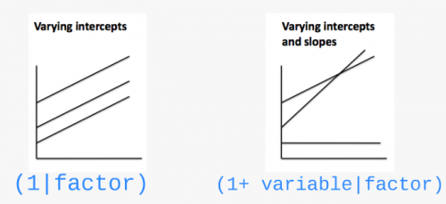

class: inverse, center, middle

```{r setup, echo = FALSE, include = FALSE, message=FALSE, warning=FALSE, results=0}
knitr::opts_chunk$set(
  comment = "#",
  collapse = TRUE,
  warning = FALSE,
  message = FALSE,
  cache = TRUE,
  fig.width = 6, fig.height = 6,
  fig.retina = 3,
  fig.align = 'center'
)

options(repos = structure(
  c(CRAN = "http://cran.r-project.org")
  )
  )

# Install xaringanExtra

if(nzchar(system.file(package = "xaringanExtra")) == FALSE) {remotes::install_github("gadenbuie/xaringanExtra", upgrade = "always", quiet = TRUE)}

# Include copy-to-clipboard icons

htmltools::tagList(
  xaringanExtra::use_clipboard(
    button_text = "<i class=\"fas fa-clipboard\"></i>",
    success_text = "<i class=\"fa fa-check\" style=\"color: #90BE6D\"></i>",
    error_text = "<i class=\"fa fa-times-circle\" style=\"color: #F94144\"></i>"
  ),
  rmarkdown::html_dependency_font_awesome()
)

mypar = list(mar = c(3, 3, 1, 0.5), mgp = c(1.6, 0.3, 0), tck = -.02)
```


```{r install_pkgs, message = FALSE, warning = FALSE, include = FALSE, results = 0}
# Standard procedure to check and install packages and their dependencies, if needed

list.of.packages <- c("lme4",
                      "MASS",
                      "vcdExtra",
                      "bbmle", 
                      "MuMIn",
                      "ggplot2",
                      "DescTools",
                      "remotes",
                      "gridExtra",
                      "lattice")

new.packages <- list.of.packages[!(list.of.packages %in% installed.packages()[,"Package"])]

if(length(new.packages) > 0) {
  install.packages(new.packages, dependencies = TRUE) 
  print(paste0("The following package was installed:", new.packages)) 
} else if(length(new.packages) == 0) {
    print("All required packages were already installed previously.")
}

# Load all required libraries at once
lapply(list.of.packages, require, character.only = TRUE, quietly = TRUE)
```

# À propos de cet atelier

[](https://r.qcbs.ca/workshop07/pres-fr/workshop07-pres-fr.html) 
[](https://r.qcbs.ca/workshop07/book-fr/index.html) 
[](https://r.qcbs.ca/workshop07/book-fr/workshop07-script-fr.R) 
[](https://github.com/QCBSRworkshops/workshop07) 

???
Note: Rappeler aux participants que le matériel de l'atelier est disponible sur le site web des ateliers R et qu'il y a un 'Bookdown' avec du texte supplémentaire. Le contenu de l'atelier est plutôt lourd, donc ils pourront retourner aux notes et les diapositives de l'atelier pour revisiter les concepts qu'ils auront moins bien compris.

---

<p style="font-size:75%">

.center[
**Participants au développement**

en modifiant et améliorant le matériel dans le cadre des <br> *P*rix d’*A*pprentissage et de *D*éveloppement
]


.pull-left[
.right[

 **2022** - **2021** - **2020**

[Maxime Fraser Franco]()
<br>
[Hassen Allegue]()
<br>
[Linley Sherin]()
<br>
[Pedro Henrique P. Braga]()
<br>
[Katherine Hébert]()
<br>
[Kevin Cazelles]()
<br>
[Janaína Serrano]()
<br>
[Dominique Caron]()
]
]

.pull-right[
.left[
**2019** - **2018** - **2017**

[Nicolas Princeloup]()
<br>
[Marie Hélène Brice]()

**2016** - **2015** - **2014**

[Catherine Baltazar]()
<br>
[Dalal Hanna]()
<br>
[Jacob Ziegler]()
<br>
[Cédric Frenette Dussault]()
<br>
[Vincent Fugère]()
<br>
[Thomas Lamy]()
<br>
[Zofia Taranu]()

]
]
</p>

---

# Matériel requis

Pour suivre cet atelier, il est nécessaire d'avoir téléchargé et installé les dernières versions de [RStudio](https://rstudio.com/products/rstudio/download/#download) et de [R](https://cran.rstudio.com/).

.pull-left[
Vous devez également utiliser les paquets suivants :


* [lme4](http://cran.r-project.org/web/packages/lme4/index.html)
* [MASS](http://cran.r-project.org/web/packages/MASS/index.html)
* [vcdExtra](http://cran.r-project.org/web/packages/vcdExtra/index.html)
* [bbmle](http://cran.r-project.org/web/packages/bbmle/index.html)
* [MuMIn](http://cran.r-project.org/web/packages/MuMIn/index.html)
* [ggplot2](http://cran.r-project.org/web/packages/ggplot2/index.html)
* [DescTools](http://cran.r-project.org/web/packages/DescTools/index.html)
* [remotes](http://cran.r-project.org/web/packages/remotes/index.html)
* [gridExtra](http://cran.r-project.org/web/packages/gridExtra/index.html)
* [lattice](http://cran.r-project.org/web/packages/lattice/index.html)


]

.pull-right[

Pour les installer à partir du CRAN, exécutez :

```{r eval = FALSE}
install.packages(c("lme4",
                      "MASS",
                      "vcdExtra",
                      "bbmle", 
                      "MuMIn",
                      "ggplot2",
                      "DescTools",
                      "remotes",
                      "gridExtra",
                      "lattice"))
```
]

???
Note: Pour sauver du temps: (1) Demander aux participants d'installer les paquets avant l'atelier. (2) Ne pas attendre que tout le monde réussisse à les installer, et aider ceux qui ont rencontrer des problèmes lors du défi #1.

---

# Matériel requis

<br>

.pull-left2[
Tout au long de cet atelier, il y aura une série de **défis** que vous pouvez reconnaître par ce rubix cube.

]

.pull-right2[
.center[


]

]

<br>

<br>

.center[
**Lors de ces défis, n'hésitez pas à collaborer !**.
]

---

# Objectifs d'apprentissage

**1.** Décrire les modèles (généralisés) à effets mixtes

**2.** Identifier les situations dans lesquelles l'utilisation d'effets mixtes est appropriée

**3.** Mettre en œuvre des modèles linéaires mixtes de base avec `R`

**4.** Exécuter des modèles linéaires généralisés mixtes de base avec `R`

**5.** Valider, interpréter et visualiser les modèles mixtes avec `R`


---
# Question de recherche

.alert[**Est-ce que la position trophique des poissons augmente avec leur taille?**
]

Pour répondre, nous utiliserons un jeu de données où la longueur corporelle de 3 espèces de poissons (10 individus par espèce) a été mesurée dans 6 lacs différents.

.center[  ]


---
# Défi 1 

**Familiarisez-vous avec le jeu de données**

**1.** Ouvrez le script de l'atelier dans `R`

**2.** Ouvrez le jeu de données dans `R`

**3.** Reproduisez les graphiques 1 à 3 (dans le script) de la relation entre la position trophique et la taille. Observez les graphiques puis evaluez ce que vous observez.

???
Note: Ce défi devrait être assez rapide. Peut-être simplement accorder un peu de temps de réflexion individuel pendant que vous aidez les participants qui ont eu de la difficulté à installer les paquets. Si il y en a aucun, vous pouvez simplement avoir une discussion de groupe un graphique à la fois.

---
exclude: true

# Familiarisez-vous avec le jeu de données
<br>

**1.** Ouvrez le jeu de données dans `R`

**2.** Ouvrez le script de l'atelier dans `R`

**3.** Visualisez la relation entre taille et position trophique

--
exclude: true
<br>

```{r, eval = TRUE}
fish.data <- read.csv('data/qcbs_w7_data.csv', stringsAsFactors = TRUE)
head(fish.data)
```


---
# Solution 

<br>

```{r, echo = FALSE}
fish.data <- read.csv('data/qcbs_w7_data.csv', stringsAsFactors = TRUE)

# thème simplifié
fig <- theme_bw() + theme(panel.grid.minor = element_blank(),
                          panel.grid.major = element_blank(), 
                          panel.background = element_blank()) +
                    theme(strip.background = element_blank(),
                          strip.text.y = element_text()) +
                    theme(legend.background = element_blank()) +
                    theme(legend.key = element_blank()) +
                    theme(panel.border = element_rect(colour = "black", fill = NA))

# Faites les trois graphiques suivants pour explorer les données
plot <- ggplot(aes(Fish_Length, Trophic_Pos), data = fish.data)

# Graphique 1 - Toutes les données
plot + geom_point() + xlab("Longueur (mm)") + ylab("Position Trophique") + labs(title = "Toutes les données") + fig
```


---
# Solution 

<br>

```{r, echo = FALSE}
# Graphique 2 - Par espèce
plot + geom_point() + facet_wrap(~ Fish_Species) + xlab("Longueur (mm)") + ylab("Position Trophique") +
   labs(title = "Par espèce") + fig
```


---
# Solution 

<br>

```{r, echo = FALSE}
# Graphique 3 – Par lac
plot + geom_point() + facet_wrap(~ Lake) + xlab("Longueur (mm)") + ylab("Position Trophique") +
   labs(title = "Par lac") + fig
```


---
# Discussion de groupe 


**Est-ce qu'on s'attend à ce que la position trophique augmente avec la longueur corporelle exactement de la même façon pour : **

* toutes les espèces?
* tous les lacs?

<br>

--

**Comment ces relations pourraient-elles différer?**


---
# Pourquoi choisir un MLM?

### Les données biologiques et écologiques peuvent être complexes!

* Peuvent contenir une structure hiérarchique

* Plusieurs covariables et facteurs

* Échantillons non équilibrés

???
Note: Utiliser la base de données comme example. Nous avons des données de longueur de poissons et de niveau toophique pour 3 espèces et 6 lacs: cela créer une structure hiérarchique où nous avons un niveau divisant les données par espèces et un autre par lac.

---
# Pourquoi choisir un MLM?

### Comment pourrions-nous analyser ces données?

--

<br>

**Option 1. Séparer**

- Faire une analyse séparée pour chaque espèce et chaque lac

<br>

**Option 2. Regrouper**

- Faire une seule analyse en ignorant les variables espèce et lac


---
# Pourquoi choisir un MLM?

.pull-left[ ]

.pull-right[
**Option 1. Séparer** 
<br>

On pourrait faire une analyse pour chaque espèce :
* Estimer 6 ordonnées à l'origine et 6 pentes pour chaque espèce (car 6 lacs)

* Taille d'échantillon *n* = 10 pour chaque analyse (i.e. 10 poissons/espèce/lac)

* Peu de chances de détecter un effet a cause de la faible taille d’échantillon *n*
]


---
# Pourquoi choisir un MLM?

.pull-left[]

.pull-right[
**Option 2. Regrouper**
* Très grande taille d'échantillon!

* Et la pseudoreplication? (les poissons d'un même lac et d'une même espèce sont corrélés)

* Beaucoup de bruit = Une partie pourrait être due aux **effets** de **l'espèce** et du **lac**
]


---
# Pourquoi choisir un MLM?

Pour **notre question**, on veut seulement savoir s'il y a un **effet général de la longueur corporelle sur la position trophique**.
<br>
<br>

Par contre :

* **Cette relation pourrait varier** par **espèce** à cause de différents taux de croissance et/ou par **lac** à cause de différences dans la disponibilité de nourriture 

* **On doit contrôler** pour ces effets potentiels dans le modèle

--

<br>

Les MLMs permettent de **séparer et regrouper** l'analyse. Ils:

1. Prennent en compte la variabilité spécifique à chaque espèce et chaque lac (**séparer**) tout en calculant moins de paramètres

2. Utilisent toutes les données disponibles (**regrouper**) tout en contrôlant les différences entre les lacs et les espèces (pseudo-replication)


---
# Pourquoi choisir un MLM?

### Effet fixe vs effet aléatoire

Dans la littérature des MLMs, vous rencontrerez souvent ces termes. 

Il existe plusieurs façons de les décrire et nous vous présenterons ici celles que nous trouvons les plus faciles à appliquer.


---
# Pourquoi choisir un MLM?

### Effet fixe : processus déterministes

Les données proviennent : 
* de tous les niveaux possibles d'un facteur (**variable qualitative**) 
* d'un prédicteur (**variable quantitative**)

<br>

On souhaite émettre des conclusions à propos des niveaux du facteur ou de la relation entre le prédicteur et la variable réponse.

<br>

*Exemple: Nous sommes intéressés par l'effet des coupes à blanc sur la richesse en espèce. La variable coupe est le facteur à deux niveaux: forêt coupé à blanc ou non coupé.*

???
Note: Mettre l'emphase sur le fait que nous avons échantillonné tous les niveaux d'intérêts du facteurs. Nous ne sommes pas intéressés par les autres niveaux non échantillonnés.

---
# Pourquoi choisir un MLM?

### Effet aléatoire : processus stochastiques

* Seulement des **variables qualitatives** = facteur aléatoire

* Permet de structurer le processus d'erreur

<br>

*Exemple: Nous échantillons des poissons dans 6 de 15 lacs d'une région. La variable lac est le facteur avec 15 niveaux. Bien que nous n'avons qu'échantillonner 6 niveaux, nous voulons pouoir faire des conclusions sur la variabilité entre tous les lacs de la région.*

???
Note: Mettre l'emphase sur le fait que nous n'avons pas nécessairement des données pour tous les niveaux d'intérêt du facteur aléatoire. 

---
# Pourquoi choisir un MLM?

### Comment fonctionnent les MLMs?
<br>

**A.** Permet aux ordonnées à l'origine et/ou aux pentes d'être considérés comme propres (c.-à.-d. de varier) à une population donnée (**effet aléatoire**), e.g. par lac et/ou par espèce.

<br>

**B.** Les ordonnées à l'origine, les pentes et leur intervalle de confiance sont ajustés pour **prendre en compte la structure des données**.


---
# Effet aléatoire : faire varier les ordonnées à l'origine et/ou les pentes

.pull-left[]
.pull-right[]
<br>

* On suppose que les ordonnées à l'origine et/ou les pentes proviennent d'une distribution normale
* Le modèle estime une ordonnée à l'origine et/ou une pente moyenne ainsi que l'écart type de l'effet aléatoire (distribution normale) 
<br><br>

Évite d'estimer une ordonnée à l'origine et une pente par espèce (+2 paramètres par espèce) = **économise des degrés de liberté** (moins de paramètres estimés).

???
Note: Cela est assez important. Passez du temps pour bien expliquer the l'on assume the l'ordonnée et/ou la pente de chaque niveau proviennent d'une même distribution (ils ne sont pas totalement indépendent), ce qui permet de réduire le nombre de paramètres à estimer par le modèle.

---
# Effet aléatoire sur l'ordonnée à l'origine
<br>


On fait la supposition que les ordonnées à l'origine proviennent d'une distribution normale. 

On a seulement besoin d'estimer la moyenne (ordonnée à l'origine générale) et l'écart type de la distribution normale (effet aléatoire) au lieu d'estimer une ordonnée à l'origine par espèce (ce qui ajouterait 2 paramètres). 

<br><br>

Au lieu d'estimer d'estimer une ordonnée à l'origine par espèce (3 paramètres), on en estime une générale ainsi qu'un effet aléatoire (2 paramètres). Avec $n$ espèce, dans le premier cas on estime $n-1$ paramètres alors qu'on reste à 2 paramètres dans le second cas!

---
# Effet aléatoire sur l'ordonnée à l'origine
<br><br>


Même principe pour les lacs. 

Estime 2 paramètres (moyenne et écart-type) au lieu de 6 ordonnées à l'origine. 

Cela **économise des degrés de liberté** (moins d’estimation de paramètres sont nécessaires). 


---
# Effet aléatoire sur la pente
<br><br>


Le même principe s’applique aux pentes qui varient selon un facteur donné. 

Comme pour les ordonnées à l'origine, seuls la moyenne et l’écart-type des pentes sont estimés au lieu de trois pentes distinctes. 


---
# Tenir compte de la structure des données
<br>
**Qu'arrive-t-il si j'ai peu d'échantillons (faible $n$) pour un niveau des facteurs?**

Si une espèce ou un lac est peu représenté dans les données, le modèle va accorder plus d'importance au modèle groupé pour estimer l'ordonnée à l'origine et la pente de cette espèce ou de ce lac (Processus de « shrinkage »).

Idéalement, avoir un minimum de $n$=3 par niveau d'un facteur.

.center[ ]


---
# Tenir compte de la structure des données
<br>
**Comment évaluer l'impact d'un effet aléatoire sur le modèle?**

* Les intervalles de confiance des ordonnées à l'origine et des pentes **générales** sont ajustés pour tenir compte de la pseudo-replication basée sur le **coefficient de corrélation intra-classe (CCI)**

* Le CCI permet de savoir la proportion de variation dans la variable réponse qui est expliquée par l'effet aléatoire, tel que :

$$CCI = \frac{\sigma_{\alpha}^2}{\sigma_{\alpha}^2 + \sigma_{\varepsilon}^2}$$
Le CCI correspond au **ratio** entre la variance d'un effet aléatoire (e.g. ordonnées à l'origine des espèces) et la variance totale.

Le CCI nous informe donc **à quel point** la position trophique moyenne entre chaque espèce ou chaque lac (c.-à-d. les ordonnées à l'origine) **varie**.

???

Note: Dire que différentes notations sont possibles selon le livre/article et comment l'équation du modèle est écrite.


---
# Tenir compte de la structure des données


.pull-left[
**CCI élevé**


Le % de variance (CCI) est élevé car **les espèces diffèrent fortement** dans leur position trophique moyenne.

Les intervalles de confiance pour la pente et l'ordonnée à l'origine générale sont grands.
]

.pull-right[
**CCI faible**


Le % de variance (CCI) est faible car **les espèces diffèrent peu** dans leur position trophique moyenne.

Les intervalles de confiance pour la pente et l'ordonnée à l'origine générale sont petits.
]


---
exclude: true
# Tenir compte de la structure des données


.pull-left[
**CCI élevé**


Les points provenant d'un même lac sont traités comme une seule observation car **très corrélés**.

 petite taille effective de l'échantillon et grands intervalles de confiance pour la pente et l'ordonnée à l'origine.
]

.pull-right[
**CCI faible**


Les points provenant d'un même lac sont traités indépendamment car **peu corrélés**.

 grande taille effective de l'échantillon et petits intervalles de confiance pour la pente et l'ordonnée à l'origine.
]


---
# Défi 2 

<br>

**Comment le CCI et l'intervalle de confiance seront affectés dans ces deux scénarios?**

**Q1.** Les positions trophiques des poissons ne varient pas entre les lacs

<br>

**Q2.** Les positions trophiques des poissons sont similaires dans les lacs mais différentes entre les lacs

???

Note: Pour ce défi, vous pouvez créer un sondage Zoom. Cela ne devrait pas être trop long.

---
# Solution 

<br>

**Q1.** Les positions trophiques des poissons ne varient pas entre les lacs

.alert[R1. CCI faible, petits intervalles de confiance]

<br>

--

**Q2.** Les positions trophiques des poissons sont similaires dans les lacs mais différentes entre les lacs

.alert[R2. CCI élevé, grands intervalles de confiance]
<br><br><br><br><br>
--

**Pour plus de détails sur le CCI** : <br>
Nakagawa et Schielzeth (2013)
https://doi.org/10.1111/j.1469-185X.2010.00141.x
Nakagawa *et al.* (2017) 
https://doi.org/10.1098/rsif.2017.0213

???

Note: Répéter que le CCI mesure le ratio de la variance "expliquée" par le facteur aléatoire. De plus, plus les intervalles de confiance pour l'ordonnée à l'origine et la pente globale est grande, plus la variation interclasse est grande.


---
# Comment implémenter un MLM avec R?


###### **Étape 1.** Construction du modèle *a priori* et exploration des données

<br>

**Étape 2.** Coder les modèles potentiels et sélection du meilleur modèle

<br>

**Étape 3.** Validation du modèle

<br>

**Étape 4.** Interprétation et visualisation des résultats

---
# Étape 1. construction du modèle *a priori*

**Modèle basé sur connaissance *a priori*:**

* Nous voulons déterminer si la position trophique peut être prédite par la longueur corporelle, tout en prenant en compte la variation entre les espèces et les lacs

* Donc nous voulons un modèle qui ressemble a ceci:

$$PT_{ijk} \sim Longueur_i + Lac_j + Espèce_k + \varepsilon_{ijk}$$

???

Note: Décrire chaque élément de l'équation. La position trophique est prédite par la longueur, le lac de provenance et l'espèce du poisson. Le dernier terme décrit l'erreur entre la position trophique prédites par les variables explicatives et la vraie position trophique.

---
# Étape 1. exploration des données

**Les données ont-elles la bonne structure?**

```{r}
fish.data <- read.csv('data/qcbs_w7_data.csv')
str(fish.data)
```

Il est recommandé de faire le ménage de votre espace de travail (`rm.list()`) avant de construire un modèle.

???

Note: Vous pouvez aller relativement rapidement pour l'étape 1 (diapositives 37-50). Les participants devraient être relativement à l'aise avec ces étapes.

---
# Étape 1. exploration des données

**Regardez la distribution des échantillons pour chaque facteur:**

```{r}
table(fish.data[ , c("Lake", "Fish_Species")])
```

Ce jeu de données est parfaitement équilibré, mais les **modèles mixtes peuvent analyser des designs expérimentaux non équilibrés**, comme c'est souvent le cas en écologie!

???

Note: Expliquer ce qu'est un jeu de données équilibré vs non équilibrés (c-a-d. le nombre d'échantillons dans chaque classe.)

---
# Étape 1. exploration des données

**Regardez la distribution des variables continues**

``` {r, fig.width = 10, fig.height = 5, eval = FALSE,}
hist(fish.data$Fish_Length, xlab = "Longueur (mm)", main = "")
hist(fish.data$Trophic_Pos, xlab = "Position trophique", main = "")
```

``` {r, fig.width = 10, fig.height = 5, echo = FALSE}
par(mfrow = c(1, 2), mar = c(4, 4, 1, 1))
hist(fish.data$Fish_Length, xlab = "Longueur (mm)", main = "")
hist(fish.data$Trophic_Pos, xlab = "Position trophique", main = "")
```


Des déviations majeures pourraient causer des problèmes d'hétéroscédasticité. Si nécessaire, faites des transformations. Dans ce cas-ci, **les données semblent correctes**.

---
# Étape 1. exploration des données

**Vérifier la colinéarité entre vos variables explicatives**

Le problème avec les prédicteurs colinéaires est simplement qu'ils expliquent la même chose, alors leur effet sur la variable réponse sera confondu dans le modèle.

Dans cet exemple, il n’y a pas de risque de colinéarité avec seulement une variable continue. Si vous aviez une autre variable continue (`Var2`), une façon simple de vérifier la colinéarité est:

```{r, eval = FALSE}
plot(data)

cor(var1, var2)
```

Voici un [exemple de colinéarité](https://yetanotheriteration.netlify.app/2018/01/high-collinearity-effect-in-regressions/).

---
# Défi 3 

Quelles mesures supplémentaires aurions-nous pu prendre sur le terrain et qui auraient pu être fortement corrélées avec la longueur corporelle?

--

> Un exemple est la masse du poisson – c’est une variable fortement corrélée avec la longueur du poisson. Par conséquent, nous ne voulons pas inclure ces deux variables dans le même modèle.


???

Note: Ce défi est principalement pour interagir un peu avec les participants. Poser la question à l'audience, et ça ne devrait pas être trop long.

---
# Étape 1. exploration des données

**Considérez l'échelle de vos données**

* Si deux variables dans un même modèle ont des échelles très différentes, il est probable que le modèle indique un problème de convergence en essayant de calculer les paramètres.

* La <a href="https://fr.wikipedia.org/wiki/Cote_Z_(statistiques)">correction Z</a> standardise les variables et résout ce problème (fonction `scale()` dans `R`) :

$$z = \frac{x-moyenne(x)}{écart.type(x)}$$
---
# Étape 1. exploration des données

**Considérez l'échelle de vos données**

* Longueur corporelle  Longue échelle

* Position trophique  Courte échelle

---
# Étape 1. exploration des données

**Considérez l'échelle de vos données**

Parce que nos données ont des échelles très différentes, on applique la **correction Z**

```{r}
# Longueur corrigée, "à la main"
fish.data$Z_Length <- (fish.data$Fish_Length - mean(fish.data$Fish_Length)) / 
                      sd(fish.data$Fish_Length)

# Position trophique corrigée, avec la fonction scale
fish.data$Z_TP     <- scale(fish.data$Trophic_Pos)
```

---
# Étape 1. exploration des données

Pour savoir si un modèle mixte est nécessaire pour vos données, vous devez déterminer s'il est important de prendre en compte l'effet aléatoire de facteurs qui pourraient influencer la relation qui vous intéresse (dans notre cas, lac et espèce)

**Nous pouvons le faire en :**

1. Créant un modèle linéaire sans les facteurs qui pourraient avoir un effet aléatoire

2. Calculant les résidus de ce modèle linéaire

3. Produisant un graphique de la valeur des résidus en fonction des niveaux des facteurs potentiellement aléatoires

---
# Étape 1. exploration des données

Créer un modèle linéaire sans les facteurs
```{r}
lm.test <- lm(Z_TP ~ Z_Length, data = fish.data)
```

Calculer les résidus de ce modèle linéaire
```{r}
lm.test.resid <- rstandard(lm.test)
```

---
# Étape 1. exploration des données

Représentez graphiquement la valeur des résidus en fonction des niveaux des facteurs

``` {r include = FALSE}
par(mfrow = c(1, 2))
```


```{r, fig.width=10, fig.height=5, eval = FALSE}
plot(lm.test.resid ~ as.factor(fish.data$Fish_Species),
     xlab = "Species", ylab = "Standardized residuals")

abline(0, 0, lty = 2)

plot(lm.test.resid ~ as.factor(fish.data$Lake),
     xlab = "Lake", ylab = "Standardized residuals")

abline(0, 0, lty = 2)
```

---
# Étape 1. exploration des données

Représentez graphiquement la valeur des résidus en fonction des niveaux des facteurs

```{r, fig.width=10, fig.height=5, echo = FALSE}
par(mfrow=c(1,2), mar = c(4,4,1,1))
plot(lm.test.resid ~ as.factor(fish.data$Fish_Species),
     xlab = "Species", ylab = "Standardized residuals")
abline(0, 0, lty = 2)
plot(lm.test.resid ~ as.factor(fish.data$Lake),
     xlab = "Lake", ylab = "Standardized residuals")
abline(0, 0, lty = 2)
```

.alert[Ces patrons suggèrent qu'il y a de la variance résiduelle qui pourrait être expliquée par ces facteurs, et ils devraient donc être inclus dans le modèle]

---
# Comment implémenter un MLM dans R ?


**Étape 1.** Construction du modèle *a priori* et exploration des données

<br>

###### **Étape 2.** Coder les modèles potentiels et sélection du meilleur modèle

<br>

**Étape 3.** Validation du modèle

<br>

**Étape 4.** Interprétation et visualisation des résultats

---
# Étape 2. coder le modèle

**Traduisons notre modèle...**

$$PT_{ijk} \sim Longueur_i + Lac_j + Espèce_k + \varepsilon_{ijk}$$

**... En code R**

```{r, include = FALSE}
library(lme4)
```

```{r, eval = FALSE}
library(lme4)
lmer(Z_TP ~ Z_Length + (1 | Lake) + (1 | Fish_Species),
     data = fish.data, REML = TRUE)
```

--

* `lmer`  fonction "linear mixed model" du package `lme4`
* `(1 | Lake)`  indique que les intercepts peuvent varier entre les lacs
* `REML = TRUE`  méthode d'estimation

---
# Étape 2. coder le modèle

**Comment faire si on souhaite que la pente puisse varier?**

.center[

]

---
# Étape 2. coder le modèle

**Différentes structures pour le modèle :**

- `(1 | Lake)` effet aléatoire par lac à l'intercept
- `(1 + Z_Length | Lake)` effet aléatoire par lac à l'intercept et la pente en réponse à la longueur corporelle (NB: (`Z_Length | Lake)` donne le même résultat)
- `(-1 + Z_Length | Lake)` pour avoir uniquement l'effet aléatoire sur la pente
- `(1 | Lake) + (1 | Species)`  pour des effets aléatoires croisés (ex: l'effet de l'espèce i ne varie pas entre les lacs)
- `(1 | Lake:Fish_Species)` pour utiliser l'interaction entre 2 facteurs groupant (ex: l'effet de l'espèce i varie d'un lac à l'autre)
- si votre jeu de données inclus des effets nichés, vous pouvez utiliser `/` pour les déclarer, e.g. `(1 | facteur1 / facteur2)` si `facteur2` est niché dans `facteur1` ([voir ](https://stats.stackexchange.com/questions/228800/crossed-vs-nested-random-effects-how-do-they-differ-and-how-are-they-specified))

???
Note: S'assurer de bien faire la distinction entre effets croisés (sans interaction), avec interaction et nichés.

---
# Note sur les méthodes d'estimation

REML (*Restricted Maximum Likelihood*) est la méthode par défaut dans la fonction `lmer` (voir `?lmer`).

La méthode de maximum de vraisemblance (ML, pour *Maximum Likelihood*) sous-estime les variances du modèle par un facteur $(n-k) / n$, ou $k$ est le nombre d'effes fixes. 

La méthode REML corrige pour ce biais.

Consultez cet [article](https://towardsdatascience.com/maximum-likelihood-ml-vs-reml-78cf79bef2cf) pour plus d'information sur la différence entre ML et REML.

???

Note: Dire que la méthode d'estimation est l'algorithme utiliser pour estimer les paramètres du modèles (ordonnées à l'origine, pentes). Expliquer qu'ils n'ont pas besoin de comprendre l'algorithme en détail, mais qu'ils peuvent suivre le lien pour plus d'informations. La prochaine diapositive résume ce qu'ils devraient savoir.

---
# Note sur les méthodes d'estimation

**On devrait utiliser :**

* **REML** pour comparer des modèles avec différentes structure **d'effets aléatoires** et la même structure d'effets fixes.

* **ML** pour comparer des modèles avec différentes structure **d'effets fixes** et la même structure d'effets aléatoires

* **ML** pour comparer des modèles **avec effets aléatoires** à des modèles **sans effets aléatoires**

???

Note: Cela peut sembler complexe, mais les deux prochains défis devraient aider les participants à comprendre les utilisations des difféerentes méthodes d'estimation.

---
# Défi 4 

Réécrivez le code suivant de façon à ce que les **pentes** de la relation position trophique en fonction de longueur corporelle **varient par lac et par espèces**:

```{r}
lmer(Z_TP ~ Z_Length + (1 | Lake) + (1 | Fish_Species),
     data = fish.data, REML = TRUE)
```

---
# Solution 

```{r}
lmer(Z_TP ~ Z_Length + (1 + Z_Length | Lake) + (1 + Z_Length | Fish_Species),
     data = fish.data, REML = TRUE)
```

---
# Étape 2. sélectionner le meilleur modèle

* Pour déterminer si vous avez construit le meilleur modèle mixte basé sur vos connaissances *a priori*, vous devez comparer ce modèle aux autres modèles alternatifs.

* Avec le jeu de données sur lequel vous travaillez, il y a plusieurs modèles alternatifs qui pourraient mieux correspondre à vos données.


---
# Défi 5 

Faites une liste de 7 modèles alternatifs qui pourraient être comparés à celui-ci:

```{r, eval = FALSE}
lmer(Z_TP ~ Z_Length + (1 | Lake) + (1 | Fish_Species),
     data = fish.data, REML = TRUE)
```

.comment[Note : si nous avions différents effets fixes entre les modèles ou un modèle sans effects aléatoires, nous aurions dû indiquer `REML = FALSE` pour les comparer avec une méthode de vraisemblance comme l'AIC.]

???

Note: Pour savoir si le modèle que vous avez construis basé sur vos connaissances a priori est le meilleur, vous devez le comparer à des modèles avec une structure alternative. Il existe de nombreux modèles alternatifs qui peuvent être construit à partir de la base de données avec laquelle vous travailler.

---
# Solution 

Nous allons aussi construire le **modèle linéaire de base** `lm()` parce qu'il est toujours utile de voir la variation dans les valeurs de AICc.

```{r}
M0 <- lm(Z_TP ~ Z_Length, data = fish.data)
```

Par contre, pour comparer ce modèle aux MLMs, il est important de .alert[changer la méthode d'estimation à ML (`REML=FALSE`)] parce que `lm()` n'utilise pas la même méthode d'estimation que `lmer()`.


---
# Solution 

```{r}
# Modele linéaire de base
M0 <- lm(Z_TP ~ Z_Length, data = fish.data)
# modèle complet avec variation des intercepts
M1 <- lmer(Z_TP ~ Z_Length + (1 | Fish_Species) + (1 | Lake), 
           data = fish.data, REML = FALSE)
# modèle complet avec variation des intercepts et de pentes
M2 <- lmer(Z_TP ~ Z_Length + (1 + Z_Length | Fish_Species) + (1 + Z_Length | Lake),
           data = fish.data, REML = FALSE)
# Pas d'effet lac, les intercepts varient par espèces
M3 <- lmer(Z_TP ~ Z_Length + (1 | Fish_Species), data = fish.data, REML = FALSE)
# Pas d'effet espèces, les intercepts varient par lac
M4 <- lmer(Z_TP ~ Z_Length + (1 | Lake), data = fish.data, REML = FALSE)
# Pas d'effet de lac, les intercepts et les pentes varient par espèces
M5 <- lmer(Z_TP ~ Z_Length + (1 + Z_Length | Fish_Species), 
           data = fish.data, REML = FALSE)
# Pas d'effet de l'espèces, les intercepts et les pentes varient par lac
M6 <- lmer(Z_TP ~ Z_Length + (1 + Z_Length | Lake), data = fish.data, REML = FALSE)
# modèle complet, variation d'intercept et pente par lac
M7 <- lmer(Z_TP ~ Z_Length + (1 | Fish_Species) + (1 + Z_Length | Lake),
           data = fish.data, REML = FALSE)
# modèle complet, variation d'intercept et pente par espèces
M8 <- lmer(Z_TP ~ Z_Length + (1 + Z_Length | Fish_Species) + (1 | Lake),
           data = fish.data, REML = FALSE)
```


---
# Solution 

Lorsqu'on ajuste des MLM avec `lmer()`, il est possible de faire face à certaines erreurs our avertissements comme: 

* `boundary (singular) fit: see ?isSingular`, voir [cette discussion ](https://stats.stackexchange.com/questions/378939/dealing-with-singular-fit-in-mixed-models)

* `Model failed to converge with max|grad| ...`, voir [cette discussion ](https://stats.stackexchange.com/questions/242109/model-failed-to-converge-warning-in-lmer)

Voici une [liste](https://rdrr.io/cran/lme4/man/troubleshooting.html) de problèmes possibles et comment les résoudre. 


---
# Étape 2. sélectionner le meilleur modèle

* Maintenant que nous avons une liste de modèles potentiels, nous voulons les comparer entre eux pour sélectionner celui(ceux) qui a(ont) le plus de pouvoir prédictif.

* Les modèles peuvent être comparés en utilisant la fonction `AICc` provenant du package `MuMIn`.

* Le critère d'information Akaike (AIC) est une **mesure de qualité du modèle** pouvant être utilisée pour comparer les modèles.

* AICc corrige pour le biais créé par les faibles tailles d'échantillon.


---
# Étape 2. sélectionner le meilleur modèle

Pour trouver la valeur AICc d'un modèle, utilisez :

```{r}
library(MuMIn)
MuMIn::AICc(M1)
```


---
# Étape 2. sélectionner le meilleur modèle

Pour regrouper toutes les valeurs d'AICc dans un seul tableau, utilisez :

```{r}
AIC.table  <- MuMIn::model.sel(M0, M1, M2, M3, M4, M5, M6, M7, M8)
(AIC.table <- AIC.table[ , c("df", "logLik", "AICc", "delta")])
```

* `df` est le degré de liberté
* `logLik` est le log de la vraisemblance
* `delta` est la différence d'AICc avec la valeur la plus petite

Nous avons seulement affiché une partie des résultats retourné par la fonction `model.sel()`, voir `?model.sel` pour plus d'information.

---
# Étape 2. sélectionner le meilleur modèle

Que signifient ces valeurs d'AICc ?

```{r}
AIC.table
```

* Le modèle avec le plus petit AICc a le plus grand pouvoir prédictif.

* Souvent on considère que deux modèles à +/- 2 unités d'AICc de différence ont un pouvoir prédictif équivalent.

* Examinons de plus proche M8 and M2. On peut exclure les autres modèles car ils ont des AICc beaucoup plus élevés.


---
# Étape 2. sélectionner le meilleur modèle

```{r}
M8 <- lmer(Z_TP ~ Z_Length + (1 + Z_Length | Fish_Species) + (1 | Lake),
           data = fish.data, REML = TRUE)

M2 <- lmer(Z_TP ~ Z_Length + (1 + Z_Length | Fish_Species) + (1 + Z_Length | Lake),
           data = fish.data, REML = TRUE)

MuMIn::model.sel(M2,M8)[ , c("df", "logLik", "AICc", "delta")]
```

Le modèle `M8` semble être le meilleur modèle parmi ceux qu'on a testé.

Notez qu'on utilise maintenant REML (i.e. `REML=TRUE`) vu qu'on compare deux modèles avec des effets aléatoires nichés et avec la même structure d'effets fixes. 

---
# Étape 2. sélectionner le meilleur modèle

Quelle est la structure du meilleur modèle?

```{r, eval = FALSE}
M8 <- lmer(Z_TP ~ Z_Length + (1 + Z_Length | Fish_Species) + (1 | Lake),
           data = fish.data, REML = TRUE)
```

L'intercept et l'effet de la longueur sur la position trophique peut varier selon l'espèce de poissons, mais seulement l'intercept peut varier par lac

.pull-left[]
.pull-right[]


---
# Étape 2. sélectionner le meilleur modèle

Une fois que le meilleur modèle est sélectionné il faut remettre la méthode d'estimation a `REML = TRUE`

```{r}
M8 <- lmer(Z_TP ~ Z_Length + (1 + Z_Length | Fish_Species) + (1 | Lake),
           data = fish.data, REML = TRUE)
```


---
exclude: true

# Défi 5 

Prenez 2 minutes avec votre voisin pour étudier la structure du modèle M2.

Comment diffère-t-il de M8 d'un point de vue écologique?

Pourquoi n'est il pas surprenant que sa valeur d'AICc était la deuxième meilleure?

```{r, eval = FALSE}
M8 <- lmer(Z_TP ~ Z_Length + (1 + Z_Length | Fish_Species) + (1 | Lake),
           data = fish.data, REML = TRUE)

M2 <- lmer(Z_TP ~ Z_Length + (1 + Z_Length | Fish_Species) + (1 + Z_Length | Lake),
           data = fish.data, REML = TRUE)
```


---
exclude: true

# Solution 

**Discussion de groupe...**

--
exclude: true

.alert[M2] La position trophique est en fonction de la longueur. L'intercept et l'effet de la longueur sur la position trophique peuvent varier selon l'espèce de poissons et le lac.

* .small[les facteurs intrinsèques des espèces et des lacs sont à la base des relations différentes entre la position trophique et la longueur (i.e. pentes et intercepts)]

.alert[M8] La position trophique est en fonction de la longueur. L'intercept et l'effet de la longueur sur la position trophique peut varier selon l’espèce de poissons, mais seulement l'intercept peut varier par lac.

* .small[seulement les facteurs intrinsèques des espèces sont responsables des différentes relations (i.e. pentes) et en moyenne, les positions trophiques pourraient être supérieures ou inférieures d’un lac à l’autre (e.g. intercepts).]


---
# Comment implémenter un MLM dans R ?


**Étape 1.** Construction du modèle *a priori* et exploration des données

<br>

**Étape 2.** Coder les modèles potentiels et sélection du meilleur modèle

<br>

###### **Étape 3.** Validation du modèle

<br>

**Étape 4.** Interprétation et visualisation des résultats


---
# Étape 3. validation du modèle

**Vous devez vérifier que le modèle respecte toutes les suppositions de base :**

<br>

**3.1 Vérifier l'homogénéité de la variance**
  - Faire un graphique des valeurs prédites en fonction des valeurs résiduelles

<br>

**3.2 Vérifier l'indépendance des résidus**
  - Graphique des résidus vs chaque covariable du modèle
  - Graphique des résidus vs chaque covariable non incluse du modèle

<br>

**3.3 Vérifier la normalité**
  - Histogramme


---
# Étape 3. validation du modèle

**3.1 Vérifier l'homogénéité de la variance**

```{r, fig.width=4.5, fig.height=4.5, echo = -1}
par(mar=c(4,4,.5,.5))
plot(resid(M8) ~ fitted(M8), 
     xlab = 'Valeurs prédites', 
     ylab = 'Résidus normalisés')
abline(h = 0, lty = 2)
```

Étendue homogène des résidus  la supposition est respectée!


---
# Étape 3. validation du modèle

**3.1 Vérifier l'homogénéité de la variance**

.center[

]

???

Note: L'hétéroscedasticité est lorsque la variance des résidus du modèles (i.e., erreur) varient avec une variable explicative. Lorsque l'on graphe les résidus avec une variable explicative, nous observons une forme conique des résidus comme les examples ci-dessous. L'inverse d'hétéoscedasticité est l'homoscedaticité. L'homoscedaticité est lorsque la variance des résidus ne varient pas avec les variables explicatives. C'est ce qu'on veut!
---
# Étape 3. validation du modèle

**3.2 Vérifier l'indépendance des résidus avec chaque covariable**

```{r include = FALSE}
par(mfrow = c(1,3), mar=c(4,4,.5,.5))
```

```{r, fig.width=11, fig.height=4.5, eval = FALSE}
plot(resid(M8) ~ fish.data$Z_Length, 
     xlab = "Longueur", ylab = "Résidus normalisés")
abline(h = 0, lty = 2)

boxplot(resid(M8) ~ Fish_Species, data = fish.data, 
        xlab = "Espèces", ylab = "Résidus normalisés")
abline(h = 0, lty = 2)

boxplot(resid(M8) ~ Lake, data = fish.data, 
        xlab = "Lacs", ylab = "Résidus normalisés")
abline(h = 0, lty = 2)
```


---
# Étape 3. validation du modèle

**3.2 Vérifier l'indépendance des résidus avec chaque covariable**

```{r, fig.width=12, fig.height=4.5, echo = FALSE}
par(mfrow = c(1,3), mar=c(4,4,.5,.5), cex.lab = 1.5)
plot(resid(M8) ~ fish.data$Z_Length, xlab = "Longueur", ylab = "Résidus normalisés")
abline(h = 0, lty = 2)
boxplot(resid(M8) ~ Fish_Species, data = fish.data, xlab = "Espèces", ylab = "")
abline(h = 0, lty = 2)
boxplot(resid(M8) ~ Lake, data = fish.data, xlab = "Lacs", ylab = "")
abline(h = 0, lty = 2)
```

Étendue homogène des résidus autour de 0  pas de patron des résidus en fonction de la variable, la supposition est respectée!

.comment[Note : les regroupements de données sont dus à la structure des données, où des poissons de seulement 5 classes de taille  (grand, petit, et trois groupes entre les deux) étaient capturés.]


---
# Étape 3. validation du modèle

**3.2 Vérifier l'indépendance des résidus avec chaque covariable**

- Graphique des résidus vs chaque covariable non incluse du modèle

  - Si vous observez des patrons dans ce graphique, vous saurez qu'il y a de la variation dans votre jeu de données qui pourrait être expliquée par ces covariables. Vous devriez considérer d'inclure ces variables dans votre modèle.

  - Puisque dans notre cas, nous avons inclus toutes les variables mesurées dans notre modèle, nous ne pouvons pas faire cette étape.


---
# Étape 3. validation du modèle

**3.3 Vérifier la normalité des résidus**

* Des résidus suivant une distribution normale indiquent que le modèle n'est pas biaisé

```{r, fig.height=5, fig.width=5}
hist(resid(M8))
```


---
# Comment implémenter un MLM dans R ?


**Étape 1.** Construction du modèle *a priori* et exploration des données

<br>

**Étape 2.** Coder les modèles potentiels et sélection du meilleur modèle

<br>

**Étape 3.** Validation du modèle

<br>

###### **Étape 4.** Interprétation et visualisation des résultats


---
# Étape 4. interprétation et visualisation

```{r}
(summ_M8 <- summary(M8))
```

???

Note: Prenons un moment pour explorer un peu plus notre modèle final à l'aide de la fonction summary(). Comment pouvons-nous interpréter ces informations?

---
# Étape 4. interprétation et visualisation

    # Random effects:
    #  Groups       Name        Variance Std.Dev. Corr
    #  Lake         (Intercept) 0.20500  0.4528
    #  Fish_Species (Intercept) 0.86621  0.9307
    #               Z_Length    0.02464  0.1570   1.00
    #  Residual                 0.05040  0.2245

- `Groups`: facteurs de regroupement,
- `Name`:
  - `(Intercept)` pour l'ordonnée à l'origine,
  - ou le nom de la variable sur lequel porte l'effet mixe dans le cas d'une pente aléatoire, (`Z_length` dans notre exemple)
- `Variance` la variance estimée de l'effet (`Std.Dev.` est l'écart type de cette valeur)
- `Corr` indique la corrélation entre la pente aléatoire et l'ordonnée à l'origine aléatoire pour un groupement donné (voir [cette discussion ](https://stats.stackexchange.com/questions/320978/understanding-and-coding-random-intercept-correlation-lmer))


---
# Étape 4. interprétation et visualisation

    # Fixed effects:
    #              Estimate Std. Error t value
    # (Intercept) -0.000906   0.568493  -0.002
    # Z_Length     0.422270   0.092170   4.581

Cette partie présente l'estimation des effets fixes. Une valeur de la statistique T [(test de Student)](https://en.wikipedia.org/wiki/T-statistic) est retournée **sans p-value** (c'est un choix des auteurs du package, voir pourquoi dans [cette discussion](https://stats.stackexchange.com/questions/185360/t-value-associated-with-nlme-lme4)).

Cette statistique peut être utilisée telle quelle. Vous pouvez aussi calculer
l’intervalle de confiance (IC) à 95% avec cette table en utilisant

$$ IC = Estimate \pm 1.96*Std.Error $$
Si 0 est dans cet interval, alors le paramètre n’est pas significativement
différente de zéro au seuil $\alpha$ = 0.05.

???

Note: Passer section par section pour bien comprendre ce qui est présenter.

La sortie est divisé en deux: la description des facteurs aléatoires et les facteurs fixes.

---
# Étape 4. interprétation et visualisation

**Quelques fonctions utiles**

- `coef(M8)` et `ranef(M8)` retournent les effets aléatoires du modèle M8

- `coef(summary(M8))` retourne les effets fixes

- `sigma(M8)` retourne l’écart type des résidus

- `fitted(M8)` retourne les valeurs prédites par le modèle

- `residuals(M8)` retourne les résidus


---
# Défi 6 

1. Quelle est la pente et son intervalle de confiance de la variable Z_Length dans le modèle M8?

2. Est-ce que la pente de Z_Length est significativement différente de 0 ?


---
# Solution 

1. Quelle est la pente et son intervalle de confiance de la variable Z_Length dans le modèle M8?

  - pente = 0.422;

  - limite supérieure de l’IC = 0.4223 + 0.09*1.96 = 0.5987

  - limite inférieure de l’IC = 0.4223 - 0.09*1.96 = 0.2459

2. Est-ce que la pente de Z_Length est significativement différente de 0 ?

  - Oui, car l'IC [0.2459, 0.5987] n'inclut pas 0

???

Note: L'intervalle de confiance de la pente n'inclue pas 0 (0 = aucun effet), la pente est donc significativement différente de 0. Cela signifie que la longueur du poisson influence sa position trophique (un plus long poisson a, en moyenne, un plus haut niveau trophique). Est-ce que ça fait du sens? Oui, les gros poissons mangent les petits poissons.

---
# Défi 7 

Il est possible de visualiser graphiquement les différentes intercepts et pentes du modèle pour mieux interpréter les résultats

Prenez 2 minutes pour réfléchir aux différentes façons pour représenter les résultats de M8.

*Indice: considérez les différents "niveaux" du modèle*


---
# Solution 

a) Figure avec toutes les données regroupées

b) Figure par espèce

c) Figure par lac


---
# Solution 

Pour faire ces figures, il nous faut:

- Les coefficients du modèle complet qui sont dans le résumé du modèle

```{r}
summ_M8$coefficients
```

- Intercept = $`r summ_M8$coefficients[1,1]`$
- Pente = $`r summ_M8$coefficients[2,1]`$


---
# Solution 

Pour faire ces figures, il nous faut:

- Les coefficients pour chaque niveau du modèle qu'on obtient avec la fonction `coef`

```{r}
coef(M8)
```


---
# Solution 

a) Figure avec toutes les données regroupées
```{r, eval = FALSE}
library(ggplot2)

# Thème ggplot simplifié
fig <- theme_bw() +
        theme(panel.grid.minor=element_blank(), 
              panel.grid.major=element_blank(),
              panel.background=element_blank()) +
        theme(strip.background=element_blank(), 
              strip.text.y = element_text()) +
        theme(legend.background=element_blank()) +
        theme(legend.key=element_blank()) +
        theme(panel.border = element_rect(colour = "black", fill=NA))

plot <- ggplot(aes(Z_Length, Z_TP), data = fish.data)
Plot_AllData <- plot + geom_point() +
                  xlab("Longueur (mm)") + 
                  ylab("Position trophique") +
                  labs(title = "Toutes les données") + fig

Plot_AllData + geom_abline(intercept = summ_M8$coefficients[1,1], 
                           slope     = summ_M8$coefficients[2,1])
```


---
# Solution 

a) Figure avec toutes les données regroupées
```{r, echo = FALSE}
plot <- ggplot(aes(Z_Length, Z_TP), data = fish.data)
Plot_AllData <- plot + geom_point() +
  xlab("Longueur (mm)") + ylab("Position trophique") +
  labs(title = "Toutes les données") + fig

Plot_AllData + geom_abline(intercept = summ_M8$coefficients[1,1], slope = summ_M8$coefficients[2,1])
```


---
# Solution 

b) Figure par espèce

```{r, eval = FALSE}
# mettre les coefs dans un tableau pour les rendre plus faciles à manipuler
Lake.coef              <- coef(M8)$Lake
colnames(Lake.coef)    <- c("Intercept", "Slope")
Species.coef           <- coef(M8)$Fish_Species
colnames(Species.coef) <- c("Intercept", "Slope")

Plot_BySpecies <- plot + 
                    geom_point(aes(colour = factor(Fish_Species)), size = 4) +
                    xlab("Longueur (mm)") + ylab("Position trophique") +
                    labs(title = "Par espèce") + fig

# Ajoutez les lignes de régression pour chaque espèce
Plot_BySpecies +
  geom_abline(intercept = Species.coef[1,1], 
              slope     = Species.coef[1,2], col = "coral2") +
  geom_abline(intercept = Species.coef[2,1], 
              slope     = Species.coef[2,2], col = "green4") +
  geom_abline(intercept = Species.coef[3,1], 
              slope     = Species.coef[3,2], col = "blue1")

```


---
# Solution 

b) Figure par espèce

```{r, echo = F, fig.width=8}
Lake.coef              <- as.data.frame(coef(M8)$Lake)
colnames(Lake.coef)    <- c("Intercept", "Slope")
Species.coef           <- as.data.frame(coef(M8)$Fish_Species)
colnames(Species.coef) <- c("Intercept", "Slope")

Plot_BySpecies<-plot + geom_point(aes(colour = factor(Fish_Species)), size = 4) +
  xlab("Longueur (mm)") + ylab("Position trophique") +
  labs(title = "Par espèce") + fig

# Ajoutez les lignes de régression pour chaque espèce
Plot_BySpecies +
  geom_abline(intercept = Species.coef[1,1], slope = Species.coef[1,2], col = "coral2") +
  geom_abline(intercept = Species.coef[2,1], slope = Species.coef[2,2], col = "green4") +
  geom_abline(intercept = Species.coef[3,1], slope = Species.coef[3,2], col = "blue1")

```


---
# Solution 

c) Figure par lac
```{r, eval= FALSE}

Plot_ByLake <- plot + 
                geom_point(aes(colour = factor(Lake)), size = 4) +
                xlab("Length (mm)") + ylab("Trophic Position") +
                labs(title = "By Lake") + fig

# Ajouter les lignes de régression avec les intercepts spécifiques à chaque lac
Plot_ByLake +
  geom_abline(intercept = Lake.coef[1,1], 
              slope     = Lake.coef[1,2], col = "coral2") +
  geom_abline(intercept = Lake.coef[2,1], 
              slope     = Lake.coef[2,2], col = "khaki4") +
  geom_abline(intercept = Lake.coef[3,1], 
              slope     = Lake.coef[3,2], col = "green4") +
  geom_abline(intercept = Lake.coef[4,1], 
              slope     = Lake.coef[4,2], col = "darkgoldenrod") +
  geom_abline(intercept = Lake.coef[5,1], 
              slope     = Lake.coef[5,2], col = "royalblue1") +
  geom_abline(intercept = Lake.coef[6,1], 
              slope     = Lake.coef[6,2], col = "magenta3")

```


---
# Solution 

c) Figure par lac
```{r, echo = F, fig.width=8}
Plot_ByLake<-plot + geom_point(aes(colour = factor(Lake)), size = 4) +
  xlab("Longueur (mm)") + ylab("Position trophique") +
  labs(title = "par lac") + fig

# Ajouter les lignes de régression avec les intercepts spécifiques à chaque lac
Plot_ByLake +
  geom_abline(intercept = Lake.coef[1,1], slope = Lake.coef[1,2], col = "coral2") +
  geom_abline(intercept = Lake.coef[2,1], slope = Lake.coef[2,2], col="khaki4") +
  geom_abline(intercept = Lake.coef[3,1], slope = Lake.coef[3,2], col="green4") +
  geom_abline(intercept = Lake.coef[4,1], slope = Lake.coef[4,2], col="darkgoldenrod") +
  geom_abline(intercept = Lake.coef[5,1], slope = Lake.coef[5,2], col="royalblue1") +
  geom_abline(intercept = Lake.coef[6,1], slope = Lake.coef[6,2], col="magenta3")

```


---

exclude: true

# Modèle mixtes et données en écologie

Les modèles mixtes sont très utiles pour prendre en compte la structure complexe des données en écologie tout en permettant de ne pas perdre beaucoup de degrés de liberté

.center[

]


---
exclude: true
# Défi 8 

**Situation:**

* Vous avez inventorié la richesse **dans 1000 quadrats** qui sont dans **10 sites différents** qui sont également dans **10 forêts différentes**.

* Vous avez de plus **mesuré la productivité** dans chaque **quadrat**.

* Vous désirez savoir si la productivité est un bon prédicteur de biodiversité

.alert[Quel modèle mixte pourriez-vous utiliser pour ce jeu de données?]


---
exclude: true
# Solution 

```{r, eval = FALSE}
lmer(Biodiv ~ Productivite + (1 | Foret / Site))
```

Ici les effets aléatoires sont nichés (i.e. Sites dans forêt) et non croisés.

Pourquoi utiliser `(1 | Foret / Site)` plutôt que `(1 | Foret) + (1 | Site)` ? Regardez [cette réponse sur ](https://stats.stackexchange.com/questions/228800/crossed-vs-nested-random-effects-how-do-they-differ-and-how-are-they-specified)!


---
exclude: true

# Défi 8 

**Situation:**

* Vous avez récolté **200 poissons** dans **12 sites différents** distribués également dans **4 habitats** différents qui se retrouvent dans **un même lac**.

* Vous avez mesuré la **longueur de chaque poisson** et la **quantité de mercure dans ses tissus**.

* Vous désirez savoir si l'habitat est un bon prédicteur de la concentration en mercure.

.alert[Quel modèle mixte pourriez-vous utiliser pour ce jeu de données?]

---
exclude: true

# Solution 

```{r, eval = FALSE}
lmer(Mercure ~ Longueur * Habitat + (1 | Site))
```

---
exclude: true

# Défi 9 

* Discutez du jeu de données sur lequel vous travaillez avec votre voisin et déterminez si un modèle mixte serait approprié.

* Si oui, travaillez ensemble pour écrire le code que vous utiliseriez pour faire ce modèle dans R.

* Si non, imaginez un jeu de données fictif pour lequel un modèle mixte serait approprié et codez ce modèle.


---
class: inverse, center, middle

# GLMMs


---
# Modèles Linéaires Généralisés Mixtes (GLMMs)

**Extension des GLMs tenant compte de structures supplémentaires dans les données**

Suivent les étapes similaires à celles introduites lors de la section sur les LMMs :

**1.** Ils incorporent les effets aléatoires (comme les LMMs)

**2.** Permettent de gérer des données non-normales (en laissant les erreurs prendre différentes familles de distribution - e.g Poisson ou binomial négatif) (comme les GLMs)


---
# Comment modéliser un GLMM avec R

Chargez les données `Arabidopsis` `banta_totalfruits.csv` dans `R`.

```{r, echo = FALSE}
dat.tf <- read.csv("data/banta_totalfruits.csv")
```

Cette base de données décrit la réponse génétique de l'espèce `Arabidopsis` à la fertilisation et l'herbivorie. 

Pour plus de détails, vous pouvez consulter [ceci](https://www.rdocumentation.org/packages/lme4/versions/1.1-27.1/topics/Arabidopsis)


```{r}
# Voici la descrition des colonnes de ce jeu de données:

# reg: facteur avec un niveau pour chaque région
# popu: facteur avec un niveau pour chaque population
# gen: facteur avec un niveau pour chaque génotype
# nutrient: facteur avec niveau bas (valeur = 1) ou haut (valeur = 8)
# amd: facteur précisant l'absence ou la présence d'herbivorie
# total.fruits: nombre entier indiquant le nombre de fruits par plante
```

L'effet de la disponibilité de nutriments et d'herbivorie (**effets fixes**) sur la production de fruits d'*Arabidopsis thaliana* (**variable réponse**) a été évalué en mesurant 625 plantes à travers neuf populations différentes, constituées chacune de 2 à 3 génotypes (**effets aléatoires**).


---
# Choisir la distribution des erreurs

La variable réponse constitue des données d'abondance, donc nous devons choisir une **distribution de Poisson** (i.e variance égale à la moyenne)

```{r, echo = F, fig.height = 5, fig.width = 6}
par(mypar);par(cex = 1.4)
hist(dat.tf$total.fruits, breaks = 50, col = 'blue', main = '',
     xlab = 'Fruits totaux', ylab = 'Compte')
```

Vous pouvez lire plus sur la distribution des erreurs [ici](http://ganymede.nmsu.edu/holtz/a535/ay535notes/node3.html) 

Cependant, comme nous le verrons, la variance de chaque groupe augmente beaucoup plus rapidement que prévu... Cela indique que les données sont surdispersées.

---
# Surdispersion: rappel

Pour une distribution Poisson, $var[y] = μ$. En pratique, cependant, on constate que la variance des données dépasse souvent $μ$, indiquant une *surdispersion* dans les paramètres du modèle.

<br>

La surdispersion est due au fait que la moyenne $μ$ varie intrinsèquement,
même lorsque toutes les variables explicatives sont fixes, ou parce que le
les événements qui sont comptés sont corrélés positivement.

<br>

.center[*Pouvez-vous penser à une situation en biologie qui peut provoquer la surdispersion?*]

<br>

**Pourquoi devrions-nous nous intéresser à la surdispersion?**

> Les tests sur les variables explicatives apparaîtront généralement plus significatifs et les intervalles de confiance des paramètres seront plus étroits que les données ne le justifierait!

---
# Exploration de la variance

Pour illustrer l'hétérogénéité de la variance, nous allons créer des boîtes à moustaches (boxplots) du **log** du nombre total de fruits (**variable réponse**) par rapport aux différents facteurs environnementaux.

Créons d'abord de nouvelles variables qui représentent toutes les combinaisons de **nutriments** x **herbivorie** x **facteur aléatoire**.

```{r}
dat.tf <- within(dat.tf,
{
  # génotype x nutriment x herbivorie
  gna <- interaction(gen, nutrient, amd)
  gna <- reorder(gna, total.fruits, mean)
  # population x nutriment x herbivorie
  pna <- interaction(popu, nutrient, amd)
  pna <- reorder(pna, total.fruits, mean)
})
```


---
# Exploration de la variance

.small[
```{r, fig.height = 3.5, fig.width = 8}
# Boxplot du total des fruits vs interaction génotype x nutriment x herbivorie
ggplot(data = dat.tf, aes(factor(x = gna), y = log(total.fruits + 1))) +
  geom_boxplot(colour = "skyblue2", outlier.shape = 21,
  outlier.colour = "skyblue2") +
  ylab("log (Fruits totaux)\n") + # \n créé un espace après le titre
  xlab("\nGénotype x nutriment x herbivorie") + # espace avant le titre
  theme_bw() + theme(axis.text.x = element_blank()) +
  stat_summary(fun = mean, geom = "point", colour = "red")
```
]

.comment[De même, la variance du total de fruits montre une grande hétérogénéité entre les populations (population x nutriments x herbivorie).]


---
# Choisir la distribution des erreurs

Comme nous venons de le voir, il existe une importante hétérogénéité parmi la variance de chaque groupe, même lorsque la variable réponse est transformée (i.e. log).

Si nous représentons graphiquement les **écarts vs moyennes par groupes** (génotypes x nutriment x herbivorie), on voit que la distribution de Poisson est la moins appropriée (i.e. car les écarts augmentent beaucoup plus vite que la moyenne).

```{r, echo = F, fig.height = 4.9, fig.width = 8, fig.align = 'center'}
# Code used to produce the plot : https://github.com/QCBSRworkshops/workshop07/blob/main/pres-fr/data/glmm_e.r

# Substantial variation among the sample variances on the transformed data
# For example, among genotypes:
grpVars <- tapply(dat.tf$total.fruits, dat.tf$gna, var)

grpMeans <- tapply(dat.tf$total.fruits,dat.tf$gna, mean)

# Quasi-Poisson
lm1 <- lm(grpVars~grpMeans-1) 
phi.fit <- coef(lm1)
# The -1 specifies a model with the intercept set to zero

# Negative binomial
lm2 <- lm(grpVars ~ I(grpMeans^2) + offset(grpMeans)-1)
k.fit <- 1/coef(lm2)
# The offset() is used to specify that we want the group means added as a term with its coefficient fixed to 1

# Non-parametric loess fit
Lfit <- loess(grpVars~grpMeans)

# The plot
par(mypar);par(cex = 1.2)
plot(grpVars ~ grpMeans, xlab = "Moyennes des groupes", ylab = "Variances des groupes" )
abline(a = 0, b = 1, lty = 2)
text(105,500,"Poisson")
curve(phi.fit*x, col = 2, add = TRUE)
# bquote() is used to substitute numeric values in equations with symbols
text(110,3900,
     bquote(paste("QP: ", sigma^2==.(round(phi.fit,1))*mu)), col = 2)
curve(x*(1+x/k.fit), col = 4, add = TRUE)
text(104, 7200, paste("NB: k = ", round(k.fit, 1), sep = ""), col = 4)
mvec <- 0:120
lines(mvec, predict(Lfit, mvec), col = 5)
text(118, 2000, "loess", col = 5)
```


---
# GLMM Poisson

**Compte tenu de la relation moyenne-variance, nous avons besoin d'un modèle qui tient compte de la surdispersion.**

Pour comprendre pourquoi, commençons avec un modèle avec une distribution de Poisson.

--

Pour lancer un GLMM dans `R`, nous faisons appel à la fonction `glmer()` de la librairie `lme4` :

```{r}
library(lme4)
mp1 <- glmer(total.fruits ~ nutrient*amd + rack + status +
             (1|popu)+
             (1|gen),
             data = dat.tf, family = "poisson")
```

**Effets aléatoires** : `(1|popu)` et `(1|gen)`. Nous faisons varier les ordonnées à l'origine pour les différentes populations (`popu`) et génotypes (`gen`).


---
# Vérification de la surdispersion

On vérifie la surdispersion en utilisant la fonction `overdisp_fun()` (Bolker *et al*. 2011) qui divise la déviance des résidus (de Pearson) par leurs degrés de liberté.

La fonction teste si le **rapport est plus grand que 1**.

--

Effectuons ce test :
```{r}
# Téléchargez le code glmm_funs.R de la page wiki et sourcez le pour exécuter la fonction dans R
source(file = "data/glmm_funs.R")
# Surdispersion?
overdisp_fun(mp1)
```
--
.alert[Le rapport est significativement > 1]
<br><br>

Comme on s'y attendait, nous devons modéliser une **distribution différente** où la variance augmente plus rapidement que la moyenne.


---
# GLMM binomiale negative .small[(Poisson-gamma)]

**Option 1.** La distribution **binomiale négative** satisfait la supposition que la variance est proportionnelle au carré de la moyenne

<br>
--
On peut modéliser cette distribution avec la fonction `glmer.nb()` :
```{R}
mnb1 <- glmer.nb(total.fruits ~ nutrient*amd + rack + status +
                 (1|popu) +
                 (1|gen),
                 data = dat.tf, control = glmerControl(optimizer = "bobyqa"))
# Control spécifie la façon dont nous optimisons les valeurs des paramètres
```
--
On teste à nouveau pour la présence de surdispersion :
```{R}
# Surdispersion?
overdisp_fun(mnb1)
```

.alert[Le rapport est beaucoup plus près de 1 mais la valeur de p < 0.05]


---
# GLMM Poisson-lognormale

**Option 2.** La distribution **Poisson-lognormale**
<br>

On réalise cette distribution en ajoutant un **effet aléatoire de niveau d'observation** dans le modèle.

Voir Harrison (2014) pour plus de détails https://doi.org/10.7717/peerj.616.

<br>
--
Pour ce faire, nous créons tout d'abord une variable nommée `X` :
```{r}
# Cette variable est déjà dans vos données "dat.tf", mais voici comment la créer.
dat.tf$X <- 1:nrow(dat.tf)
```

On traite la surdispersion en ajoutant l'effet `(1|X)` dans la formule :
```{r}
mpl1 <- glmer(total.fruits ~ nutrient*amd + rack + status +
              (1|X) +
              (1|popu) +
              (1|gen),
data = dat.tf, family = "poisson",
control = glmerControl(optimizer = "bobyqa"))
```


---
# GLMM Poisson-lognormale
<br><br><br>

On teste finalement pour la présence de surdispersion :
```{r}
overdisp_fun(mpl1)
```

.alert[Le rapport est maintenant conforme avec notre critère, soit < 1]


---
# GLMM Poisson-lognormale

**Représentons graphiquement les paramètres du modèle** 

Peut être obtenu en utilisant la fonction `coefplot2()`de la librairie `coefplot2` :
<br><br>


.alert[ Cette librairie n'est pas sur le CRAN! On utilise la librairie `remotes` pour l'installer à partir de GitHub]

```{R install_coefplot2, message = FALSE, warning = FALSE}
if (!require("coefplot2"))
  remotes::install_github("palday/coefplot2", 
                          subdir = "pkg", 
                          upgrade = "always", 
                          quiet = TRUE)

library(coefplot2)
```


---
# GLMM Poisson-lognormale


.pull-left[
```{r, fig.height = 5, fig.width = 6, echo = -1}
par(cex = 1.4) # seems the same size as the other plot when using 1.4
# Effets aléatoires
coefplot2(mpl1, ptype = "vcov", intercept = TRUE, main = "Variance des effets aléatoires")
```
]
.pull-right[
```{r, fig.height = 5, fig.width = 6, echo = -1}
par(cex = 1.3)
# Effets fixes
coefplot2(mpl1, intercept = TRUE, main = "Coefficients des effets fixes")
```
]

.comment[Note : barres d'erreur visibles seulement pour les effets fixes car `glmer()` ne modélise pas d'incertitude pour les effets aléatoires.]


---
# GLMM Poisson-lognormale

**Visualisation des effets aléatoires**

Vous pouvez extraire les effets aléatoires en utilisant la fonction `ranef()` et les tracer en utilisant un `dotplot()` de la librairie `lattice`.

<br>
--
On constate une variation **inter-population** :

- Les populations espagnoles (SP) ont des valeurs plus élevées que les populations suédoises (SW) et néerlandaises (NL)

On constate une faible variation **inter-génotype** :
- Les différences entre les génotypes semblent induites par le génotype 34

```r
library(gridExtra)
library(lattice)
# dotplot code
pp <- list(layout.widths = list(left.padding = 0, right.padding = 0),
           layout.heights = list(top.padding = 0, bottom.padding = 0))
r2 <- ranef(mpl1, condVar = TRUE)
d2 <- dotplot(r2, par.settings = pp)
grid.arrange(d2$gen, d2$popu, nrow = 1)
```


---
# GLMM Poisson-lognormale

**Visualisation des effets aléatoires**

<br>

```{r, echo = FALSE, fig.width = 9}
library(gridExtra)
library(lattice)
pp <- list(layout.widths = list(left.padding = 0, right.padding = 0),
           layout.heights = list(top.padding = 0, bottom.padding = 0))
r2 <- ranef(mpl1, condVar = TRUE)
d2 <- dotplot(r2, par.settings = pp, scales = list(x = list(cex = 1.4), y = list(cex = 1.3)))
grid.arrange(d2$gen, d2$popu, nrow = 1)
```


---
# Sélection du modèle

Les même méthodes peuvent être utilisées avec un glmm ou lmm pour choisir entre des modèles avec différentes ordonnées à l'origine et/ou pentes aléatoires ainsi que pour choisir les effets fixes à conserver dans le modèle final.

<br>

En voici deux :

- une **approche de la théorie de l'information** (e.g., AICc - Atelier 5)
- une **approche fréquentiste** (où l'importance de chaque terme est évaluée en faisant un test de rapport de vraisemblance; LRT, avec la fonction `anova()`)


---
# Sélection du modèle

Nous dérivons d'abord les modèles potentiels et les comparons en utilisant l'AICc.comment[*] :

```{r}
mpl2 <- update(mpl1, . ~ . - rack) # modèle sans rack
mpl3 <- update(mpl1, . ~ . - status) # modèle sans status
mpl4 <- update(mpl1, . ~ . - amd:nutrient) # modèle sans interaction amd:nutrient

aic_tab  <- MuMIn::model.sel(mpl1, mpl2, mpl3, mpl4)
(round(aic_table <- aic_tab[ , c("AICc", "delta", "df")], digits = 2))
```

.comment[*NB: Nous ne couvrons pas tous les modèles possibles ci-dessus, cependant, l'interaction `amd:nutriments` ne peut être évaluée que si les effets additifs de amd et de nutriments sont présents dans le modèle.
]


---
# Sélection du modèle

Nous pouvons aussi utiliser les fonctions `drop1()` et `dfun()` pour évaluer nos effets fixes (`dfun()` convertit les valeurs AIC retournées par `drop1()` en valeurs $\Delta$AIC)

.small[
```{r}
dd_LRT <- drop1(mpl1, test = "Chisq")
(dd_AIC <- dfun(drop1(mpl1)))
```
]

--

- Fort effet de **rack** (dAIC = 55.08 si on enlève cette variable)
- Effets de **status** et de l'**interaction** sont faibles (dAIC < 2)


---
# Sélection du modèle
Commençons par **enlever l'interaction non significative** afin de tester les effets principaux de nutriments et d'herbivorie.
```{r}
mpl2 <- update(mpl1, . ~ . - amd:nutrient)

mpl3 <- update(mpl2, . ~ . - rack) # pas de rack ou d'interaction
mpl4 <- update(mpl2, . ~ . - status) # pas de status ou d'interaction
mpl5 <- update(mpl2, . ~ . - nutrient) # pas de nutrient ou d'interaction
mpl6 <- update(mpl2, . ~ . - amd) # pas d'herbivorie ou d'interaction
```
---
# Sélection du modèle
Sélectionnez le meilleur modèle avec la méthode de votre choix :

**Méthode par `AICc`** 
```{r}
aic_tab2  <- MuMIn::model.sel(mpl2, mpl3, mpl4, mpl5, mpl6)
(round(aic_table2 <- aic_tab2[ , c("AICc", "delta", "df")], digits = 2))
```

**Méthode avec `drop1()`** 
```{r}
dd_LRT2 <- drop1(mpl2, test = "Chisq")
dd_AIC2 <- dfun(drop1(mpl2))
```

---
# Sélection du modèle
**Quels sont nos constats ?**
<br>

Les **nutriments** et l'**herbivorie** ont un effet important (grand changement d'AIC de $135.6$ (`mpl5`) et $10.2$ (`mpl6`) si l'un ou l'autre sont supprimés, respectivement)

<br>

**Notre modèle final inclut donc :**

Effets fixes
* nutriments, 
* herbivorie
* la variable nuisance de rack. 

Effets aléatoires 
* effet du niveau d'observation `(1|X)` 
* populations `(1|popu)` 
* génotypes `(1|gen)`


---
# Défi 8 

En utilisant l'ensemble de données `inverts` (temps de développement larvaire (`PLD`) de 74 espèces d'invertébrés et vertébrés marins élevés à différentes températures et temps), répondez aux questions suivantes:

- Quel est l'effet du type d'alimentation et du climat (**effets fixes**) sur `PLD`?
- Est-ce que cette relation varie selon les taxons (**effets aléatoires**)?
- Quelle est la **meilleure famille de distributions** pour ces données?
- Finalement, une fois que vous avez déterminé la meilleure famille de distribution, re-évaluez vos effets fixes et aléatoires.


---
# Solution 

```{R, eval = FALSE}
inverts <- read.csv('data/inverts.csv', header = TRUE)
head(inverts)
table(inverts$temp, inverts$feeding.type)

mod.glm <- glm(PLD ~ temp + feeding.type, family = poisson(), data = inverts)
summary(mod.glm)
drop1(mod.glm, test = "Chisq")

boxplot(PLD ~ temp,  data = inverts)
boxplot(PLD ~ feeding.type ,  data = inverts)

boxplot(predict(mod.glm, type = "response")~inverts$temp)

modglm <- glm(PLD ~ temp + feeding.type, family = poisson(), data = inverts)
```


---
# Solution 
```{R, eval = FALSE}
r2 <- ranef(mpl1, condVar = TRUE)
d2 <- dotplot(r2, par.settings = pp)

plot(aggregate(PLD ~ taxon, FUN = mean, data = inverts)[,2], aggregate(PLD ~ taxon, FUN = var, data = inverts)[,2], pch = 19)
abline(a = 0, b = 1, lty = 2)

mod.glmer <- glmer.nb(PLD ~ temp + feeding.type + (1|taxon), data = inverts)
mod.glm <- glm.nb(PLD ~ temp + feeding.type, family = poisson(), data = inverts)

plot(aggregate(PLD ~ taxon, FUN = var, data = inverts)[,2], aggregate(PLD ~ taxon, FUN = mean, data = inverts)[,2])
abline(a = 0, b = 1, lty = 2 )
```


---
# Ressources additionnelles

.center[
  
]

**Libraries connues pour des (G)LMM** 

* Fréquentiste : `nlme`, `lme4`, `glmmTMB`
* Bayésien : `brms`, `rstan`, `rstanarm`, `MCMCglmm`

**Articles**
* [Harrison *et al.* (2018), *PeerJ*, DOI 10.7717/peerj.4794
](http://dx.doi.org/10.7717/peerj.4794)
* [Silk *et al.* (2020), *PeerJ*,  DOI 10.7717/peerj.9522
](https://doi.org/10.7717/peerj.9522)
* [Schielzeth *et al.* (2020), *Methods Ecol Evol.*,  DOI: 10.1111/2041-210X.13434
]( https://doi.org/10.1111/2041-210X.13434)
* [Zuur & Ieno (2016), *Methods Ecol Evol.*,  DOI: 10.1111/2041-210X.12577
]( https://doi.org/10.1111/2041-210X.12577)


---
class: inverse, center, bottom

# Merci de votre participation à cet atelier!


<!-- https://stats.stackexchange.com/questions/64226/lme-and-lmer-comparison -->
