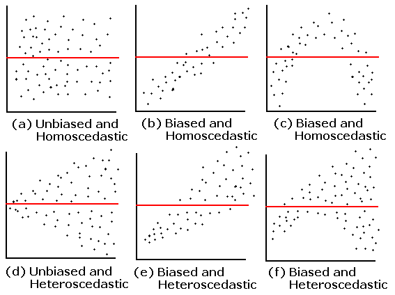
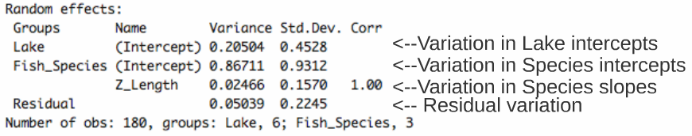

```{r setup, echo = F}
knitr::opts_chunk$set(
  comment = "#",
  collapse = TRUE,
  warning = FALSE,
  message = FALSE,
  cache = T,
  fig.width=6, fig.height=6,
  fig.align = 'center'
)
```

```{r, echo =F}
options(repos=structure(c(CRAN="http://cran.r-project.org")))
```

```{r, include = FALSE}
if (!require(ggplot2)) install.packages("ggplot2")
library(ggplot2)
if (!require(lme4)) install.packages("lme4")
library(lme4)
if (!require(AICcmodavg)) install.packages("AICcmodavg")
library(AICcmodavg)
```

# Objectives

1. What is a linear mixed effects model (LMM) and why should I care?

2. How do I implement LMM's in R?
  - A priori model building and data exploration
  - Coding potential models and model selection
  - Model validation
  - Model interpretation and visualization

---
## 1. Why choose a LMM?

Ecological and biological data can be complex!

* Inherent structure to data

* Many covariates and grouping factors

* Small sample size

---
## 1. Why choose a LMM?

Introduction to the example dataset

.center[  ]

.comment[**Q: Does fish trophic position increase with fish size for all three fish species?**
]


---

## 1. Why choose a LMM?

<br>

Throughout this workshop, there will be a serie of **challenges** that you can recognize by this rubix cube

.center[

]

<br>

**During these challenges, collaborate with your neighbors!**


---
## Challenge 1 

* Introduction to the example dataset

* Open the workshop script in R

* Reproduce the plots 1 to 3 from the script. Observe the plots and try to get a sense of what you see.

---
## Solution 

<br>

```{r, echo=F}
data <- read.csv('qcbs_w6_data.csv')

# simple theme
fig <- theme_bw() + theme(panel.grid.minor=element_blank(), panel.grid.major=element_blank(), panel.background=element_blank()) +
  theme(strip.background=element_blank(), strip.text.y = element_text()) + theme(legend.background=element_blank()) +
  theme(legend.key=element_blank()) + theme(panel.border = element_rect(colour="black", fill=NA))

plot <- ggplot(aes(Fish_Length,Trophic_Pos),data=data)

# Plot 1 - All data
plot + geom_point() + xlab("Length (mm)") + ylab("Trophic Position") + labs(title="All Data") + fig
```


---
## Solution 

<br>

```{r, echo=FALSE}
# Plot 2 - By species
plot + geom_point() + facet_wrap(~ Fish_Species) + xlab("Length (mm)") + ylab("Trophic Position") +
   labs(title="By Species") + fig
```

---
## Solution 

<br>

```{r, echo=F}
# Plot 3 – By lake
plot + geom_point() + facet_wrap(~ Lake) + xlab("Length (mm)") + ylab("Trophic Position") +
   labs(title="By Lake") + fig
```


---
## 1. Why choose a LMM?

**Group discussion**

* Do you expect all species to increase in trophic position with length?

  * In the exact same way?

<br>

--

*Do you expect these relationships to be the same across lakes?

  * What might differ?


---

## 1. Why choose a LMM?

How might we analyze these data?

<br>

You can:

<br>

**Option 1. Separate**:

- Run separate analyses for each species in each lake

**Option 2. Lump**:

- Run one analysis ignoring ake and species

---

## 1. Why choose a LMM?

.pull-left[ ]

.pull-right[
**Option 1. Separate**
* Estimate 6 intercepts and 6 slopes for each species (i.e. 6 lakes)

* Sample size *n* = 10 for each analysis (i.e. 10 fish/species/lake)

* Low chance of detecting an effect due to small *n*
]

---

## 1. Why choose a LMM?

.pull-left[]

.pull-right[
**Option 2. Lump**
* Big sample size!

* What about pseudoreplication? (fish within a lake and within a species might be correlated).

* A lot of noise in the data! Some of it might be due to difference among species and lake...
]

---
## 1. Why choose a LMM?


* For our question, we only want to know if there is a .alert [general effect of length on the trophic position]

* this relationship might differ slightly among species due to unmeasured biological processes (e.g. growth rate) or among lakes due to unmeasured environmental variables. But don't really care about these unmeasured factors we just want to control for them.


---
## 1. Why choose a LMM?

LMM are a balance between separating and lumping. They:

1. Estimate slope and intercept parameters for each species and lake (separating) but estimate fewer parameters than classical regression.

2. Use all the data available (lumping) while accounting for pseudoreplication and controlling for differences among lakes and species.


---
## 1. Why choose a LMM?

**Fixed vs Random Effects**

In the litterature on LMM, we will meet those terms frequently.

There are many possible Challengenitions, and we chose to present those we think are easier to apply when doing your analyses.

---
## 1. Why choose a LMM?

### Fixed effect

* Data comes from all possible levels of a factor (qualitative variable)

* We wish to make conclusions about the levels of the factor from which the data come from

---
## 1. Why choose a LMM?

### Random effect


* Only qualitative variables = random factor

* Data includes only a random sample of all possible factor levels, all of interest

* Often grouping factors

---
## 1. Why choose a LMM?

**How do LMMs work?**

**A.** Intercepts and/or slopes are allowed to vary according to a given factor (**effet aléatoire**), e.g. by lake and/or species.

**B.** Intercepts, slopes and their confidence interval are adjusted to **take into account the data structure**

---
## Random intercept

<br>

<p>


It is assumed that the intercepts come from a normal distribution

Only need to estimate the mean and standard deviation of the normal distribution instead of 3 intercepts, i.e. one for each species</p>

<br>

.comment[Note that the more levels your factor has, the more accurately the mean and standard deviation of the normal distribution will be estimated. Three levels may be a little low, but easier to visualize!]

---
## Random intercept

<br>

<p>

Same principle for lakes

Estimate 2 parameters (mean and standard deviation) instead of 6 intercepts.

This saves degrees of freedom (less parameter estimation is needed)
</p>


---
## Random slope


<br>

<p>

The same principle applies to slopes that vary according to a given factor, just more difficult to visualize

As for intercepts, only the mean and standard deviation of the slopes are estimated instead of three distinct slopes.
</p>

---
## Taking into account the data structure

If a certain species or lake is poorly represented (low *n*) in the data, the model will give more weight to the pooled model to estimate the intercept and slope of that species or lake.

.center[ ]

---
## Taking into account the data structure

* The confidence intervals for the intercepts and slopes are adjusted to take account of the pseudo-replication-based on the **intraclass correlation coefficient (ICC)**


* How much variation is there in each VS group between groups?


---
## Taking into account the data structure


.pull-left[
**High ICC**


the points coming from the same lake are treated as a single observation because they are very correlated

 small effective sample size and large confidence intervals for slope and intercept.
]

.pull-right[
**Low ICC**


the points coming from the same lake are treated independently because little correlated

 large effective sample size and small confidence intervals for slope and intercept.
]

---
# Challenge 2 

<br>

How will the ICC and the confidence intervals be affected in these two scenarios?

**Q1.** Fish trophic positions do not vary among lakes

<br>

**Q2.** Fish trophic positions are similar within lakes but different among lakes

---
# Solution 

**Q1.** Fish trophic positions do not vary among lakes

.alert[A1. Low ICC, small confidence intervals]

<br>

--

**Q2.** Fish trophic positions are similar within lakes but different among lakes

.alert[A2. High ICC, large confidence intervals]

---

## How to implement an LMM in R?

<br>


.comment[**Step 1: *A priori* model building and data exploration**]
<br>

**Step 2:** Code potential models and model selection

<br>

**Step 3:** Model validation

<br>

**Step 4:** Model interpretation and visualization


---
## How to implement an LMM in R?

.comment[**Step 1: *A priori* model building and data exploration**]

* What we know *a priori*:

  * We want to determine if the trophic position can be predicted by body length, while taking into account the variation between species and lakes

  * So we want a model that looks like this:

$$PT_{ijk} ~ Lenght_i + Lake_j + Species_k + \epsilon$$


---
## Data exploration


Does the data have the right structure?

```{r}
data <- read.csv('qcbs_w6_data.csv')
str(data)
```


> It is recommended to clean up your workspace (`rm.list()`) before building models

---
## Data exploration

Look at the distribution of samples for each factor:

```{r}
table(data$Lake)
table(data$Fish_Species)
```


.comment[This dataset is perfectly balanced, but the **mixed models can be used to analyze unbalanced experimental plans**, as is often the case in ecology!]

---
## Data exploration

Look at the distribution of continuous variables

```{r, fig.width=10, fig.height=4}
par(mfrow=c(1,2), mar = c(4,4,1,1))
hist(data$Fish_Length)
hist(data$Trophic_Pos)
```

.small[Major deviations could cause heteroscedasticity problems. If necessary, make transformations. In this case, **the data seems OK**.]

---
## Data exploration

Check for collinearity between your explanatory variables

- The problem with collinear predictors is simply that they explain the same thing, so their effect on the response variable will be confounded in the model

- In this example, there is no risk of collinearity with only one continuous variable. If you had another continuous variable (Var2), one simple way to check for collinearity is:

```{r, eval = F}
plot(data)

cor(var1, var2)
```


---
# Challenge 3 

What additional measures could we have taken in the field that could have been strongly correlated with body length?

--

> An example is fish body mass - this variable is strongly correlated with fish length. Therefore, we do not want to include these two variables in the same model.


---
## Data exploration

**Consider the scale of your data**

* If two variables in the same model have very different scales, the mixed model will likely returns a `convergence error` when trying to compute the parameters.

* The Z-correction standardizes the variables and solve this problem:

$$z = \frac{(x-mean(x))}{standard.deviation(x)}$$


---
## Data exploration

**Consider the scale of your data**

* Body length  Long scale

* Trophi position  Short scale

---
## Data exploration

**Consider the scale of your data**

* Because our data have very different scales of variation, we apply the **Z-correction**

```{r}
# Standardized length:
data$Z_Length <- (data$Fish_Length-mean(data$Fish_Length))/sd(data$Fish_Length)

# Standardized trophic position:
data$Z_TP<- (data$Trophic_Pos-mean(data$Trophic_Pos))/sd(data$Trophic_Pos)
```


---
## Data exploration

To find out if a mixed model is needed for your data, you need to determine whether it is important to consider the random effects that might influence the relationship you are interested in (in our case, lake and species)

We can do it by:

1. Creating a linear model without random effect

2. Calculating the residuals of this linear model

3. Plot the residuals against the levels of the potential random factors

---
## Data exploration


1. Creating a linear model without random effect

```{r}
lm.test <- lm(Z_TP ~ Z_Length, data = data)
```

2. Calculating the residuals of this linear model
```{r}
lm.test.resid <- rstandard(lm.test)
```

---
## Data exploration

3. Plot the residuals against the levels of the potential random factors

```{r, fig.width=10, fig.height=5, eval = F}
par(mfrow=c(1,2))

plot(lm.test.resid ~ data$Fish_Species,
     xlab = "Species", ylab = "Standardized residuals")

abline(0, 0, lty = 2)

plot(lm.test.resid ~ data$Lake,
     xlab = "Lake", ylab = "Standardized residuals")

abline(0, 0, lty = 2)
```

---
## Data exploration

3. Plot the residuals against the levels of the potential random factors

```{r, fig.width=10, fig.height=5, echo = F}
par(mfrow=c(1,2), mar = c(4,4,1,1))
plot(lm.test.resid ~ data$Fish_Species,
     xlab = "Species", ylab = "Standardized residuals")
abline(0, 0, lty = 2)
plot(lm.test.resid ~ data$Lake,
     xlab = "Lake", ylab = "Standardized residuals")
abline(0, 0, lty = 2)
```

.alert[These patterns suggest that there is residual variance that could be explained by these factors, so they should be included in the model.]

---
## How to implement an LMM in R?


**Step 1:** *A priori* model building and data exploration
<br>

.comment[**Step 2: Code potential models and model selection**]

<br>

**Step 3:** Model validation

<br>

**Step 4:** Model interpretation and visualization


---
## How to implement an LMM in R?

.comment[**Step 2: Code potential models and model selection**]

* Translate this model...

$$PT_{ijk} ~ Length_i + Lac_j + Espèce_k + \epsilon$$

* ... in R code

```{r, eval = F}
library(lme4)
lmer(Z_TP ~ Z_Length + (1 | Lake) + (1 | Fish_Species),
     data = data, REML = TRUE)
```


* `lmer` "linear mixed model" function from `lme4` package
* `(1 | Lake)`  indicate varying intercepts
* `REML = TRUE`  estimation method

---
## Note on estimation methods

REML (Restricted Maximum Likelihood) is the default method in `lmer`

Note that the standard deviation estimator in the Maximum Likelihood (ML) is biased by a factor of $(n-2) / n$. The REML method corrects this bias.


- We should compare **nested random effect models with REML**

- While we should compare **nested fixed effect models with ML **


---
## Code potential models and model selection

.comment[What if we want the slopes to vary?]

.center[

]


---
## Challenge 4 

Re-write the following code so that the **slopes** of the relationship between trophic position and body length **vary by lake and species**:

```{r}
lmer(Z_TP ~ Z_Length + (1 | Lake) + (1 | Fish_Species),
     data = data, REML = TRUE)
```


---
## Solution 

<br>

```{r}
lmer(Z_TP ~ Z_Length + (1 + Z_Length | Lake) + (1 + Z_Length | Fish_Species),
     data = data, REML = TRUE)
```


---
## Code potential models and model selection

<br>

* To determine if you have built the best mixed model based on your prior knowledge, you should compare this *a priori* model to other alternative models

* With the dataset you are working on, there are several alternative models that might better fit your data

---
## Challenge 5 

Make a list of 7 alternative models that could be compared to this one:

```{r, eval=F}
lmer(Z_TP ~ Z_Length + (1 | Lake) + (1 | Fish_Species),
     data = data, REML = TRUE)
```


.comment[Note: If we had different fixed effects between the models, we would have to specify `REML = FALSE` to compare with likelihood methods like AIC. Here, you must report the estimates of the "best" model parameters using `REML = TRUE`]


---
## Solution 


* We will also build the **basic linear model** `lm()` because it is always useful to see the variation in the AICc values.

```{r}
M0 <- lm(Z_TP ~ Z_Length, data = data)
```

* However, to compare this model to the MLMs, it is important to .alert[change the estimation method to ML (REML = F)] because `lm()` does not use the same estimation method as `lm ()`
  - Demonstrate that the results of the least squares method is equivalent to the results of the ML method for basic linear models!

---
## Solution

```{r}
# Linear model with no random effects
M0 <- lm(Z_TP ~ Z_Length, data = data)
# Full model with varying intercepts
M1 <- lmer(Z_TP ~ Z_Length + (1 | Fish_Species) + (1 | Lake), data = data, REML = FALSE)
# Full model with varying intercepts and slopes
M2 <- lmer(Z_TP ~ Z_Length + (1 + Z_Length | Fish_Species) + (1 + Z_Length | Lake),
           data = data, REML = FALSE)
# No Lake, varying intercepts only
M3 <- lmer(Z_TP ~ Z_Length + (1 | Fish_Species), data = data, REML = FALSE)
# No Species, varying intercepts only
M4 <- lmer(Z_TP ~ Z_Length + (1 | Lake), data = data, REML = FALSE)
# No Lake, varying intercepts and slopes
M5 <- lmer(Z_TP ~ Z_Length + (1 + Z_Length | Fish_Species), data = data, REML = FALSE)
# No Species, varying intercepts and slopes
M6 <- lmer(Z_TP ~ Z_Length + (1 + Z_Length | Lake), data = data, REML = FALSE)
# Full model with varying intercepts and slopes only varying by lake
M7 <- lmer(Z_TP ~ Z_Length + (1 | Fish_Species) + (1 + Z_Length | Lake),
           data = data, REML = FALSE)
# Full model with varying intercepts and slopes only varying by species
M8 <- lmer(Z_TP ~ Z_Length + (1 + Z_Length | Fish_Species) + (1 | Lake),
           data = data, REML = FALSE)
```


---
## Code potential models and model selection

* Now that we have a list of potential models, we want to compare them to each other to select the one(s) the with highest predictive power given the data

* Models can be compared by using the `AICc` function from the` AICcmodavg` package

* The Akaike Information Criterion (AIC) is a **measure of model quality** that can be used to compare models

* `AICc` corrects for bias created by small sample sizes

---
## Code potential models and model selection

To find the AICc value of a model, use:

```{r, eval = F}
library(AICcmodavg)
AICc(M1)
```


To group all AICc values into a single table, use:

```{r}
AICc <- c(AICc(M0), AICc(M1), AICc(M2), AICc(M3),
          AICc(M4), AICc(M5), AICc(M6), AICc(M7), AICc(M8))

Model <- c("M0", "M1", "M2", "M3", "M4", "M5", "M6", "M7", "M8")

AICtable <- data.frame(Model = Model, AICc = AICc)

```

---
## Code potential models and model selection

What do these AICc values mean?

```{r}
AICtable
```

.small[The model with the smallest AICc has the highest predictive power

Some suggest that if models are within 2 AICc units of each other then they are equally plausible.

Let's take a closer look at M8 and M2. We can exclude the others because they have such higher AICc]

---
## Code potential models and model selection

What is the structure of the best model?

```{r, eval = F}
M8 <- lmer(Z_TP ~ Z_Length + (1 + Z_Length | Fish_Species) + (1 | Lake),
           data = data, REML = FALSE)
```

Both the intercepts and slopes of the relationship between trophic position and length may vary by fish species, but only the intercept may vary by lake

<br>

.pull-left[]
.pull-right[]

---
## Code potential models and model selection

Once the best models are selected, the estimation method must be reset to `REML = TRUE`

```{r}
M8 <- lmer(Z_TP ~ Z_Length + (1 + Z_Length | Fish_Species) + (1 | Lake),
           data = data, REML = TRUE)

M2 <- lmer(Z_TP ~ Z_Length + (1 + Z_Length | Fish_Species) + (1 + Z_Length | Lake),
           data = data, REML = TRUE)
```


---
# Challenge 6 

Take 2 minutes with your neighbour to draw out the model structure of M2.

Biologically, how does it differ from M8?

Why is it not surprising that it's AICc value was 2nd best?

```{r, eval = F}
M8 <- lmer(Z_TP ~ Z_Length + (1 + Z_Length | Fish_Species) + (1 | Lake),
           data = data, REML = TRUE)

M2 <- lmer(Z_TP ~ Z_Length + (1 + Z_Length | Fish_Species) + (1 + Z_Length | Lake),
           data = data, REML = TRUE)
```

---

## Solution


**Group discussion...**

--

.alert[M2] The trophic position is a function of length and both the intercept and the effect of length on trophic position can vary by fish species and lake.

  * .small[the intrinsic factors of species and lakes cause the relationship between trophic position and length to differ (i.e. both slopes and intercepts) (i.e. slopes and intercepts)]


.alert[M8] The trophic position is a function of length and both the intercept and the effect of length on trophic position can vary by fish species but only the intercept can vary by lake (not the slope of trophic position on length).

  * .small[intrinsic factors of species alone cause this relationship to differ (i.e. slopes) and that on average trophic positions might be higher or lower in one lake versus another (i.e. intercepts).]


---
## How to implement an LMM in R?

<br>


**Step 1:** *A priori* model building and data exploration
<br>

**Step 2:** Code potential models and model selection

<br>

.comment[**Step 3: Model validation**]

<br>

**Step 4:** Model interpretation and visualization


---
## How to implement an LMM in R?

.comment[**Step 3: Model validation**]

You must verify that the model follows all the basic assumptions:

1. Check the homogeneity of the variance
  - Plot predicted values vs residual values

2. Check the independence of the model residuals
  - Plot residuals VS each covariate of the model
  - Plot residuals VS each covariate not included in the model


3. Check the normality of the model residuals
  - Histogram of residuals


---
## Model validation

1- Check the homogeneity of the variance

```{r, fig.width=4.5, fig.height=4.5, echo = -1}
par(mar=c(4,4,.5,.5))
plot(resid(M8) ~ fitted(M8), xlab = 'Predicted values', ylab = 'Normalized residuals')
abline(h = 0, lty = 2)
```

Homogeneous dispersion of the residuals  the assumption is respected!

---
## Model validation

1- Check the homogeneity of the variance

.center[

]

---
## Model validation

2- Check the independence of the model residuals with each covariate

```{r, fig.width=11, fig.height=4.5, eval = F}
par(mfrow = c(1,3), mar=c(4,4,.5,.5))

plot(resid(M8) ~ data$Z_Length, xlab = "Length", ylab = "Normalized residuals")
abline(h = 0, lty = 2)

boxplot(resid(M8) ~ Fish_Species, data = data, xlab = "Species", ylab = "Normalized residuals")
abline(h = 0, lty = 2)

boxplot(resid(M8) ~ Lake, data = data, xlab = "Lakes", ylab = "Normalized residuals")
abline(h = 0, lty = 2)
```

---
## Model validation

2- Check the independence of the model residuals with each covariate

```{r, fig.width=12, fig.height=4.5, echo = F}
par(mfrow = c(1,3), mar=c(4,4,.5,.5), cex.lab = 1.5)
plot(resid(M8) ~ data$Z_Length, xlab = "Length", ylab = "Normalized residuals")
abline(h = 0, lty = 2)
boxplot(resid(M8) ~ Fish_Species, data = data, xlab = "Species", ylab = "")
abline(h = 0, lty = 2)
boxplot(resid(M8) ~ Lake, data = data, xlab = "Lakes", ylab = "")
abline(h = 0, lty = 2)
```


Homogeneous dispersion of the residuals around 0  no pattern of residuals depending on the variable, the assumption is respected!

.comment[Note: The clusters are due to the data structure, where fish of only 5 size classes (large, small, and three groups in between) were captured.]

---
## Model validation

2- Check the independence of the model residuals with each covariate

- Plot residuals VS each covariate not included in the model

  - If you observe patterns in these plots, you will know that there is variation in your dataset that could be explained by these covariates. You should consider including them in your model.

  - Because we have included all the measured variables in our model, we can not do this step.


---
## Model validation

3- Check the normality of the model residuals

* Residuals following a normal distribution indicate that the model is not biased

```{r, fig.height=5, fig.width=5}
hist(resid(M8))
```


---
## How to implement an LMM in R?

<br>


**Step 1:** *A priori* model building and data exploration
<br>

**Step 2:** Code potential models and model selection

<br>

**Step 3:** Model validation

<br>

.comment[**Step 4: Model interpretation and visualization**]


---
## How to implement an LMM in R?

.comment[**Step 4: Model interpretation and visualization**]

```{r}
(summ_M8 <- summary(M8))
```


---
## How to implement an LMM in R?

.comment[**Step 4: Model interpretation and visualization**]

.center[

]

<br>

.center[

]

If the 95% confidence interval of the slope ($slope ± SE * 1.96$) includes zero, the slope (here = 0.4223), and therefore the effect of length on trophic position, is not significantly different from zero at the threshold $\alpha$ = 0.05.

---
## Challenge 7 

<br>

1. What is the slope and confidence interval of the Z_Length variable in the M8 model?

2. Is the slope of Z_Length significantly different from 0?

---
## Solution 

<br>

1. What is the slope and confidence interval of the Z_Length variable in the M8 model?

  - slope = 0.422;

  - CI upper limit = 0.4223 + 0.09*1.96 = 0.5987

  - CI lower limit = 0.4223 - 0.09*1.96 = 0.2459

2. Is the slope of Z_Length significantly different from 0?

  - Yes, because the CI [0.2459, 0.5987] does not include 0


---
## Challenge 8 

* It is possible to visualize graphically the different intercepts and slopes of the model to better interpret the results

* Take 2 minutes to think about different ways to represent the results of M8.

*Hint: consider the different "levels" of the model*

---
## Solution 

a) Figure with all data grouped

b) Figure by species

c) Figure by lake

---
## Solution 

To produce these figures, we need:

- The coefficients of the full model that are in the model summary

```{r}  
summ_M8$coefficients
```

Intercept = -0.0009059

Slope = 9.4222687

---
## Solution 

To produce these figures, we need:

- The coefficients for each level of the model, which can be obtained with the `coef` function

```{r}
coef(M8)
```

---
## Solution 

a) Figure with all data grouped
```{r, eval = F}
library(ggplot2)

# Create a simplified ggplot theme
fig <- theme_bw() + 
  theme(panel.grid.minor=element_blank(), 
        panel.grid.major=element_blank(),
        panel.background=element_blank()) +
  theme(strip.background=element_blank(), 
        strip.text.y = element_text()) + 
  theme(legend.background=element_blank()) +
  theme(legend.key=element_blank()) + 
  theme(panel.border = element_rect(colour="black", fill=NA))

plot <- ggplot(aes(Z_Length, Z_TP), data = data)
Plot_AllData <- plot + geom_point() +
  xlab("Length (mm)") + ylab("Trophic position") +
  labs(title = "All data") + fig

Plot_AllData + geom_abline(intercept = -0.0009059, slope = 0.4222697)
```

---
## Solution 

a) Figure with all data grouped
```{r, echo = F}
plot <- ggplot(aes(Z_Length, Z_TP), data = data)
Plot_AllData <- plot + geom_point() +
  xlab("Length (mm)") + ylab("Trophic position") +
  labs(title = "All data") + fig

Plot_AllData + geom_abline(intercept = -0.0009059, slope = 0.4222697)
```

---
## Solution 

b) Figure by species

```{r, eval = F}
# create a table with the coefs to facilitate their manipulation
Lake.coef <- as.data.frame(coef(M8)$Lake)
colnames(Lake.coef) <- c("Intercept", "Slope")
Species.coef <- as.data.frame(coef(M8)$Fish_Species)
colnames(Species.coef) <- c("Intercept", "Slope")

Plot_BySpecies<-plot + geom_point(aes(colour = factor(Fish_Species)), size = 4) +
  xlab("Length (mm)") + ylab("Trophic position") +
  labs(title = "By species") + fig

# Add regression lines for each species
Plot_BySpecies +
  geom_abline(intercept = Species.coef[1,1], slope = Species.coef[1,2], col = "coral2") +
  geom_abline(intercept = Species.coef[2,1], slope = Species.coef[2,2], col = "green4") +
  geom_abline(intercept = Species.coef[3,1], slope = Species.coef[3,2], col = "blue1")


```

---
## Solution 

b) Figure by species

```{r, echo = F, fig.width=8}
Lake.coef <- as.data.frame(coef(M8)$Lake)
colnames(Lake.coef) <- c("Intercept", "Slope")
Species.coef <- as.data.frame(coef(M8)$Fish_Species)
colnames(Species.coef) <- c("Intercept", "Slope")

Plot_BySpecies<-plot + geom_point(aes(colour = factor(Fish_Species)), size = 4) +
  xlab("Length (mm)") + ylab("Trophic position") +
  labs(title = "By species") + fig

# Add regression lines for each species
Plot_BySpecies +
  geom_abline(intercept = Species.coef[1,1], slope = Species.coef[1,2], col = "coral2") +
  geom_abline(intercept = Species.coef[2,1], slope = Species.coef[2,2], col = "green4") +
  geom_abline(intercept = Species.coef[3,1], slope = Species.coef[3,2], col = "blue1")

```

---
## Solution 

c) Figure by lake
```{r, eval=F}
Plot_ByLake <- plot + geom_point(aes(colour = factor(Lake)), size = 4) +
  xlab("Length (mm)") + ylab("Trophic Position") +
  labs(title = "By Lake") + fig

# Add in regression lines with the intercepts specific to each lake
Plot_ByLake +
  geom_abline(intercept = Lake.coef[1,1], slope = Lake.coef[1,2], col = "coral2") +
  geom_abline(intercept = Lake.coef[2,1], slope = Lake.coef[2,2], col = "khaki4") +
  geom_abline(intercept = Lake.coef[3,1], slope = Lake.coef[3,2], col = "green4") +
  geom_abline(intercept = Lake.coef[4,1], slope = Lake.coef[4,2], col = "darkgoldenrod") +
  geom_abline(intercept = Lake.coef[5,1], slope = Lake.coef[5,2], col = "royalblue1") +
  geom_abline(intercept = Lake.coef[6,1], slope = Lake.coef[6,2], col = "magenta3")

```

---
## Solution 

c) Figure by lake
```{r, echo = F, fig.width=8}
Plot_ByLake<-plot + geom_point(aes(colour = factor(Lake)), size = 4) +
  xlab("Length (mm)") + ylab("Trophic position") +
  labs(title = "par lac") + fig

# Plot the data color coded by lake
Plot_ByLake +
  geom_abline(intercept = Lake.coef[1,1], slope = Lake.coef[1,2], col = "coral2") +
  geom_abline(intercept = Lake.coef[2,1], slope = Lake.coef[2,2], col="khaki4") +
  geom_abline(intercept = Lake.coef[3,1], slope = Lake.coef[3,2], col="green4") +
  geom_abline(intercept = Lake.coef[4,1], slope = Lake.coef[4,2], col="darkgoldenrod") +
  geom_abline(intercept = Lake.coef[5,1], slope = Lake.coef[5,2], col="royalblue1") +
  geom_abline(intercept = Lake.coef[6,1], slope = Lake.coef[6,2], col="magenta3")

```


---
## Mixed model and ecological data

<br>

Mixed models are very useful for taking into account the complex structure of ecological data while not loosing too many degrees of freedom

.center[

]


---
## Challenge 9 

<br>

**Situation:**

* You have inventoried species richness **in 1000 quadrats** that are within **10 different sites** which are also within **10 different forests**.

* You also **measured productivity** in each **quadrat**.

* You want to know if productivity is a good predictor of biodiversity

.alert[What mixed model could you use for this dataset?]


---
## Solution!

<br>

```{r, eval = F}
lmer(Biodiv ~ Productivity + (1 | Forest / Site))
```

Here the random effects are nested (i.e. Sites within forest) and not crossed

---
## Challenge 10

<br>

**Situation:**

* You have collected **200 fish** from **12 different sites** evenly distributed across **4 habitat types** that are found within **the same lake**.

* You measured **the length of each fish** and the **amount of mercury in its tissue**.

* You want to know if habitat is a good predictor of mercury concentration.

.alert[What mixed model could you use for this dataset?]
---

## Solution!

<br>


```{r, eval = F}
lmer(Mercury ~ Length * Habitat_Type + (1 | Site))
```


---
## Challenge 11!

* Discuss the dataset you are working on with your neighbor and determine if a mixed model would be appropriate.

* If so, work together to write the code you would use to make this model in R.

* If not, imagine a fictitious dataset for which a mixed model would be appropriate and code that model.

---
## Additional ressources

* Difference between `nlme` et `lme4`

.center[
 
]


---
class: inverse, center, bottom

# Thank you for attending this workshop!


