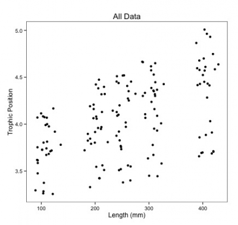
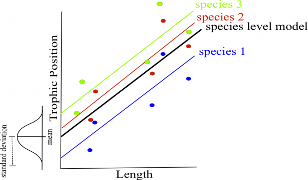
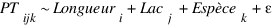
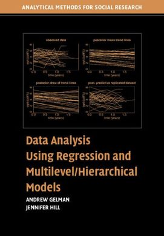

```{r setup, echo = F}
knitr::opts_chunk$set(
  comment = "#",
  collapse = TRUE,
  warning = FALSE,
  message = FALSE,
  cache = TRUE,
  fig.width=6, fig.height=6,
  fig.align = 'center'
)
```

```{r, echo =F}
options(repos=structure(c(CRAN="http://cran.r-project.org")))
```

```{r, include = FALSE}
if (!require(ggplot2)) install.packages("ggplot2")
library(ggplot2)
if (!require(lme4)) install.packages("lme4")
library(lme4)
if (!require(arm)) install.packages("arm")
library(arm)
if (!require(AICcmodavg)) install.packages("AICcmodavg")
library(AICcmodavg)
```

# Objectifs

1. Qu'est-ce qu'un modèle linéaire à effets mixtes (MLM) et pourquoi est-ce important?

2. Comment appliquer, vérifier les suppositions, comparer et présenter les résultats des MLMs dans R?
    - Construction et exploration a priori des modèles et données
    - Codage et sélection des modèles potentiels
    - Validation des modèles
    - Interprétation des résultats et visualisation du modèle

---
## 1. Pourquoi choisir un MLM?

Les données écologiques et biologiques peuvent être complexes et désordonnées!

* Structure particulière dans les données

* Plusieurs covariables (facteurs de regroupement)

* Faible taille d'échantillons

---
## 1. Pourquoi choisir un MLM?

Introduction au jeu de données

.center[  ]

.comment[**Q: Est-ce que la position trophique des poissons augmente avec leur taille?**
]


---

## 1. Pourquoi choisir un MLM?

<br>

Dans cet atelier, il y aura une série de **défis** que vous reconnaitrez par le symbole du cube rubique

.center[

]

<br>

**Pendant ces défis, collaborez avec votre voisin-e!**


---
## Défi 1 

* Introduction au jeu de données

* Ouvrez le script de l'atelier dans R

* Faites les graphiques 1 à 3,
regardez les graphiques et
essayez d'obtenir une idée de ce qui se passe


---

## Solution 

<br>

```{r, echo=F}
data <- read.csv('qcbs_w6_data.csv')

# thème simplifié
fig <- theme_bw() + theme(panel.grid.minor=element_blank(), panel.grid.major=element_blank(), panel.background=element_blank()) +
  theme(strip.background=element_blank(), strip.text.y = element_text()) + theme(legend.background=element_blank()) +
  theme(legend.key=element_blank()) + theme(panel.border = element_rect(colour="black", fill=NA))

# Faites les trois graphiques suivants pour explorer les données
plot <- ggplot(aes(Fish_Length,Trophic_Pos),data=data)

# Graphique 1 - Toutes les données
plot + geom_point() + xlab("Length (mm)") + ylab("Trophic Position") + labs(title="All Data") + fig
```


---
## Solution 

<br>

```{r, echo=FALSE}
# Graphique 2 - Par espèce
plot + geom_point() + facet_wrap(~ Fish_Species) + xlab("Length (mm)") + ylab("Trophic Position") + 
   labs(title="By Species") + fig
```

---
## Solution 

<br>

```{r, echo=F}
# Graphique 3 – Par lac 
plot + geom_point() + facet_wrap(~ Lake) + xlab("Length (mm)") + ylab("Trophic Position") + 
   labs(title="By Lake") + fig
```


---
## 1. Pourquoi choisir un MLM?

**Discussion de groupe**

* Est-ce qu'on s'attend à ce que, pour toutes les espèces, la position trophique augmente avec la longueur corporelle?

    * Exactement de la même façon?

<br>

--

* Est-ce qu'on s'attend à ce que ces relations soient pareilles entre les lacs?

    * Comment pourraient-elles différer?

---

## 1. Pourquoi choisir un MLM?

Comment pourrions-nous analyser ces données?

<br>

Nous pourrions:

<br>

**Option 1. Séparer**: 

- Faire une analyse separée pour chaque espèces et chaque lac

**Option 2. Regrouper**: 

- Faire une seule analyse en ignorant les variables espèces et lac

---

## 1. Pourquoi choisir un MLM?

.pull-left[ ]

.pull-right[
**Option 1. Séparer**
* Estime 6 intercepts et 6 pentes pour chaque espèces (i.e. 6 lacs)

* Taille d'échantillon *n* = 10 pour chaque analyse (i.e. 10 poissons/espèces/lac)

* Peu de chances de détecter un effet a cause de la faible taille d'échantillion *n*
]

---

## 1. Pourquoi choisir un MLM?

.pull-left[]

.pull-right[
**Option 2. Regrouper:**
* Très grande taille d'échantillon!

* Et la pseudoreplication? (les poissons d'un même lac et d'une même espèce sont correlés).

* Beaucoup de bruit! Une partie doit être due aux effets de l'espèce et du lac.
]

---
## 1. Pourquoi choisir un MLM?

.comment[
* Pour notre question, on veut seulement savoir s'il y a un **effet général de la longueur corporelle sur la position trophique**

* Ceci pourrait varier faiblement par espèce à cause de différents taux de croissance et/ou par lac à cause de différences dans la disponibilité de nourriture. On ne s'intéresse pas directement à ces facteurs non mesurés, mais on doit contrôler leur effet dans le modèle
]

---
## 1. Pourquoi choisir un MLM?

.left[Les MLMs sont un compromis entre séparer et regrouper. Ils:
]

1. Estiment une pente et un intercept pour chaque espèce et chaque lac (séparer) mais en calculant moins de paramètres qu'une regression classique

2. Utilisent toutes les données disponibles (regrouper) tout en contrôlant les différences entre les lacs et les espèces (pseudo-replication)

---
## 1. Pourquoi choisir un MLM?

**Effet fixe VS aléatoire**

.center[Dans la littérature des MLMs, vous rencontrerez ces termes souvent.

Il existe plusieurs définitions possibles des effets fixes et aléatoires et nous vous présenterons aujourd'hui celles que nous trouvons plus faciles a appliquer
]
---
#1. Qu'est-ce qu'un MLM et pourquoi est-ce important?

.huge[**Effet fixe **
]
* Les données proviennent de tous les niveaux possibles d'un facteur (variable qualitative)

* On souhaite émettre des conclusions à propos des niveaux du facteur d'où les données proviennent

---
#1. Qu'est-ce qu'un MLM et pourquoi est-ce important?

.huge[**Effet aléatoire**
]
* Seulement des variables qualitatives = facteur aléatoire

* Les données incluent seulement un échantillon aléatoire de tous les niveaux possibles du facteur, qui sont tous d'intérêt

* Souvent des facteurs groupants

---
#1. Qu'est-ce qu'un MLM et pourquoi est-ce important?

**Comment fonctionnent les MLMs?**

A. Permettre aux intercepts et/ou les pentes peuvent varier par lac et par espèces

B. Les intercepts, les pentes et leurs intervalles de confiance sont ajustés pour prendre en compte la structure des données

---
# A. Permettre aux intercepts de varier selon un facteur donné

* Supposons que les intercepts proviennent d'une distribution normale (DN)

.pull-left[* Seulement besoin d'estimer la moyenne et l'ecart type de a DN au lieu de 3 ordonnées a l'origine]

.pull-right[ ]


.alert[.small[* Notez que plus votre facteur comporte de niveaux, le plus précisement vous estimerez la moyenne et l'écart-type de votre DN. Trois niveaux c'est un peu faible, mais plus facile à visualiser ! ]]

---

# A. Permettre aux intercepts de varier selon un facteur donné

* Même chose pour les lacs


.pull-left[ * Estime 2 paramètres (moyenne et E-T) au lieu de 6 ordonnées à l'origine - sauve des degrés de liberté]

.pull-right[ ]

---

#A. Permettre aux intercepts de varier selon un facteur donné


Même concept pour les pentes, juste plus difficile à visualiser

.pull-left[ ]


.pull-right[Encore, estime seulement la moyenne et l'écart-type au lieu de 3 pentes]

---


#B. Ajuster les intercepts et pentes pour tenir compte de la structure des données

Si une certaine espèce ou un lac est peu représenté (faible n) dans les données, le modèle va accorder plus d'importance au modèle groupé pour estimer l'intercept et la pente de cette espèce ou de ce lac.

.center[ ]

---

# B. Ajuster les intercepts et pentes pour tenir compte de la structure des données

* Les intervalles de confiance des intercepts et pentes sont ajustés pour tenir compte de la pseudo-replication basée sur: **Le coefficient de corrélation intra-classe (CCI)**


* Combien de variation y a-t-il dans chaque groupe VS entre les groupes ?


---
# B. Ajuster les intercepts et pentes pour tenir compte de la structure des données

* CIC élevé

.pull-left[]

* CIC faible

.pull-right[]

---
# B. Ajuster les intercepts et pentes pour tenir compte de la structure des données

.pull-left[Petite taille effective de l'échantillon, ET plus elevé, et grands intervalles de confiance. Les points seront traites comme une seule observation ]

.pull-right[
]

---
# B. Ajuster les intercepts et pentes pour tenir compte de la structure des données

.pull-left[Grande taille effective de l'échantillon, ET plus petite, et plus petits intervalles de confiance. Les points seront traités comme étant indépendants ]

.pull-right[
]
---
# Defi 2 

Comment le CIC et l'intervalle de confiance seront affectés dans ces deux scénarios ?

1. Les positions trophiques des poissons ne varient pas entre les lacs

2. Les positions trophiques des poissons sont similaires dans les lacs mais différentes entre les lacs

---
# Solution 


Q1. La position trophique ne varie pas entre les lacs?

R1. *CIC faible, petits intervalles de confiances*

Q2. La position trophique est similaire dans un lac mais différente entre les lacs ?

R2. *CIC élevé, grands intervalles de confiance*

---

# Comment implémenter un MLM dans R ?

Etape1: Construction du modèle *a priori* et exploration des données

Etape2: Coder les modèles potentiels et sélectionner le meilleur modèle

Etape3: Valider le modèle

Etape4: Interpréter les résultats et visualiser le modèle

.right[ ]


---

# Comment implémenter un MLM dans R ?

.huge[**Etape1:**] Construction du modèle *a priori* et exploration des données

* Modèle base sur connaissance *a priori*:
* nous voulons déterminer si la position trophique peut être prédite par la longueur corporelle, tout en prenant en compte la variation entre les espèces et les lacs

* Donc nous voulons un modèle qui ressemble a ceci:

.center[ ]

---
# Exploration des données

Assurez-vous d'avoir fait le ménage de l'espace de travail (Housekeeping) avant de construire un modèle

Les données ont-elles la bonne structure?
```{r}
str(data) # vérifier d'avoir charger les données avant
```

---
# Exploration des données

Regardez la distribution des échantillons pour chaque facteur:
```{r, echo=c(10:11)}
# Supprimer commandes antérieures en R
rm(list=ls())
library(ggplot2)
library(lme4)
library(arm)
library(AICcmodavg)
data <- read.csv('qcbs_w6_data.csv')
table(data$Lake)
table(data$Fish_Species)

```


* Ce jeu de données est parfaitement equilibré, mais les **modèles mixtes peuvent analyser les plants experimentaux non equilibrés**, comme c'est souvent le cas en écologie!

---
# Exploration des données

Regardez la distribution des variables continues

```{r}
hist(data$Fish_Length)
```

---
# Exploration des données

Regardez la distribution des variables continues

```{r}
hist(data$Trophic_Pos)
```
---
# Exploration des données

Regardez la distribution des variables continues


* Des déviations majeures pourraient causer des problèmes d'hétéroscédasticité. Si nécessaire, faites des transformations. Dans ce cas-ci, **les données semblent correctes**.

---
# Exploration des données

Vérification de la colinéarité entre vos variables explicatives

* Vous ne pouvez inclure deux variables explicatives collinéaires dans un même modèle, leurs effets sur la variable réponse seront confondus

> plot(data)

*
> cor()

* Pas de risque de colinéarité avec seulement une variable explicative continue

---
# Défi 3

Quelles mesures supplémentaires aurions-nous pu prendre sur le terrain et qui auraient pu être fortement corrélées avec la longueur corporelle?


.right[ ]


---
# Exploration des données

.large[Considérez l'échelle de vos données]
* Si deux variables dans un même modèle ont des valeurs se situant sur des échelles très différentes, il est probable que le modèle mixte indique un problême de convergence en essayant de calculer les paramètres.

* La correction Z standardise les variables et résout ce problème :
* **z = (x-moyenne(x))/ecart-type(x)**

---
# Exploration des données

Considérez l'échelle de vos données

* Longueur corporelle: Longue échelle

* Position trophique: Courte échelle

---
# Exploration des données

Considérez l'échelle de vos données
* Parce que nos données ont des échelles très différentes, on applique la **correction Z**

Longueur corrigée:
> data$Z_Length <- (data$Fish_Length-mean(data$Fish_Length))/sd(data$Fish_Length)

Position trophique corrigée:
> data$Z_TP<- (data$Trophic_Pos-mean(data$Trophic_Pos))/sd(data$Trophic_Pos)

---
# Exploration des données

Pour savoir si un modèle mixte est nécessaire pour vos données, vous devez déterminer s'il est important de prendre en compte l'effet aléatoire de facteurs qui pourraient influencer la relation qui vous intéresse

* Lac et espèce dans notre cas

---
# Exploration des données

**Comment?**

* Créer un modèle linéaire sans les facteurs qui pourraient avoir un effet aléatoire

* Calculer les résidus de ce modèle linéaire

* Faites un graphique de la valeur des résidus en fonction des niveaux des facteurs potentiellement aléatoires

---

# Exploration des données

```{r, echo=F}
#Longueur corrigée:
data$Z_Length <- (data$Fish_Length-mean(data$Fish_Length))/sd(data$Fish_Length)

#Position trophique corrigée:
data$Z_TP<- (data$Trophic_Pos-mean(data$Trophic_Pos))/sd(data$Trophic_Pos)
```
**Comment?**

* Creer un modèle linéaire sans les facteurs
```{r}
lm.test<- lm(Z_TP~Z_Length, data=data)
```

* Calculer les résidus de ce modèle linéaire
```{r}
lm.test.resid<-rstandard(lm.test)
```

---

# Exploration des données

* Représentez graphiquement la valeur des résidus en fonction des niveaux des facteurs

.pull-left[ # Effet de l'espèce
> plot(lm.test.resid~data$Fish_Species, xlab="Species",    ylab="Standardized residuals")
abline(0,0, lty=2)

]

.pull-right[ # Effet du lac
> plot(lm.test.resid~data$Lake, xlab="Lake", ylab="Standardized residuals")
abline(0,0, lty=2)

]


---
# Exploration des données

* Représentez graphiquement la valeur des résidus en fonction des niveaux des facteurs.


* Effet de l'espèce et Effet du lac
```{r, echo=F, fig.width=8, fig.height=8}
par(mfrow=c(1,2))
plot(lm.test.resid~data$Fish_Species,
     xlab="Species",
     ylab="Standardized residuals")
abline(0,0, lty=2)
plot(lm.test.resid~data$Lake,
     xlab="Lake",
     ylab="Standardized residuals")
abline(0,0, lty=2)
```


.alert[Ces patrons suggèrent qu'il y a de la variance résiduelle qui pourrait être expliquée par ces facteurs, et ils devraient donc être inclus dans le modèle]

---

# Comment implémenter un MLM dans R ?

Etape1: Construction du modèle *a priori* et exploration des données

.huge[**Etape2:**] Coder les modèles potentiels et sélectionner le meilleur modèle

Etape3: Valider le modèle

Etape4: Interpréter les résultats et visualiser le modèle

.right[ ]

---

# Comment implémenter un MLM dans R ?

**Etape2: **Coder les modèles potentiels et sélectionner le meilleur modèle

* On veut que notre modèle dise quelque chose comme :


* Dans R, on le code ainsi

>lmer(Z_TP~Z_Length + (1|Lake) + (1|Fish_Species),
     data=data, REML=TRUE)


---

# Coder et sélectionner le meilleur modèle

* Coder un modèle mixte dans R:

> lmer(Z_TP~Z_Length + (1|Lake) + (1|Fish_Species),
     data=data, REML=TRUE)

* LMER : fonction "linear mixed model"
* (1|Lake) : indique que les intercepts peuvent varier
* REML=TRUE : méthode d'estimation

---
# Note a propos de la méthode d'estimation

REML (Restricted Maximum Likelihood) est la méthode par défaut dans la fonction "lmer"


On devrait comparer les **modèles d'effets aléatoires** niches avec **REML**

---
# Coder un modèle mixte dans R:
> lmer(Z_TP~Z_Length + (1|Lake) + (1|Fish_Species),
     data=data, REML=TRUE)

* LMER : fonction "linear mixed model"
* (1|Lake) : indique que les intercepts peuvent varier
* REML=TRUE : méthode d'estimation

---

.center[]


---
# Coder un modèle mixte dans R:

> lmer(Z_TP~Z_Length + (1|Lake) + (1|Fish_Species),
     data=data, REML=TRUE)


.comment[* Mais comment faire si on souhaite que la pente puisse varier ?]

---
# Coder et sélectionner le meilleur modèle

* Coder un modèle mixte dans R :


---
# Défi 4

Réecrivez le code suivant de façon à ce que les **pentes** de la relation position trophique en fonction de longueur corporelle **varient par lac et par espèces**:

```{r, echo=c(1:2)}
lmer(Z_TP~Z_Length + (1|Lake) + (1|Fish_Species),
     data=data, REML=TRUE)
```

.right[]


---
# Solution!

> lmer(Z_TP~Z_Length + (1+Z_Length|Lake) + (1+Z_Length|Fish_Species),
     data=data, REML=TRUE)


.right[]


---
# Coder et sélectionner le meilleur modèle

* Pour déterminer si vous avez construit le meilleur modèle mixte base sur vos connaissances a priori, vous devez comparer ce modèle a priori aux autres modèles aternatifs

* Avec le jeu de données sur lequel vous travaillez, il y a plusieurs modèles alternatifs qui pourraient mieux correspondre à vos données

---

# Défi 5

Faites une liste de 7 modèles alternatifs qui pourraient être construits et comparés à partir de celui-ci:
> lmer(Z_TP~Z_Length + (1|Lake) + (1|Fish_Species),
     data=data, REML=TRUE)

.comment[.small[*Note: Si nous avions différents effets fixes entre les modèles, nous aurions dû indiquer "REML=FALSE". Cependant, vous devez rapporter les estimations des paramètres du "meilleur" modèle en utilisant "REML=TRUE"]]

.right[]

---
# Solution

**modèle bonus**

* Nous allons aussi construire le modèle linéaire de base lm() parce qu'il est toujours utile de voir la variation dans les valeurs de AICc.
```{r, echo=F}
M0<-lm(Z_TP~Z_Length, data=data)
```

>M0<-lm(Z_TP~Z_Length, data=data)

* Par contre, pour comparer ce modèle aux MLMs, il est important de .alert[changer la méthode d'estimation a ML (REML=F)] parce que lm() n'utilise pas la même méthode d'estimation que lmer()
- Démontrer que les résultats de la méthode des moindres carrés (least squares) est équivalente aux résultats de la méthode ML pour les modèles linéaires de bases!

---

# Solution!

```{r, echo=T}
# Modele bonus!
M0<-lm(Z_TP~Z_Length, data=data)
# modèle complet avec variation des intercepts
M1<-lmer(Z_TP~Z_Length + (1|Fish_Species) + (1|Lake), data=data, REML=FALSE)
# modèle complet avec variation des intercepts et de pentes
M2<-lmer(Z_TP~Z_Length + (1+Z_Length|Fish_Species) + (1+Z_Length|Lake), data=data, REML=FALSE)
# Pas d'effet lac, les intercepts varient par espèces
M3<-lmer(Z_TP~Z_Length + (1|Fish_Species), data=data, REML=FALSE)
# Pas d'effet espèces, les intercepts varient par lac
M4<-lmer(Z_TP~Z_Length + (1|Lake), data=data, REML=FALSE)
# Pas d'effet de lac, les intercepts et les pentes varient par espèces
M5<-lmer(Z_TP~Z_Length + (1+Z_Length|Fish_Species), data=data, REML=FALSE)
# Pas d'effet de l'espèces, les intercepts et les pentes varient par lac
M6<-lmer(Z_TP~Z_Length + (1+Z_Length|Lake), data=data, REML=FALSE)
# modèle complet, variation d'intercept et pente par lac
M7<-lmer(Z_TP~Z_Length + (1|Fish_Species) + (1+Z_Length|Lake), data=data, REML=FALSE)
# modèle complet, variation d'intercept et pente par espèces
M8<-lmer(Z_TP~Z_Length + (1+Z_Length|Fish_Species) + (1|Lake), data=data, REML=FALSE)
```


---
# Coder et sélectionner le meilleur modèle

* Maintenant que nous avons une liste de modèles potentiels, nous voulons les comparer entre eux pour sélectionner celui(ceux) qui a(ont) le plus de pouvoir predictif

---
# Coder et sélectionner le meilleur modèle

* Les modèles peuvent être comparés en utiliant la fonction "AICc" provenant du paquet (*package*) "AICcmodavg"

* Le critère d'information Akaike (AIC) est une **mesure de qualité du modèle** pouvant être utilisée pour comparer les modèles

* AICc corrige pour le biais créé par les faibles tailles d'échantillon quand le AIC est calculé

---
# Coder et sélectionner le meilleur modèle

Pour trouver la valeur AICc d'un modèle, utilisez :

>AICc(M1)


Pour regrouper toutes les valeurs d'AICc dans un seul tableau, utilisez :
>AICc<-c(AICc(M0), AICc(M1), AICc(M2), AICc(M3),AICc(M4), AICc(M5), AICc(M6), AICc(M7), AICc(M8))

> Model<-c("M0", "M1", "M2", "M3", "M4", "M5", "M6", "M7", "M8")

> AICtable<-data.frame(Model=Model, AICc=AICc)

```{r, echo=F}
AICc<-c(AICc(M0), AICc(M1), AICc(M2), AICc(M3),AICc(M4), AICc(M5), AICc(M6), AICc(M7), AICc(M8))

Model<-c("M0", "M1", "M2", "M3", "M4", "M5", "M6", "M7", "M8")

AICtable<-data.frame(Model=Model, AICc=AICc)

```

---

# Coder et sélectionner le meilleur modèle

Qu'est-ce que ces valeurs d'AICc nous disent ?

> AICtable

.push-left[
```{r, echo=F}
AICtable
```
]

.push-right[
.small[ * Le modèle avec un AICc plus bas a le plus grand pouvoir prédictif considérant les données

* Certains disent que si deux modelès sont à plus ou moins 2 unitées d'AICc de différence, leurs pouvoirs prédictifs sont équivalents

* Dans notre cas, on peut regarder de plus près M8 et M2, mais tous les autres ont des AICc tellement plus élevés qu'on peut exclure la possibilite qu'ils soient les meilleurs modèles pour nos données]
]

---
# Coder et sélectionner le meilleur modèle

Quelle est la structure du meilleur modçle?

> AICtable

> M8<-lmer(Z_TP~Z_Length + (1+Z_Length|Fish_Species) + (1|Lake), data=data, REML=FALSE)


* L'intercept et l'effet de la longueur sur la position trophique peut varier selon l'espèce de poissons, mais seulement l'intercept peut varier par lac

---
# Coder et sélectionner le meilleur modèle

Quelle est la structure du meilleur modçle?

>M8<-lmer(Z_TP~Z_Length + (1+Z_Length|Fish_Species) + (1|Lake), data=data, REML=FALSE)

.push-left[]
.push-right[]

---
# Coder et sélectionner le meilleur modèle

Une fois que les meilleurs modèles sont sélectionnés il faut remettre la méthode d'estimation a REML=TRUE

> M8<-lmer(Z_TP~Z_Length + (1+Z_Length|Fish_Species) + (1|Lake), data=data, REML=TRUE)


> M2<-lmer(Z_TP~Z_Length + (1+Z_Length|Fish_Species) + (1+Z_Length|Lake), data=data, REML=TRUE)

---
# Défi 6

Prenez deux minutes avec votre voisin pour étudier la structure du modèle M2.

Comment diffère-t-il de M8 d'un point de vue écologique?

Pourquoi n'est il pas surprenant que sa valeur AICc était la deuxième meilleure?
> M2<-lmer(Z_TP~Z_Length + (1+Z_Length|Fish_Species) + (1+Z_Length|Lake), data=data, REML=TRUE)

.push-right[]
---

# Solution!

.large[**Discussion de groupe...**]

.right[]


---
# Comment implémenter un MLM dans R?

**Etape3: **Valider le modèle


.right[ ]


---
# Comment implémenter un MLM dans R?

**Etape3: **Valider le modèle
* Vous devez vérifier que le modèle respecte toutes les suppositions de bases

A. Vérifier l'homogénéité des résidus
- Faire un graphique des valeurs prédites en fonction des valeurs résiduelles

B. Vérifier l'indépendance des résidus
- Graphique des résidus VS chaque covariable du modèle
- Graphique des résidus VS chaque covariable non incluses du modèle

C. Vérifier la normalité
- Histogramme

.right[ ]


---

# Valider le modèle

A. Vérifier l'homogénéité de la variance
- graphique des valeurs prédites VS résiduelles

```{r, fig.width=6, fig.height=6}
E1 <- resid(M8)
F1 <- fitted(M8)
plot(x=F1, y=E1, xlab= 'Fitted values', ylab='Normalizes residuals')
abline (h=0, lty=2)
```
---
# Valider le modèle

```{r, echo=F, fig.width=6, fig.height=6}
plot(x=F1, y=E1, xlab= 'Fitted values', ylab='Normalizes residuals')
abline (h=0, lty=2)
```
* Etendue égale des résidus suggère que le modèle est adéquat pour bien modéliser nos données

---
# Valider le modèle
B. Vérifier l'indépendance des résidus
- Graphique des résidus VS chaque covariable du modèle
```{r, echo=F}
plot(x=data$Z_Length, y = E1, xlab="Z Length", ylab="Normalized residuals")
abline(h=0, lty=2)
```

---
# Valider le modèle
## B. Vérifier l'indépendance des résidus

* L'étendue égale au-dessus et en dessous de 0 indique qu'il n'y a pas de problèmes d'indépendance avec cette variable
* Les regroupements de données sont dus à la structure des données, où des poissons de seulement certaines classes de tailles étaient capturés (grande, petite et 3 dans le milieu)

---

# B. Vérifier l'indépendance des résidus
- Graphique des résidus VS chaque covariable du modèle
```{r, echo=F}
# Utilisé pour simplifier les figures
fig <- theme_bw() + theme(panel.grid.minor=element_blank(), panel.grid.major=element_blank(), panel.background=element_blank()) +
  theme(strip.background=element_blank(), strip.text.y = element_text()) + theme(legend.background=element_blank()) +
  theme(legend.key=element_blank()) + theme(panel.border = element_rect(colour="black", fill=NA))

boxplot(E1~Fish_Species, ylab="Normalized residuals", data=data, xlab="Species")
abline(h=0, lty=2)
```
>boxplot(E1~Fish_Species, ylab="Normalized residuals", data=data, xlab="Species")
abline(h=0, lty=2)


---
# B. Vérifier l'indépendance des résidus
- Graphique des résidus VS chaque covariable du modèle

```{r, echo=F}
boxplot(E1~Lake, ylab="Normalized residuals", data=data, xlab="Lake")
abline(h=0, lty=2)
```
>boxplot(E1~Lake, ylab="Normalized residuals", data=data, xlab="Lake")
abline(h=0, lty=2)


Aucun patron observe suggere qu'il n'y a pas de problemes d'independance pour lac et especes

---


# B. Vérifier l'indépendance des résidus
- Graphique des résidus VS chaque covariable non incluses du modèle

* Si vous observez des patrons dans ce graphique, vous saurez qu'il y a de la variation dans votre jeu de données qui pourrait être expliquée par ces covariables. Vous devriez considerer de ré-inclure ces variables dans votre modèle.

* Puisque dans notre cas, nous avons inclus touts les variables mesurées dans notre modèle, nous ne pouvons pas faire cette étape.

---

# Validation du modele

C. Vérifier la normalite des residus

* Des residus suivant une distribution normale indiquent que le modele n'est pas biaise

```{r, echo=F, fig.width=6, fig.height=6}
E1<- resid(M8)
hist(E1)
```


---
# Comment implémenter un MLM dans R ?

**Etape4: **Interpréter les résultats et visualiser le modèle

.right[ ]

---
# Comment implémenter un MLM dans R ?

**Etape4: **Interpreter les résultats et visualiser le modèle

```{r}
summary(M8)
```


---
# Comment implémenter un MLM dans R ?

**Etape4: **Interpreter les résultats et visualiser le modèle

* Qu'est ce que la "variance"?
 - Ecart-type(SD)^2

* Qu'est-ce qu'une "p-value"?
 - La pente estimée +/- l'intervalle de confiance à 95%

---
# Defi 7

a) quelle est la pente et son intervalle de confiance de la variable Z_Length dans le modèle M8?

b) Est-ce que la pente de Z_Length est significativement différente de 0 ?


.right[ ]

---
# Solution!

a) * pente = 0,422;
* IC= 0.09*2 = 0.18

b)  Oui, car l'IC n'inclut pas 0

-> Voir dans le "summary(M8)", la partie "Fixed effects"

---
# Interpréter les résultats et visualiser le modèle

* Les différentes interceptes et pentes générées par le modèle peuvent etre placées dans des figures pour mieux visualiser les résultats d'un modèle mixte

.push-right[ ]

---
# Défi

Prenez deux minutes pour reflêhir aux différentes façon que vous pourriez utiliser pour représenter les résultats de M8.

*Indice: considérez les différents "niveaux" du modèle*

.push-right[]

---
# Solution!
.push-left[]

a) Toutes les données regroupées

b) figure par espèce

c) Figure par lac

---
```{r}
library(ggplot2)
plot <- ggplot(aes(Z_Length, Z_TP), data=data)
Plot_AllData <- plot + geom_point()+ xlab("Length (mm)")+ ylab("Trophic Position")+ labs(title="All Data") + fig
Plot_AllData + geom_abline(intercept= -.0009059, slope=0.4222697)

```
---
```{r, echo=F}
Lake.coef <- as.data.frame(coef(M8)$Lake)
colnames(Lake.coef) <- c("Intercept","Slope")
Species.coef <- as.data.frame(coef(M8)$Fish_Species)
colnames(Species.coef) <- c("Intercept","Slope")
Plot_BySpecies<-plot + geom_point(aes(colour = factor(Fish_Species)), size = 4) + xlab("Length (mm)") + ylab("Trophic Position") + labs(title="By Species") + fig
# Ajoutez les lignes de régression pour chaque espèce

Plot_BySpecies + geom_abline(intercept = Species.coef[1,1], slope =Species.coef[1,2], colour="coral2") + geom_abline(intercept = Species.coef[2,1], slope =Species.coef[2,2], colour = "green4") + geom_abline(intercept = Species.coef[3,1], slope =Species.coef[3,2], colour="blue1")


```
---
```{r, echo=F}
Plot_ByLake<-plot + geom_point(aes(colour = factor(Lake)), size = 4) + xlab("Length (mm)") + ylab("Trophic Position") + labs(title="By Lake") + fig
# Ajouter les lignes de régression avec les intercepts spécifiques à chaque lac
Plot_ByLake + geom_abline(intercept = Lake.coef[1,1], slope =Lake.coef[1,2], colour="coral2") + geom_abline(intercept = Lake.coef[2,1], slope =Lake.coef[2,2], colour="khaki4") + geom_abline(intercept = Lake.coef[3,1], slope =Lake.coef[3,2], colour="green4") + geom_abline(intercept = Lake.coef[4,1], slope =Lake.coef[4,2], colour="darkgoldenrod") + geom_abline(intercept = Lake.coef[5,1], slope =Lake.coef[5,2], colour="royalblue1") + geom_abline(intercept = Lake.coef[6,1], slope =Lake.coef[6,2], colour="magenta3")

```
---

# Interpréter les résultats et visualiser le modèle

* Pour faire ces figures vous devez obtenir les coefficients (intercepts et pentes) de chaque composante du modèle
  * Coefficient du modèle complet (aka: "coefs") se trouvent dans le résumé du modèle
  * Coefficients pour chaque niveau du modèle (dans notre cas: Lac et Espece) peuvent être obtenus en utilisant la fonction "coef"

---
# Comment visualiser les résultats

a) Toutes les données regroupées

b) Figure par espèce

c) Figure par lac

---

# Toutes les données groupées

1- Obtenir les coefficients d'intérêts
> summary(M8)

OaO = -0.0009059
Pente = 9.4222687

2- Illustrer les coefs
* Graphique qui inclut toutes les données

> plot <- ggplot(aes(Z_Length, Z_TP), data=data)
> Plot_AllData <- plot + geom_point()
>+ xlab("Length (mm)")
>+ ylab("Trophic Position")
>+ labs(title="All Data") + fig

* Ajouter une ligne avec coefs

> Plot_AllData

>+ geom_abline(intercept= -.0009059, slope=0.4222697)

---
```{r, echo=F}
# Visualiser les résultats du modèle ####
# Il existe plusieurs façons de visualiser les résultats d'un modèle mixte, qui font tous appel au coefficients générés par le modèle.
# La première étape est d'obtenir les coefficients du modèle afin de les ajouter aux figures
coef(M8)
# Maintenant, mettez les coefs dans un tableau pour les rendre plus faciles à manipuler
Lake.coef <- as.data.frame(coef(M8)$Lake)
colnames(Lake.coef) <- c("Intercept","Slope")
Species.coef <- as.data.frame(coef(M8)$Fish_Species)
colnames(Species.coef) <- c("Intercept","Slope")
```
---
# Figure par espèce

1- Obtenir les coefficients d'intérêts
> coef(M8)

2- Colorez les données par espèce et ajoutez les lignes de regression pour chaque espèce en utilisant les coefficients extraits

---
```{r, echo=F}
Plot_BySpecies<- plot + geom_point(aes(colour = factor(Fish_Species)), size = 4) + xlab("Length (mm)") + ylab("Trophic Position") + labs(title="By Species") + fig
# Ajoutez les lignes de régression pour chaque espèce
Plot_BySpecies + geom_abline(intercept = Species.coef[1,1], slope =Species.coef[1,2], colour="coral2") + geom_abline(intercept = Species.coef[2,1], slope =Species.coef[2,2], colour = "green4") + geom_abline(intercept = Species.coef[3,1], slope =Species.coef[3,2], colour="blue1")
```

---

# Figure par lac

1- Obtenir les coefficients d'interet
> coef(M8)

2- Colorez les données par lac et ajoutez les lignes de regression pour chaque espèce en utilisant les coefficients extraits

---
```{r, echo=F}
Plot_ByLake<-plot + geom_point(aes(colour = factor(Lake)), size = 4) + xlab("Length (mm)") + ylab("Trophic Position") + labs(title="By Lake") + fig
# Ajouter les lignes de régression avec les intercepts spécifiques à chaque lac
Plot_ByLake + geom_abline(intercept = Lake.coef[1,1], slope =Lake.coef[1,2], colour="coral2") + geom_abline(intercept = Lake.coef[2,1], slope =Lake.coef[2,2], colour="khaki4") + geom_abline(intercept = Lake.coef[3,1], slope =Lake.coef[3,2], colour="green4") + geom_abline(intercept = Lake.coef[4,1], slope =Lake.coef[4,2], colour="darkgoldenrod") + geom_abline(intercept = Lake.coef[5,1], slope =Lake.coef[5,2], colour="royalblue1") + geom_abline(intercept = Lake.coef[6,1], slope =Lake.coef[6,2], colour="magenta3")
```

---
# Modèle mixtes et données en écologie

Les modèles mixtes sont très utiles pour prendre en compte la structure complexe des données en écologie tout en permettant de ne pas perdre beaucoup de degrés de liberté

---
# Défi 8 
**Situation:**
* Vous avez recolté des estimés de biodiversité *dans 1000 quadrats* qui sont dans *10 différents sites* qui sont également dans *10 différentes forêts*.
* Vous avez de plus *mesuré la productivité* dans chaque *quadrat*.
* Vous vous intéressez à savoir si la productivité est un bon prédicteur de biodiversité

- Quel modèle mixte pourriez-vous utiliser pour ce jeu de données?
---
# Solution!

> lmer(Bio_Div~Prodcutivite + (1|Foret/Site))

Ici les effets aléatoires sont nichés (i.e. Sites dans forêt) et non croisés


---
# Défi 9

**Situation:**
* Vous avez recolté *200 poissons* dans *12 différents sites* distribués également dans *4 habitats* différents qui se retrouvent dans un *même lac*.
* Vous avez mesuré la *longueur de chaque poisson* et la *quantité de mercure dans ses tissus*.
* Vous vous intéressez surtout à savoir si l'habitat est un bon prédicteur de la concentration en mercure.

- Quel modèle mixte pourriez-vous utiliser pour ce jeu de données?
---

# Solution!

> lmer(Mercury~Length*Habitat_Type + (1|Site))

---
# Défi!

* Discutez du jeu de données sur lequel vous travaillez avec votre voisin et déterminez si un modèle mixte serait approprié.

* Si oui, travaillez ensemble pour écrire le code que vous utiliserez pour faire ce modèle dans R.

* Si non, imaginez un jeu de données fictif pour lequel un modèle mixte serait approprié et codez ce modèle.
---
# Ressources additionnelles

* Différences entre nlme et lme4

.push-left[]
.push-right[]

---
class: inverse, center, bottom

# Thank you for attending this workshop!


