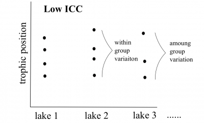

```{r setup, echo = F}
knitr::opts_chunk$set(
  comment = "#",
  collapse = TRUE,
  warning = FALSE,
  message = FALSE,
  cache = T,
  fig.width=6, fig.height=6,
  fig.align = 'center'
)
```

```{r, echo =F}
options(repos=structure(c(CRAN="http://cran.r-project.org")))
```

```{r, include = FALSE}
if (!require(ggplot2)) install.packages("ggplot2")
library(ggplot2)
if (!require(lme4)) install.packages("lme4")
library(lme4)
if (!require(AICcmodavg)) install.packages("AICcmodavg")
library(AICcmodavg)
```

# Objectifs

1. Qu'est-ce qu'un modèle linéaire à effets mixtes (MLM) et pourquoi est-ce important?

2. Comment appliquer, vérifier les suppositions, comparer et présenter les résultats des MLMs dans R?
    - Construction du modèle *a priori* et exploration des données
    - Coder les modèles potentiels et sélection du meilleur modèle
    - Validation du modèle
    - Interprétation et visualisation des résultats

---
## 1. Pourquoi choisir un MLM?

Les données écologiques et biologiques peuvent être complexes et désordonnées!

* Structure particulière dans les données

* Plusieurs covariables (facteurs de regroupement)

* Faible taille d'échantillons

---
## 1. Pourquoi choisir un MLM?

Introduction au jeu de données

.center[  ]

.comment[**Q: Est-ce que la position trophique des poissons augmente avec leur taille?**
]


---

## 1. Pourquoi choisir un MLM?

<br>

Dans cet atelier, il y aura une série de **défis** que vous reconnaitrez par le symbole du cube rubique

.center[

]

<br>

**Pendant ces défis, collaborez avec votre voisin-e!**


---
## Défi 1 

* Introduction au jeu de données

* Ouvrez le script de l'atelier dans R

* Faites les graphiques 1 à 3,
regardez les graphiques et
essayez d'obtenir une idée de ce qui se passe


---

## Solution 

<br>

```{r, echo=F}
data <- read.csv('qcbs_w6_data.csv')

# thème simplifié
fig <- theme_bw() + theme(panel.grid.minor=element_blank(), panel.grid.major=element_blank(), panel.background=element_blank()) +
  theme(strip.background=element_blank(), strip.text.y = element_text()) + theme(legend.background=element_blank()) +
  theme(legend.key=element_blank()) + theme(panel.border = element_rect(colour="black", fill=NA))

# Faites les trois graphiques suivants pour explorer les données
plot <- ggplot(aes(Fish_Length,Trophic_Pos),data=data)

# Graphique 1 - Toutes les données
plot + geom_point() + xlab("Length (mm)") + ylab("Trophic Position") + labs(title="All Data") + fig
```


---
## Solution 

<br>

```{r, echo=FALSE}
# Graphique 2 - Par espèce
plot + geom_point() + facet_wrap(~ Fish_Species) + xlab("Length (mm)") + ylab("Trophic Position") +
   labs(title="By Species") + fig
```

---
## Solution 

<br>

```{r, echo=F}
# Graphique 3 – Par lac
plot + geom_point() + facet_wrap(~ Lake) + xlab("Length (mm)") + ylab("Trophic Position") +
   labs(title="By Lake") + fig
```


---
## 1. Pourquoi choisir un MLM?

**Discussion de groupe**

* Est-ce qu'on s'attend à ce que, pour toutes les espèces, la position trophique augmente avec la longueur corporelle?

    * Exactement de la même façon?

<br>

--

* Est-ce qu'on s'attend à ce que ces relations soient pareilles entre les lacs?

    * Comment pourraient-elles différer?

---

## 1. Pourquoi choisir un MLM?

Comment pourrions-nous analyser ces données?

<br>

Nous pourrions:

<br>

**Option 1. Séparer**:

- Faire une analyse separée pour chaque espèces et chaque lac

**Option 2. Regrouper**:

- Faire une seule analyse en ignorant les variables espèces et lac

---

## 1. Pourquoi choisir un MLM?

.pull-left[ ]

.pull-right[
**Option 1. Séparer**
* Estime 6 intercepts et 6 pentes pour chaque espèces (i.e. 6 lacs)

* Taille d'échantillon *n* = 10 pour chaque analyse (i.e. 10 poissons/espèces/lac)

* Peu de chances de détecter un effet a cause de la faible taille d'échantillion *n*
]

---

## 1. Pourquoi choisir un MLM?

.pull-left[]

.pull-right[
**Option 2. Regrouper:**
* Très grande taille d'échantillon!

* Et la pseudoreplication? (les poissons d'un même lac et d'une même espèce sont correlés).

* Beaucoup de bruit! Une partie doit être due aux effets de l'espèce et du lac.
]

---
## 1. Pourquoi choisir un MLM?


* Pour notre question, on veut seulement savoir s'il y a un .alert[effet général de la longueur corporelle sur la position trophique]

* Ceci pourrait varier faiblement par espèce à cause de différents taux de croissance et/ou par lac à cause de différences dans la disponibilité de nourriture. On ne s'intéresse pas directement à ces facteurs non mesurés, mais on doit contrôler leur effet dans le modèle


---
## 1. Pourquoi choisir un MLM?

Les MLMs sont un compromis entre séparer et regrouper. Ils:


1. Estiment une pente et un intercept pour chaque espèce et chaque lac (séparer) mais en calculant moins de paramètres qu'une regression classique

2. Utilisent toutes les données disponibles (regrouper) tout en contrôlant les différences entre les lacs et les espèces (pseudo-replication)

---
## 1. Pourquoi choisir un MLM?

**Effet fixe VS aléatoire**

Dans la littérature des MLMs, vous rencontrerez ces termes souvent.

Il existe plusieurs définitions possibles des effets fixes et aléatoires et nous vous présenterons aujourd'hui celles que nous trouvons plus faciles a appliquer

---
## 1. Pourquoi choisir un MLM?

### Effet fixe

* Les données proviennent de tous les niveaux possibles d'un facteur (variable qualitative)

* On souhaite émettre des conclusions à propos des niveaux du facteur d'où les données proviennent

---
## 1. Pourquoi choisir un MLM?

### Effet aléatoire

* Seulement des variables qualitatives = facteur aléatoire

* Les données incluent seulement un échantillon aléatoire de tous les niveaux possibles du facteur, qui sont tous d'intérêt

* Souvent des facteurs groupants

---
## 1. Pourquoi choisir un MLM?

**Comment fonctionnent les MLMs?**

**A.** Permet aux intercepts et/ou aux pentes de varier selon un facteur donné (**effet aléatoire**), e.g. par lac et/ou par espèce

**B.** Les intercepts, les pentes et leur intervalle de confiance sont ajustés pour **prendre en compte la structure des données**

---
## Effet aléatoire sur l'intercept

<br>

<p>


On fait la supposition que les intercepts proviennent d'une distribution normale

Seulement besoin d'estimer la moyenne et l'écart type de la distribution normale au lieu de 3 intercepts, une par espèce
</p>

<br>

.comment[Notez que plus votre facteur comporte de niveaux, plus la moyenne et l'écart-type de la distribution normale seront estimés précisément. Trois niveaux c'est un peu faible, mais plus facile à visualiser!]

---
## Effet aléatoire sur l'intercept

<br>

<p>

Même principe pour les lacs

Estime 2 paramètres (moyenne et écart-type) au lieu de 6 intercepts.

Cela économise des degrés de liberté (moins d’estimation de paramètres sont nécessaires)
</p>


---
## Effet aléatoire sur la pente


<br>

<p>

Le même principe s’applique aux pentes qui varient selon un facteur donné, juste plus difficile à visualiser

Comme pour les intercepts, seuls la moyenne et l’écart-type des pentes sont estimés au lieu de trois pentes distinctes.
</p>

---
## Tenir compte de la structure des données

Si une certaine espèce ou un lac est peu représenté (faible *n*) dans les données, le modèle va accorder plus d'importance au modèle groupé pour estimer l'intercept et la pente de cette espèce ou de ce lac.

.center[ ]

---
## Tenir compte de la structure des données

* Les intervalles de confiance des intercepts et pentes sont ajustés pour tenir compte de la pseudo-replication basée sur le **coefficient de corrélation intra-classe (CCI)**


* Combien de variation y a-t-il dans chaque groupe VS entre les groupes ?


---
## Tenir compte de la structure des données


.pull-left[
**CIC élevé**


les points provenant d'un même lac sont traités comme une seule observation car très corrélés

 petite taille effective de l'échantillon et grands intervalles de confiance pour la pente et l'intercept.
]

.pull-right[
**CIC faible**



les points provenant d'un même lac sont traités indépendamment car peu corrélés

 grande taille effective de l'échantillon et petits intervalles de confiance pour la pente et l'intercept.
]

---
# Défi 2 

<br>

Comment le CIC et l'intervalle de confiance seront affectés dans ces deux scénarios ?

**Q1.** Les positions trophiques des poissons ne varient pas entre les lacs

<br>

**Q2.** Les positions trophiques des poissons sont similaires dans les lacs mais différentes entre les lacs

---
# Solution 

<br>

**Q1.** La position trophique ne varie pas entre les lacs?

.alert[R1. CIC faible, petits intervalles de confiances]

<br>

--

**Q2.** La position trophique est similaire dans un lac mais différente entre les lacs ?

.alert[R2. CIC élevé, grands intervalles de confiance]

---

## Comment implémenter un MLM dans R ?

<br>


.comment[**Étape 1: Construction du modèle *a priori* et exploration des données**]

<br>

**Étape 2:** Coder les modèles potentiels et sélection du meilleur modèle

<br>

**Étape 3:** Validation du modèle

<br>

**Étape 4:** Interprétation et visualisation des résultats


---

## Comment implémenter un MLM dans R ?

.comment[**Étape 1: Construction du modèle *a priori* et exploration des données**]

* Modèle basé sur connaissance *a priori*:

  * Nous voulons déterminer si la position trophique peut être prédite par la longueur corporelle, tout en prenant en compte la variation entre les espèces et les lacs

  * Donc nous voulons un modèle qui ressemble a ceci:

$$PT_{ijk} ~ Longueur_i + Lac_j + Espèce_k + \epsilon$$


---
## Exploration des données


Les données ont-elles la bonne structure?

```{r}
data <- read.csv('qcbs_w6_data.csv')
str(data)
```


> Il est recommandé de faire le ménage de votre espace de travail (`rm.list()`) avant de construire un modèle

---
## Exploration des données

Regardez la distribution des échantillons pour chaque facteur:

```{r}
table(data$Lake)
table(data$Fish_Species)
```


.comment[Ce jeu de données est parfaitement équilibré, mais les **modèles mixtes peuvent analyser les plans expérimentaux non équilibrés**, comme c'est souvent le cas en écologie!]

---
## Exploration des données

Regardez la distribution des variables continues

```{r, fig.width=10, fig.height=4}
par(mfrow=c(1,2), mar = c(4,4,1,1))
hist(data$Fish_Length)
hist(data$Trophic_Pos)
```

.small[Des déviations majeures pourraient causer des problèmes d'hétéroscédasticité. Si nécessaire, faites des transformations. Dans ce cas-ci, **les données semblent correctes**.]

---
## Exploration des données

Vérification de la colinéarité entre vos variables explicatives

Le problème avec les prédicteurs colinéaires est simplement qu'ils expliquent la même chose, alors leur effet sur la variable réponse sera confondu dans le modèle

Dans cet exemple, il n’y a pas de risque de colinéarité avec seulement une variable continue. Si vous aviez une autre variable continue (Var2), une façon simple de vérifier la colinéarité est:

```{r, eval = F}
plot(data)

cor(var1, var2)
```


---
# Défi 3 

Quelles mesures supplémentaires aurions-nous pu prendre sur le terrain et qui auraient pu être fortement corrélées avec la longueur corporelle?


--

> Un exemple est la masse du poisson – c’est une variable fortement corrélée avec la longueur du poisson. Par conséquent, nous ne voulons pas inclure ces deux variables dans le même modèle.


---
## Exploration des données

**Considérez l'échelle de vos données**

* Si deux variables dans un même modèle ont des échelles très différentes, il est probable que le modèle mixte indique un problême de convergence en essayant de calculer les paramètres.

* La correction Z standardise les variables et résout ce problème :

$$z = \frac{(x-moyenne(x))}{ecart.type(x)}$$


---
## Exploration des données

**Considérez l'échelle de vos données**

* Longueur corporelle  Longue échelle

* Position trophique  Courte échelle

---
## Exploration des données

**Considérez l'échelle de vos données**

* Parce que nos données ont des échelles très différentes, on applique la **correction Z**

```{r}
#Longueur corrigée:
data$Z_Length <- (data$Fish_Length-mean(data$Fish_Length))/sd(data$Fish_Length)

#Position trophique corrigée:
data$Z_TP<- (data$Trophic_Pos-mean(data$Trophic_Pos))/sd(data$Trophic_Pos)
```


---
## Exploration des données

Pour savoir si un modèle mixte est nécessaire pour vos données, vous devez déterminer s'il est important de prendre en compte l'effet aléatoire de facteurs qui pourraient influencer la relation qui vous intéresse (dans notre cas, lac et espèce)

Nous pouvons le faire en :

1. Créant un modèle linéaire sans les facteurs qui pourraient avoir un effet aléatoire

2. Calculant les résidus de ce modèle linéaire

3. Produisant un graphique de la valeur des résidus en fonction des niveaux des facteurs potentiellement aléatoires

---
## Exploration des données


1. Creer un modèle linéaire sans les facteurs
```{r}
lm.test <- lm(Z_TP ~ Z_Length, data = data)
```

2. Calculer les résidus de ce modèle linéaire
```{r}
lm.test.resid <- rstandard(lm.test)
```

---
## Exploration des données

Représentez graphiquement la valeur des résidus en fonction des niveaux des facteurs

```{r, fig.width=10, fig.height=5, eval = F}
par(mfrow=c(1,2))

plot(lm.test.resid ~ data$Fish_Species,
     xlab = "Species", ylab = "Standardized residuals")

abline(0, 0, lty = 2)

plot(lm.test.resid ~ data$Lake,
     xlab = "Lake", ylab = "Standardized residuals")

abline(0, 0, lty = 2)
```

---
## Exploration des données

Représentez graphiquement la valeur des résidus en fonction des niveaux des facteurs

```{r, fig.width=10, fig.height=5, echo = F}
par(mfrow=c(1,2), mar = c(4,4,1,1))
plot(lm.test.resid ~ data$Fish_Species,
     xlab = "Species", ylab = "Standardized residuals")
abline(0, 0, lty = 2)
plot(lm.test.resid ~ data$Lake,
     xlab = "Lake", ylab = "Standardized residuals")
abline(0, 0, lty = 2)
```

.alert[Ces patrons suggèrent qu'il y a de la variance résiduelle qui pourrait être expliquée par ces facteurs, et ils devraient donc être inclus dans le modèle]

---

## Comment implémenter un MLM dans R ?

<br>


Étape 1: Construction du modèle *a priori* et exploration des données

<br>

.comment[**Étape 2: Coder les modèles potentiels et sélection du meilleur modèle**]

<br>

Étape 3: Validation du modèle

<br>

Étape 4: Interprétation et visualisation des résultats


---
## Comment implémenter un MLM dans R ?

.comment[**Étape 2: Coder les modèles potentiels et sélection du meilleur modèle**]

* Traduison notre modèle...

$$PT_{ijk} ~ Longueur_i + Lac_j + Espèce_k + \epsilon$$

* ... En code R

```{r, eval = F}
library(lme4)
lmer(Z_TP ~ Z_Length + (1 | Lake) + (1 | Fish_Species),
     data = data, REML = TRUE)
```


* `lmer`  fonction "linear mixed model" du package `lme4`
* `(1 | Lake)`  indique que les intercepts peuvent varier
* `REML = TRUE`  méthode d'estimation

---
## Note à propos de la méthode d'estimation

REML (Restricted Maximum Likelihood) est la méthode par défaut dans la fonction `lmer`

Il est à noter que l'estimateur de l’écart-type du maximum de vraisemblance (ML, pour Maximum Likelihood) est biaisé d’un facteur $(n-2) / n$. La méthode REML corrige ce biais.


- On devrait comparer les **modèles d'effets aléatoires nichés avec REML**

- Tandis qu'on devrait comparer les **modèles nichés à effets fixes avec ML**


---
## Coder et sélectionner le meilleur modèle

.comment[Comment faire si on souhaite que la pente puisse varier ?]

.center[

]


---
## Défi 4 

Réecrivez le code suivant de façon à ce que les **pentes** de la relation position trophique en fonction de longueur corporelle **varient par lac et par espèces**:

```{r}
lmer(Z_TP ~ Z_Length + (1 | Lake) + (1 | Fish_Species),
     data = data, REML = TRUE)
```


---
## Solution 

<br>

```{r}
lmer(Z_TP ~ Z_Length + (1 + Z_Length | Lake) + (1 + Z_Length | Fish_Species),
     data = data, REML = TRUE)
```


---
## Coder et sélectionner le meilleur modèle

<br>

* Pour déterminer si vous avez construit le meilleur modèle mixte base sur vos connaissances a priori, vous devez comparer ce modèle a priori aux autres modèles alternatifs

* Avec le jeu de données sur lequel vous travaillez, il y a plusieurs modèles alternatifs qui pourraient mieux correspondre à vos données

---
## Défi 5 

Faites une liste de 7 modèles alternatifs qui pourraient être comparés à celui-ci:

```{r, eval=F}
lmer(Z_TP ~ Z_Length + (1 | Lake) + (1 | Fish_Species),
     data = data, REML = TRUE)
```


.comment[Note: Si nous avions différents effets fixes entre les modèles, nous aurions dû indiquer `REML=FALSE` pour les comparer avec un méthode de vraisemblance comme l'AIC. Ici, vous devez rapporter les estimations des paramètres du "meilleur" modèle en utilisant `REML=TRUE`]


---
## Solution 


* Nous allons aussi construire le **modèle linéaire de base** `lm()` parce qu'il est toujours utile de voir la variation dans les valeurs de AICc.

```{r}
M0 <- lm(Z_TP ~ Z_Length, data = data)
```

* Par contre, pour comparer ce modèle aux MLMs, il est important de .alert[changer la méthode d'estimation à ML (REML=F)] parce que `lm()` n'utilise pas la même méthode d'estimation que `lmer()`
  - Démontrer que les résultats de la méthode des moindres carrés (least squares) est équivalente aux résultats de la méthode ML pour les modèles linéaires de bases!

---
## Solution

```{r}
# Modele linéaire de base
M0 <- lm(Z_TP ~ Z_Length, data = data)
# modèle complet avec variation des intercepts
M1 <- lmer(Z_TP ~ Z_Length + (1 | Fish_Species) + (1 | Lake), data = data, REML = FALSE)
# modèle complet avec variation des intercepts et de pentes
M2 <- lmer(Z_TP ~ Z_Length + (1 + Z_Length | Fish_Species) + (1 + Z_Length | Lake),
           data = data, REML = FALSE)
# Pas d'effet lac, les intercepts varient par espèces
M3 <- lmer(Z_TP ~ Z_Length + (1 | Fish_Species), data = data, REML = FALSE)
# Pas d'effet espèces, les intercepts varient par lac
M4 <- lmer(Z_TP ~ Z_Length + (1 | Lake), data = data, REML = FALSE)
# Pas d'effet de lac, les intercepts et les pentes varient par espèces
M5 <- lmer(Z_TP ~ Z_Length + (1 + Z_Length | Fish_Species), data = data, REML = FALSE)
# Pas d'effet de l'espèces, les intercepts et les pentes varient par lac
M6 <- lmer(Z_TP ~ Z_Length + (1 + Z_Length | Lake), data = data, REML = FALSE)
# modèle complet, variation d'intercept et pente par lac
M7 <- lmer(Z_TP ~ Z_Length + (1 | Fish_Species) + (1 + Z_Length | Lake),
           data = data, REML = FALSE)
# modèle complet, variation d'intercept et pente par espèces
M8 <- lmer(Z_TP ~ Z_Length + (1 + Z_Length | Fish_Species) + (1 | Lake),
           data = data, REML = FALSE)
```


---
## Coder et sélectionner le meilleur modèle

* Maintenant que nous avons une liste de modèles potentiels, nous voulons les comparer entre eux pour sélectionner celui(ceux) qui a(ont) le plus de pouvoir predictif

* Les modèles peuvent être comparés en utiliant la fonction `AICc` provenant du package `AICcmodavg`

* Le critère d'information Akaike (AIC) est une **mesure de qualité du modèle** pouvant être utilisée pour comparer les modèles

* `AICc` corrige pour le biais créé par les faibles tailles d'échantillon

---
## Coder et sélectionner le meilleur modèle

Pour trouver la valeur AICc d'un modèle, utilisez :

```{r, eval = F}
library(AICcmodavg)
AICc(M1)
```


Pour regrouper toutes les valeurs d'AICc dans un seul tableau, utilisez :

```{r}
AICc <- c(AICc(M0), AICc(M1), AICc(M2), AICc(M3),
          AICc(M4), AICc(M5), AICc(M6), AICc(M7), AICc(M8))

Model <- c("M0", "M1", "M2", "M3", "M4", "M5", "M6", "M7", "M8")

AICtable <- data.frame(Model = Model, AICc = AICc)

```

---

## Coder et sélectionner le meilleur modèle

Que signifient ces valeurs d'AICc ?

```{r}
AICtable
```

.small[Le modèle avec le plus petit AICc a le plus grand pouvoir prédictif

Souvent on considère que deux modèles à +/- 2 unités d'AICc de différence ont une pouvoir prédictif équivalent

Regardons de plus près M8 et M2. On peut exclure les autres car ils ont des AICc tellement plus élevés]

---
## Coder et sélectionner le meilleur modèle

Quelle est la structure du meilleur modèle?

```{r, eval = F}
M8 <- lmer(Z_TP ~ Z_Length + (1 + Z_Length | Fish_Species) + (1 | Lake),
           data = data, REML = FALSE)
```

L'intercept et l'effet de la longueur sur la position trophique peut varier selon l'espèce de poissons, mais seulement l'intercept peut varier par lac

<br>

.pull-left[]
.pull-right[]

---
## Coder et sélectionner le meilleur modèle

Une fois que les meilleurs modèles sont sélectionnés il faut remettre la méthode d'estimation a `REML=TRUE`

```{r}
M8 <- lmer(Z_TP ~ Z_Length + (1 + Z_Length | Fish_Species) + (1 | Lake),
           data = data, REML = TRUE)

M2 <- lmer(Z_TP ~ Z_Length + (1 + Z_Length | Fish_Species) + (1 + Z_Length | Lake),
           data = data, REML = TRUE)
```


---
# Défi 6 

Prenez 2 minutes avec votre voisin pour étudier la structure du modèle M2.

Comment diffère-t-il de M8 d'un point de vue écologique?

Pourquoi n'est il pas surprenant que sa valeur d'AICc était la deuxième meilleure?

```{r, eval = F}
M8 <- lmer(Z_TP ~ Z_Length + (1 + Z_Length | Fish_Species) + (1 | Lake),
           data = data, REML = TRUE)

M2 <- lmer(Z_TP ~ Z_Length + (1 + Z_Length | Fish_Species) + (1 + Z_Length | Lake),
           data = data, REML = TRUE)
```

---

## Solution


**Discussion de groupe...**

--

.alert[M2] La position trophique est une fonction de la longueur. L'intercept et l'effet de la longueur sur la position trophique peuvent varier selon l'espèce de poissons et le lac.

  * .small[les facteurs intrinsèques des espèces et des lacs sont à la base de relations différentes entre la position trophique et la longueur (i.e. pentes et intercepts)]

.alert[M8] La position trophique est une fonction de la longueur. L'intercept et l'effet de la longueur sur la position trophique peut varier selon l’espèce de poissons, mais seulement l'intercept peut varier par lac.

  * .small[seulement les facteurs intrinsèques des espèces sont responsables des différentes relations (i.e. pentes) et en moyenne, les positions trophiques pourraient être supérieures ou inférieures d’un lac à l’autre (e.g. intercepts).]


---
# Comment implémenter un MLM dans R?

<br>


Étape 1: Construction du modèle *a priori* et exploration des données

<br>

Étape 2: Coder les modèles potentiels et sélection du meilleur modèle

<br>

.comment[**Étape 3: Validation du modèle**]

<br>

Étape 4: Interprétation et visualisation des résultats


---
## Comment implémenter un MLM dans R?

.comment[**Étape 3: Validation du modèle**]

Vous devez vérifier que le modèle respecte toutes les suppositions de base:

1. Vérifier l'homogénéité de la variance
  - Faire un graphique des valeurs prédites en fonction des valeurs résiduelles

2. Vérifier l'indépendance des résidus
  - Graphique des résidus VS chaque covariable du modèle
  - Graphique des résidus VS chaque covariable non incluse du modèle


3. Vérifier la normalité
  - Histogramme


---
## Validation du modèle

1- Vérifier l'homogénéité de la variance

```{r, fig.width=4.5, fig.height=4.5, echo = -1}
par(mar=c(4,4,.5,.5))
plot(resid(M8) ~ fitted(M8), xlab = 'Valeurs pérdites', ylab = 'Résidus normalisés')
abline(h = 0, lty = 2)
```

Étendue homogène des résidus  la supposition est respectée!

---
## Validation du modèle

1- Vérifier l'homogénéité de la variance

.center[

]

---
## Validation du modèle

2- Vérifier l'indépendance des résidus avec chaque covariable

```{r, fig.width=11, fig.height=4.5, eval = F}
par(mfrow = c(1,3), mar=c(4,4,.5,.5))

plot(resid(M8) ~ data$Z_Length, xlab = "Longueur", ylab = "Résidus normalisés")
abline(h = 0, lty = 2)

boxplot(resid(M8) ~ Fish_Species, data = data, xlab = "Espèces", ylab = "Résidus normalisés")
abline(h = 0, lty = 2)

boxplot(resid(M8) ~ Lake, data = data, xlab = "Lacs", ylab = "Résidus normalisés")
abline(h = 0, lty = 2)
```

---
## Validation du modèle

2- Vérifier l'indépendance des résidus avec chaque covariable

```{r, fig.width=12, fig.height=4.5, echo = F}
par(mfrow = c(1,3), mar=c(4,4,.5,.5), cex.lab = 1.5)
plot(resid(M8) ~ data$Z_Length, xlab = "Longueur", ylab = "Résidus normalisés")
abline(h = 0, lty = 2)
boxplot(resid(M8) ~ Fish_Species, data = data, xlab = "Espèces", ylab = "")
abline(h = 0, lty = 2)
boxplot(resid(M8) ~ Lake, data = data, xlab = "Lacs", ylab = "")
abline(h = 0, lty = 2)
```


Étendue homogène des résidus autour de 0  pas de patron des résidus en fonction de la variable, la supposition est respectée!

.comment[Note: Les regroupements de données sont dus à la structure des données, où des poissons de seulement 5 classes de taille  (grand, petit, et trois groupes entre les deux) étaient capturés.]

---
## Validation du modèle

2- Vérifier l'indépendance des résidus avec chaque covariable

- Graphique des résidus VS chaque covariable non incluse du modèle

  - Si vous observez des patrons dans ce graphique, vous saurez qu'il y a de la variation dans votre jeu de données qui pourrait être expliquée par ces covariables. Vous devriez considérer d'inclure ces variables dans votre modèle.

  - Puisque dans notre cas, nous avons inclus toutes les variables mesurées dans notre modèle, nous ne pouvons pas faire cette étape.

---
## Validation du modèle

3- Vérifier la normalité des résidus

* Des résidus suivant une distribution normale indiquent que le modèle n'est pas biaisé

```{r, fig.height=5, fig.width=5}
hist(resid(M8))
```


---
## Comment implémenter un MLM dans R ?

<br>


Étape 1: Construction du modèle *a priori* et exploration des données

<br>

Étape 2: Coder les modèles potentiels et sélection du meilleur modèle

<br>

Étape 3: Validation du modèle

<br>

.comment[**Étape 4: Interprétation et visualisation des résultats**]


---
## Comment implémenter un MLM dans R ?

.comment[**Étape 4: Interprétation et visualisation des résultats**]

```{r}
(summ_M8 <- summary(M8))
```


---
## Comment implémenter un MLM dans R ?

.comment[**Étape 4: Interprétation et visualisation des résultats**]

.center[

]

<br>

.center[

]

Si l’intervalle de confiance à 95% de la pente ( $pente ± SE * 1.96$ ) inclut zéro, la pente (ici = 0.4223), et donc l'effet de la longueur sur la position trophique, n’est pas significativement différente de zéro au seuil $\alpha$ = 0.05.

---
## Défi 7 

<br>

1. Quelle est la pente et son intervalle de confiance de la variable Z_Length dans le modèle M8?

2. Est-ce que la pente de Z_Length est significativement différente de 0 ?


---
## Solution 

<br>

1. Quelle est la pente et son intervalle de confiance de la variable Z_Length dans le modèle M8?

  - pente = 0.422;

  - limite supérieure de l’IC = 0.4223 + 0.09*1.96 = 0.5987

  - limite inférieure de l’IC = 0.4223 - 0.09*1.96 = 0.2459

2. Est-ce que la pente de Z_Length est significativement différente de 0 ?

  - Oui, car l'IC [0.2459, 0.5987] n'inclut pas 0


---
## Défi 8 

* Il est possible de visualiser graphiquement les différentes intercepts et pentes du modèle pour mieux interpréter les résultats

Prenez 2 minutes pour refléchir aux différentes façon pour représenter les résultats de M8.

*Indice: considérez les différents "niveaux" du modèle*


---
## Solution 

a) Figure avec toutes les données regroupées

b) Figure par espèce

c) Figure par lac

---
## Solution 

Pour faire ces figures, il nous faut:

- Les coefficients du modèle complet qui sont dans le résumé du modèle

```{r}  
summ_M8$coefficients
```

Intercept = -0.0009059

Pente = 9.4222687

---
## Solution 

Pour faire ces figures, il nous faut:

- Les coefficients pour chaque niveau du modèle qu'on obtient avec la fonction `coef`

```{r}
coef(M8)
```

---
## Solution 

a) Figure avec toutes les données regroupées
```{r, eval = F}
library(ggplot2)

# Thème ggplot simplifié
fig <- theme_bw() +
  theme(panel.grid.minor=element_blank(), panel.grid.major=element_blank(),
        panel.background=element_blank()) +
  theme(strip.background=element_blank(), strip.text.y = element_text()) +
  theme(legend.background=element_blank()) +
  theme(legend.key=element_blank()) +
  theme(panel.border = element_rect(colour = "black", fill=NA))

plot <- ggplot(aes(Z_Length, Z_TP), data = data)
Plot_AllData <- plot + geom_point() +
  xlab("Longueur (mm)") + ylab("Position trophique") +
  labs(title = "Toutes les données") + fig

Plot_AllData + geom_abline(intercept = -.0009059, slope = 0.4222697)
```

---
## Solution 

a) Figure avec toutes les données regroupées
```{r, echo = F}
plot <- ggplot(aes(Z_Length, Z_TP), data = data)
Plot_AllData <- plot + geom_point() +
  xlab("Longueur (mm)") + ylab("Position trophique") +
  labs(title = "Toutes les données") + fig

Plot_AllData + geom_abline(intercept = -.0009059, slope = 0.4222697)
```

---
## Solution 

b) Figure par espèce

```{r, eval = F}
# mettre les coefs dans un tableau pour les rendre plus faciles à manipuler
Lake.coef <- as.data.frame(coef(M8)$Lake)
colnames(Lake.coef) <- c("Intercept", "Slope")
Species.coef <- as.data.frame(coef(M8)$Fish_Species)
colnames(Species.coef) <- c("Intercept", "Slope")

Plot_BySpecies<-plot + geom_point(aes(colour = factor(Fish_Species)), size = 4) +
  xlab("Longueur (mm)") + ylab("Position trophique") +
  labs(title = "Par espèce") + fig

# Ajoutez les lignes de régression pour chaque espèce
Plot_BySpecies +
  geom_abline(intercept = Species.coef[1,1], slope = Species.coef[1,2], col = "coral2") +
  geom_abline(intercept = Species.coef[2,1], slope = Species.coef[2,2], col = "green4") +
  geom_abline(intercept = Species.coef[3,1], slope = Species.coef[3,2], col = "blue1")


```

---
## Solution 

b) Figure par espèce

```{r, echo = F, fig.width=8}
Lake.coef <- as.data.frame(coef(M8)$Lake)
colnames(Lake.coef) <- c("Intercept", "Slope")
Species.coef <- as.data.frame(coef(M8)$Fish_Species)
colnames(Species.coef) <- c("Intercept", "Slope")

Plot_BySpecies<-plot + geom_point(aes(colour = factor(Fish_Species)), size = 4) +
  xlab("Longueur (mm)") + ylab("Position trophique") +
  labs(title = "Par espèce") + fig

# Ajoutez les lignes de régression pour chaque espèce
Plot_BySpecies +
  geom_abline(intercept = Species.coef[1,1], slope = Species.coef[1,2], col = "coral2") +
  geom_abline(intercept = Species.coef[2,1], slope = Species.coef[2,2], col = "green4") +
  geom_abline(intercept = Species.coef[3,1], slope = Species.coef[3,2], col = "blue1")

```

---
## Solution 

c) Figure par lac
```{r, eval=F}
Plot_ByLake<-plot + geom_point(aes(colour = factor(Lake)), size = 4) +
  xlab("Length (mm)") + ylab("Trophic Position") +
  labs(title = "By Lake") + fig

# Ajouter les lignes de régression avec les intercepts spécifiques à chaque lac
Plot_ByLake +
  geom_abline(intercept = Lake.coef[1,1], slope = Lake.coef[1,2], col = "coral2") +
  geom_abline(intercept = Lake.coef[2,1], slope = Lake.coef[2,2], col = "khaki4") +
  geom_abline(intercept = Lake.coef[3,1], slope = Lake.coef[3,2], col = "green4") +
  geom_abline(intercept = Lake.coef[4,1], slope = Lake.coef[4,2], col = "darkgoldenrod") +
  geom_abline(intercept = Lake.coef[5,1], slope = Lake.coef[5,2], col = "royalblue1") +
  geom_abline(intercept = Lake.coef[6,1], slope = Lake.coef[6,2], col = "magenta3")

```

---
## Solution 

c) Figure par lac
```{r, echo = F, fig.width=8}
Plot_ByLake<-plot + geom_point(aes(colour = factor(Lake)), size = 4) +
  xlab("Longueur (mm)") + ylab("Position trophique") +
  labs(title = "par lac") + fig

# Ajouter les lignes de régression avec les intercepts spécifiques à chaque lac
Plot_ByLake +
  geom_abline(intercept = Lake.coef[1,1], slope = Lake.coef[1,2], col = "coral2") +
  geom_abline(intercept = Lake.coef[2,1], slope = Lake.coef[2,2], col="khaki4") +
  geom_abline(intercept = Lake.coef[3,1], slope = Lake.coef[3,2], col="green4") +
  geom_abline(intercept = Lake.coef[4,1], slope = Lake.coef[4,2], col="darkgoldenrod") +
  geom_abline(intercept = Lake.coef[5,1], slope = Lake.coef[5,2], col="royalblue1") +
  geom_abline(intercept = Lake.coef[6,1], slope = Lake.coef[6,2], col="magenta3")

```


---
## Modèle mixtes et données en écologie

<br>

Les modèles mixtes sont très utiles pour prendre en compte la structure complexe des données en écologie tout en permettant de ne pas perdre beaucoup de degrés de liberté

.center[

]


---
## Défi 9 

<br>

**Situation:**

* Vous avez inventorié la richesse **dans 1000 quadrats** qui sont dans **10 sites différents** qui sont également dans **10 forêts différentes**.

* Vous avez de plus **mesuré la productivité** dans chaque **quadrat**.

* Vous désirez savoir si la productivité est un bon prédicteur de biodiversité

.alert[Quel modèle mixte pourriez-vous utiliser pour ce jeu de données?]

---
## Solution!

<br>

```{r, eval = F}
lmer(Biodiv ~ Productivite + (1 | Foret / Site))
```

Ici les effets aléatoires sont nichés (i.e. Sites dans forêt) et non croisés


---
## Défi 10

<br>

**Situation:**

* Vous avez recolté **200 poissons** dans **12 sites différents** distribués également dans **4 habitats** différents qui se retrouvent dans **un même lac**.

* Vous avez mesuré la **longueur de chaque poisson** et la **quantité de mercure dans ses tissus**.

* Vous désirez savoir si l'habitat est un bon prédicteur de la concentration en mercure.

.alert[Quel modèle mixte pourriez-vous utiliser pour ce jeu de données?]

---

## Solution!

<br>


```{r, eval = F}
lmer(Mercure ~ Longueur * Habitat + (1 | Site))
```


---
## Défi 11!

* Discutez du jeu de données sur lequel vous travaillez avec votre voisin et déterminez si un modèle mixte serait approprié.

* Si oui, travaillez ensemble pour écrire le code que vous utiliseriez pour faire ce modèle dans R.

* Si non, imaginez un jeu de données fictif pour lequel un modèle mixte serait approprié et codez ce modèle.

---
## Ressources additionnelles

* Différences entre `nlme` et `lme4`

.center[
 
]


---
class: inverse, center, bottom

# Merci de votre participation à cet atelier!


